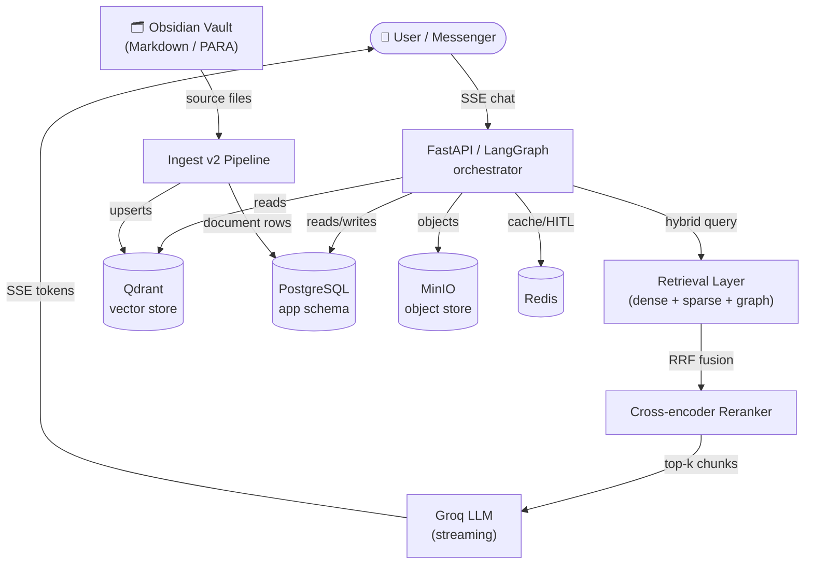

# Getting Started with NEXUS

NEXUS is a sovereign, enterprise-grade **Retrieval-Augmented Generation (RAG)** system fused with an Obsidian Second Brain. It turns a personal knowledge vault into a live, queryable intelligence layer — with a streaming chat interface, multi-tenant workspace management, Meta Messenger integration, and a fully customizable AI persona engine.

---

## What is NEXUS?

At its core, NEXUS solves a fundamental problem: **personal knowledge is siloed and unsearchable**. Your notes, research, and accumulated expertise live in Markdown files that can't answer questions.

NEXUS bridges the gap:

1. **Vault** (Obsidian PARA structure) → source of truth for all knowledge
2. **Ingest pipeline** → chunks, embeds, and indexes every note into Qdrant + Postgres
3. **Hybrid retrieval** → BM25 + dense semantic search + knowledge graph traversal, fused via RRF
4. **Cross-encoder reranking** → surfaces the most relevant passages
5. **Groq streaming generation** → synthesizes answers with `[n]` citation enforcement
6. **Multi-tenant workspace** → isolates knowledge per organization with RBAC
7. **Messenger integration** → deploys the AI to Meta Messenger with HITL fallback

---

## Key Capabilities

| Capability | Description |
|---|---|
| **Streaming chat** | SSE-based real-time responses with source citations |
| **Hybrid retrieval** | Dense + sparse + graph arms fused via Reciprocal Rank Fusion |
| **Multi-tenancy** | Full workspace isolation at the Qdrant payload + Postgres row level |
| **3-tier RBAC** | `owner` / `admin` / `member` roles with granular permission gates |
| **AI customization** | Per-tenant personas, node toggles, model parameters, Prompt Studio |
| **Messenger HITL** | Full Meta Messenger integration with human-in-the-loop pause |
| **SDR persona** | Sales tools (Stripe checkout, CRM lead capture) wired to LangGraph |
| **Knowledge graph** | Wikilink-backed graph retrieval arm (Phase 31, Postgres-backed) |
| **Guardrails** | Citation, exactmatch, and entropy validators before every response |
| **Observability** | OpenTelemetry spans + Langfuse LLM tracing + audit logs |

---

## System Overview (Architecture at a Glance)

→ See [Architecture Overview](architecture-overview.md) for the full annotated system diagram.

---

## Live Surfaces

| Surface | URL | Description |
|---|---|---|
| RAG Chat Interface | [chat.nexus.gayo-sphere.cloud](https://chat.nexus.gayo-sphere.cloud) | FastAPI SPA + streaming chat |
| Published Vault | [nexus.gayo-sphere.cloud](https://nexus.gayo-sphere.cloud) | Quartz v4 static site |
| Qdrant Dashboard | `https://qdrant.nexus.gayo-sphere.cloud` | Vector store admin (VPN/auth required) |

---

## Prerequisites

Before running NEXUS locally or deploying to a VPS, you need:

- **Python ≥ 3.11** (recommended: 3.13 via `uv`)
- **uv** package manager (`pip install uv` or `brew install uv`)
- **Node.js ≥ 22** (for Quartz publishing only)
- **PostgreSQL** (for relational data + LangGraph checkpointer)
- **Qdrant** (vector store — Docker or hosted)
- **Redis** (sessions, HITL state, outbound queue)
- **MinIO or S3-compatible storage** (avatars, product images)
- **Groq API key** (LLM generation)
- A populated `.env` file — see [Environment Variables](../16-configuration-reference/environment-variables.md)

---

## Navigation

| Document | Read when |
|---|---|
| [Quickstart Guide](quickstart.md) | You want NEXUS running in 5 minutes |
| [Architecture Overview](architecture-overview.md) | You need a full system + data-flow diagram |
| [Key Concepts](key-concepts.md) | You encounter unfamiliar terms (vault, tenant, chunk, HITL, RRF…) |
| [Multi-Tenancy Model](multi-tenancy-model.md) | You're deploying for multiple organizations |

---

## Related Sections

- [RAG Pipeline →](../02-rag-pipeline/README.md) — how knowledge becomes answers
- [Authentication →](../05-authentication/README.md) — JWT, API tokens, RBAC
- [Deployment →](../12-deployment/README.md) — getting NEXUS on a VPS
- [Configuration Reference →](../16-configuration-reference/README.md) — all env vars
