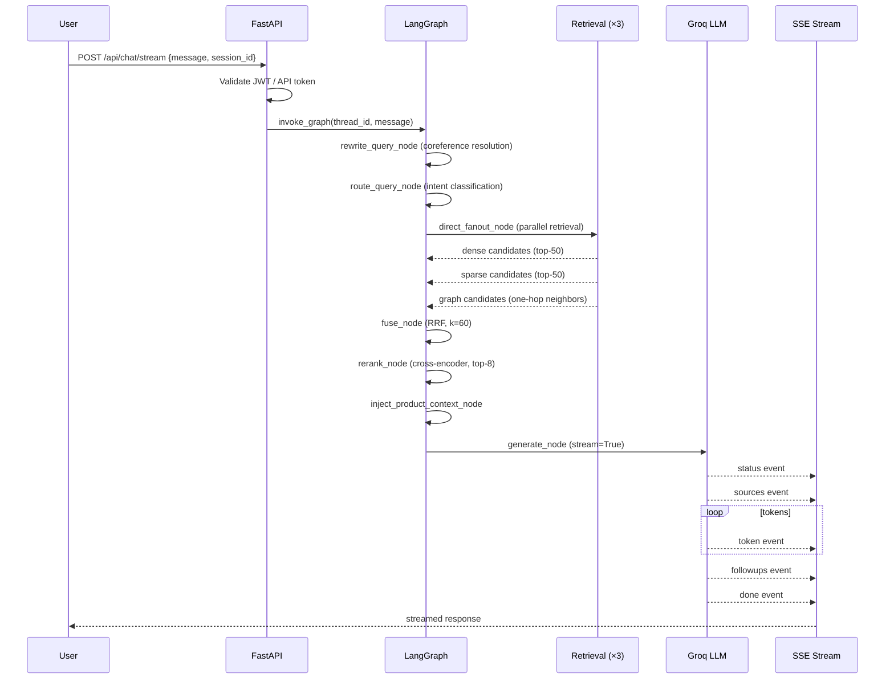
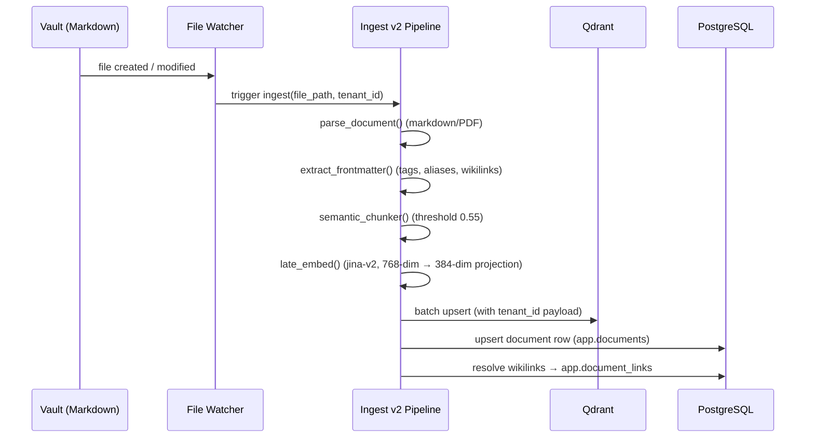

# Architecture Overview

NEXUS is composed of six interconnected layers. This document maps every component, its role, and how data flows through the system from vault note to streamed answer.

---

## System Architecture Diagram

```mermaid
graph TB
    subgraph CLIENTS["Client Layer"]
        WEB["Web SPA\nnexus-ui (React 18)"]
        MSG["Meta Messenger\n(inbound webhook)"]
        API_CLIENT["API Consumers\n(nxs_ tokens)"]
    end

    subgraph GATEWAY["API Gateway (FastAPI)"]
        MAIN["main.py\nASGI entrypoint"]
        AUTH_MW["Auth Middleware\nJWT / API Token"]
        ROUTERS["24 FastAPI Routers\n(chat, tenants, docs, products…)"]
    end

    subgraph ORCHESTRATOR["LangGraph Orchestrator"]
        GRAPH["StateGraph\n(NexusState)"]
        NODES["20+ Nodes\n(preprocess → rewrite → route\n→ retrieve → fuse → rerank\n→ generate → guardrails → respond)"]
        CHECKPOINTER["Postgres Checkpointer\n(thread-keyed multi-turn state)"]
    end

    subgraph RETRIEVAL["Retrieval Layer"]
        DENSE["Dense Arm\nQdrant + fastembed\n(bge-small-en-v1.5)"]
        SPARSE["Sparse Arm\nBM25 / rank_bm25\n(in-memory, 1h TTL)"]
        GRAPH_ARM["Graph Arm\nPostgres wikilink walk\n(one-hop, tenant-scoped)"]
        RRF["RRF Fusion\nk=60, equal weights"]
        RERANK["Cross-encoder Rerank\nXenova/ms-marco-MiniLM-L-6-v2\ntop-50 → top-8"]
    end

    subgraph GENERATION["Generation Layer"]
        GROQ["Groq LLM\nllama-3.3-70b-versatile\n(temp 0.3, max 1024)"]
        FOLLOWUP["Follow-up LLM\nllama-3.1-8b-instant\n(temp 0.5, 3/turn)"]
        GUARDRAILS["Guardrails Pipeline\n(citation + exactmatch + entropy)"]
    end

    subgraph INGEST["Ingest Layer"]
        WATCHER["File Watcher\n(watchdog)"]
        PIPELINE["Ingest v2 Pipeline\nparse → chunk → embed → upsert"]
        CHUNKER["Semantic Chunker\n(chonkie, threshold 0.55)"]
        LATE_EMBED["Late Chunker\n(jina-v2, 768-dim)"]
    end

    subgraph STORAGE["Storage Layer"]
        QDRANT[("Qdrant\ncollection: nexus-vault\n384-dim cosine")]
        PG[("PostgreSQL\napp schema\n17 tables")]
        MINIO[("MinIO / S3\navatars + product images")]
        REDIS[("Redis\nsessions + HITL + retry queue")]
    end

    subgraph VAULT["Knowledge Source"]
        OBSIDIAN["📁 Obsidian Vault\n(PARA structure)\nMarkdown + Wikilinks"]
    end

    OBSIDIAN --> WATCHER
    WATCHER --> PIPELINE
    PIPELINE --> CHUNKER
    CHUNKER --> LATE_EMBED
    LATE_EMBED --> QDRANT
    PIPELINE --> PG

    WEB --> MAIN
    MSG --> MAIN
    API_CLIENT --> MAIN
    MAIN --> AUTH_MW
    AUTH_MW --> ROUTERS
    ROUTERS --> GRAPH

    GRAPH --> NODES
    NODES --> CHECKPOINTER
    CHECKPOINTER --> PG
    NODES --> DENSE
    NODES --> SPARSE
    NODES --> GRAPH_ARM
    DENSE --> QDRANT
    SPARSE --> QDRANT
    GRAPH_ARM --> PG
    DENSE --> RRF
    SPARSE --> RRF
    GRAPH_ARM --> RRF
    RRF --> RERANK
    RERANK --> GROQ
    GROQ --> GUARDRAILS
    GUARDRAILS --> NODES
    NODES -->|SSE stream| WEB
    NODES -->|send()| MSG

    MINIO --> NODES
    REDIS --> NODES
```

---

## Layer Descriptions

### Client Layer

| Client | Protocol | Auth |
|---|---|---|
| **nexus-ui (React 18)** | HTTP + SSE | JWT (Bearer) |
| **Meta Messenger** | Webhook POST | HMAC SHA-256 signature |
| **API consumers** | HTTP REST | `nxs_` scoped API tokens |

### API Gateway — `rag/main.py`

The single ASGI application. Responsibilities:

- Mounts all 24 FastAPI routers under `/api/*` and `/api/v2/*`
- Serves the React SPA from `/static/*` and the embeddable widget from `/widget`
- Runs two lifespan tasks on startup: integration dispatcher registration and optional LangGraph Postgres checkpointer initialization
- All requests pass through the **auth middleware** which validates JWT or `nxs_` tokens before hitting router handlers

### LangGraph Orchestrator — `rag/orchestrator/graph.py`

The stateful conversation engine. Key design decisions:

- **`StateGraph`** with typed `NexusState` — all conversation context (messages, retrieved chunks, intent, citations) flows through a single state object
- **Thread-keyed checkpointing** — each conversation thread has a persistent state snapshot in Postgres; multi-turn context is automatically reconstructed
- **Conditional edges** — `route_query_node` classifies intent (`direct_answer` / `research` / `abandon`) and routes to different sub-graphs
- **Surface-aware prompting** — the `generate_node` selects system prompts based on the entry surface (chat SPA vs. Messenger)

### Retrieval Layer — `rag/retrieval/`

Three independent arms run in parallel via `direct_fanout_node`:

| Arm | Module | Method | Index |
|---|---|---|---|
| **Dense** | `dense.py` | cosine similarity (384-dim) | Qdrant (`nexus-vault`) |
| **Sparse** | `sparse.py` | BM25 keyword matching | In-memory (1h TTL rebuild) |
| **Graph** | `graph.py` | wikilink one-hop traversal | Postgres (`app.document_links`) |

Results from all three arms are combined by **Reciprocal Rank Fusion** (`rrf.py`, `k=60`), then the top-50 candidates are passed to the cross-encoder reranker which selects the final top-8 passages.

### Generation Layer — `rag/orchestrator/nodes.py`

| Component | Model | Role |
|---|---|---|
| **Primary LLM** | `llama-3.3-70b-versatile` | Main answer generation (temp 0.3, max 1024 tokens) |
| **Follow-up LLM** | `llama-3.1-8b-instant` | Fast suggestion generation (temp 0.5, 3 per turn) |
| **Guardrails pipeline** | — | Validates citation density, exactmatch, entropy before sending |

Generation streams as SSE events in this order:
```
status → sources → token × N → followups → done
```

### Ingest Layer — `rag/ingest_v2/`

The v2 pipeline processes every vault file through a deterministic chain:

```
parse (markdown/PDF) → frontmatter extraction → semantic chunking
  → late embedding (jina-v2, 768-dim) → Qdrant upsert + Postgres document row
```

> **📝 NOTE:** The legacy `ingest.py` (v1) still exists for backwards compatibility but routes through v2 for all new ingestion. Prefer `ingest_v2/` for direct invocation.

### Storage Layer

| Store | Purpose | Key detail |
|---|---|---|
| **Qdrant** | Vector search | Collection `nexus-vault`, 384-dim cosine, tenant_id payload filter |
| **PostgreSQL** | Relational data | `app` schema, 17 tables, Alembic-managed migrations |
| **MinIO / S3** | Object storage | Workspace avatars + product images (WebP) |
| **Redis** | Ephemeral state | HITL pause keys, outbound retry queue, rate-limit counters |

---

## Data Flow: Chat Request



---

## Data Flow: Vault Ingestion



---

## Technology Stack Summary

| Layer | Technology | Version |
|---|---|---|
| API framework | FastAPI + Uvicorn | ≥ 0.115 |
| AI orchestration | LangGraph | latest |
| Vector database | Qdrant + fastembed | ≥ 1.14 |
| Embeddings | BAAI/bge-small-en-v1.5 (fastembed) | 384-dim |
| Ingest embeddings | jina-v2 (late chunking) | 768-dim |
| LLM gateway | Groq (primary) + LiteLLM proxy | — |
| Relational DB | PostgreSQL + SQLAlchemy 2 + asyncpg | — |
| Migrations | Alembic | — |
| Object storage | MinIO / S3-compatible | — |
| Caching / state | Redis | — |
| Frontend | React 18 + Vite + Tailwind CSS | — |
| Static publishing | Quartz v4.5.2 | Node ≥ 22 |
| Package manager | uv (Python) | — |
| Observability | OpenTelemetry + Langfuse | — |

---

## Related Docs

- [Key Concepts & Glossary](key-concepts.md)
- [RAG Pipeline — Stage-by-Stage](../02-rag-pipeline/README.md)
- [LangGraph Orchestrator](../08-orchestrator/README.md)
- [Deployment Architecture](../12-deployment/README.md)
