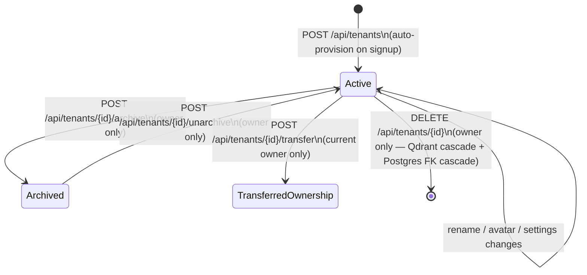
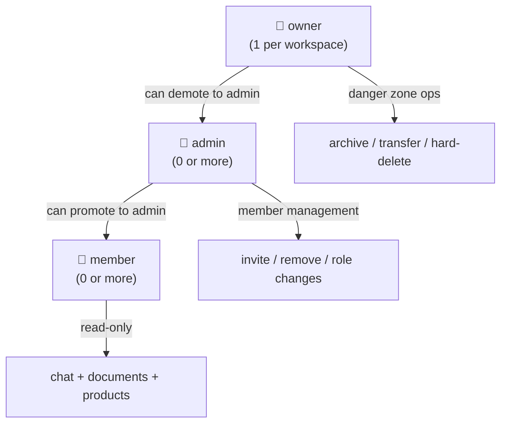
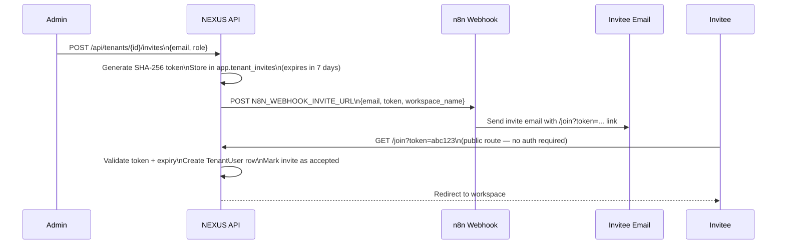

# Multi-Tenancy Model

NEXUS implements full workspace-level isolation across every data store. This document explains the isolation architecture, how tenants map to data, and the guarantees NEXUS provides.

---

## Overview

Every resource in NEXUS — documents, conversations, products, settings, members — belongs to exactly one **tenant** (workspace). Tenants are isolated at the storage layer, not just the application layer:

| Store | Isolation mechanism |
|---|---|
| **Qdrant** | Payload filter `tenant_id == slug` on every query |
| **PostgreSQL** | `tenant_id` foreign key on every tenant-scoped table |
| **MinIO** | Path prefix `{bucket}/{tenant_slug}/…` |
| **Redis** | Key namespace `nexus:hitl:paused:{sender_id}` (implicitly per-sender) |

> **⚠️ WARNING:** The Qdrant `tenant_id` payload filter is the **primary knowledge boundary**. Removing or bypassing it exposes one tenant's documents to another. All retrieval code in `rag/retrieval/` passes this filter unconditionally — never modify this without a security review.

---

## Tenant Lifecycle



---

## Roles & Permissions

Each tenant member has one of three roles:



| Action | `member` | `admin` | `owner` |
|---|:---:|:---:|:---:|
| Chat, read documents | ✅ | ✅ | ✅ |
| Invite new members | — | ✅ | ✅ |
| Change member roles | — | ✅ | ✅ |
| Remove members | — | ✅ | ✅ |
| Edit workspace name / avatar | — | ✅ | ✅ |
| Update AI settings / prompts | — | ✅ | ✅ |
| Manage integrations | — | ✅ | ✅ |
| Archive workspace | — | — | ✅ |
| Transfer ownership | — | — | ✅ |
| Hard-delete workspace | — | — | ✅ |
| Rotate JWT secret | — | — | ✅ |

---

## Tenant Provisioning

### Auto-Provisioning on Signup

When a new user registers, `auth/manager.py::_provision_personal_tenant()` automatically creates a personal workspace:
- **Name:** derived from the user's email
- **Slug:** slugified from the name + collision suffix if needed
- **Role:** the registering user becomes `owner`

### Manual Creation

```bash
POST /api/tenants
Authorization: Bearer <jwt>
Content-Type: application/json

{
  "name": "Acme Corp",
  "slug": "acme-corp"   # optional — auto-derived from name if omitted
}
```

Response includes the full tenant object. The caller becomes `owner`.

---

## Slug Rules & Constraints

The workspace slug is used as the `tenant_id` payload value in Qdrant. It must:

- Be unique across all tenants (enforced by a `UNIQUE` constraint on `app.tenants.slug`)
- Contain only URL-safe characters (lowercase letters, numbers, hyphens)
- Not be empty or whitespace-only

**Slug mutation constraint:** Once a workspace has documents indexed in Qdrant, the slug **cannot be changed**. The slug is baked into every Qdrant point's `tenant_id` payload — renaming it would orphan all existing vectors. The API enforces this with a 409 conflict if documents exist.

> **💡 PRO TIP:** Choose your slug carefully before ingesting documents. If you need to rename, contact the system admin to coordinate a Qdrant re-index.

---

## Data Isolation in Practice

### Qdrant Query (Retrieval)

Every retrieval arm appends a mandatory tenant filter:

```python
# rag/retrieval/dense.py
filter = Filter(
    must=[FieldCondition(key="tenant_id", match=MatchValue(value=tenant_slug))]
)
results = qdrant_client.search(
    collection_name=settings.qdrant_collection,
    query_vector=query_embedding,
    query_filter=filter,
    limit=retrieve_k
)
```

This runs at the Qdrant server level — there is no way for a query to accidentally cross tenant boundaries.

### PostgreSQL (Row-Level)

Every tenant-scoped table has a `tenant_id` column. All queries in `rag/routers/` use the `tenant_id` extracted from the authenticated user's session:

```python
# Example: list documents for current tenant only
stmt = select(Document).where(Document.tenant_id == current_tenant.id)
```

### Archived Workspace Guard

If a tenant is archived, `get_current_tenant()` in `rag/routers/deps.py` raises `403 Forbidden` for all API requests on that tenant — **except** `GET /api/tenants` (which still lists the tenant so the owner can see it and unarchive). This prevents accidental usage of an archived workspace.

---

## Invite Flow



---

## Tenant AI Settings Isolation

Each tenant has its own `ai_settings` JSONB blob in `app.tenants`. This blob controls:

- **Persona** — system prompt overlays per conversation scenario
- **Node toggles** — which LangGraph nodes are active
- **Model parameters** — temperature, max tokens, model choice

AI settings are tenant-scoped and only modifiable by `admin` or `owner` roles. They never bleed across tenants.

→ See [AI Customization →](../06-ai-customization/README.md) for details.

---

## Related Docs

- [RBAC Model](../04-workspace-management/rbac-model.md)
- [Token-Based Invites](../04-workspace-management/token-based-invites.md)
- [Workspace Lifecycle](../04-workspace-management/workspace-lifecycle.md)
- [Tenant Knowledge Boundary (Phase 46)](../06-ai-customization/README.md)
- [Authentication](../05-authentication/README.md)
