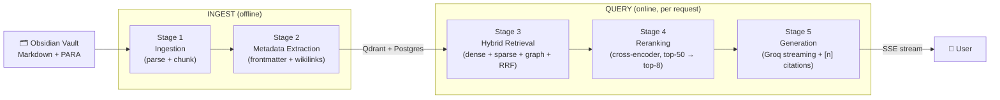

# RAG Pipeline

The NEXUS RAG pipeline transforms raw Markdown notes into grounded, cited answers through five sequential stages. Each stage is independently tunable and observable.

---

## Pipeline Overview

---

## Stage Summary

| Stage | Module | When runs | Key output |
|---|---|---|---|
| **1. Ingestion** | `rag/ingest_v2/pipeline.py` | On file change / manual trigger | Chunks in Qdrant + document rows in Postgres |
| **2. Metadata Extraction** | `rag/ingest_v2/metadata.py` | During ingestion | Rich payload per chunk (tags, heading path, content hash…) |
| **3. Hybrid Retrieval** | `rag/retrieval/` | Per chat request | Top-50 candidates from 3 arms, RRF-fused |
| **4. Reranking** | `rag/retrieval/rerank.py` | Per chat request | Top-8 passages ordered by cross-encoder score |
| **5. Generation** | `rag/orchestrator/nodes.py` | Per chat request | Streamed answer with `[n]` citations |

---

## Ingest vs. Query Phases

The pipeline has two distinct execution phases:

**Ingest phase (offline):** Triggered by file changes (watchdog), manual CLI invocation, or the `/api/documents/upload` endpoint. Reads vault files, processes them through Stages 1–2, and writes to Qdrant + Postgres. Results are durable — a note ingested once is queryable immediately.

**Query phase (online):** Triggered by every chat request. Stages 3–5 run inside the LangGraph `StateGraph` per turn. The query phase is latency-sensitive — total pipeline latency target is under 3 seconds for a standard 6-chunk response.

---

## Implementation Status

| Stage | Status | Gap |
|---|---|---|
| 1. Ingestion | ✅ Shipped | Semantic-boundary detector partially shipped; code-fence preservation pending |
| 2. Metadata | ✅ Shipped | Wikilinks, `aliases`, `source_kind`, `language` partially populated |
| 3. Hybrid Retrieval | ✅ Shipped | Dense + sparse + graph + RRF all live |
| 4. Reranking | ✅ Shipped | — |
| 5. Generation | ✅ Shipped | — |
| Evals / RAGAS | ⏳ Planned | No golden set or CI regression gate yet |
| BM25 persistence | ⏳ Planned | Sparse arm rebuilds in-memory per process |

---

## Stage Documents

| Document | Stage | Read when |
|---|---|---|
| [Stage 1 — Ingestion](stage-1-ingestion.md) | Offline | You're ingesting documents or debugging missing content |
| [Stage 2 — Metadata Extraction](stage-2-metadata-extraction.md) | Offline | You need to understand chunk payloads or add metadata fields |
| [Stage 3 — Hybrid Retrieval](stage-3-hybrid-retrieval.md) | Online | You're tuning recall, debugging poor search results |
| [Stage 4 — Reranking](stage-4-reranking.md) | Online | You're tuning precision or the confidence floor |
| [Stage 5 — Generation](stage-5-generation.md) | Online | You're debugging citations, streaming, or generation quality |

---

## Key Tuning Parameters

| Parameter | Stage | Where to change |
|---|---|---|
| `CHUNK_TOKENS` (default: 400) | 1 | Dynamic settings → `PATCH /api/settings` |
| `CHUNK_OVERLAP` (default: 50) | 1 | Dynamic settings |
| `SEMANTIC_BREAK_THRESHOLD` (default: 0.55) | 1 | Dynamic settings |
| `RETRIEVE_K` (default: 50) | 3 | Dynamic settings |
| `RERANK_CONFIDENCE_FLOOR` (default: 0.30) | 4 | Dynamic settings |
| `TOP_K` (default: 6) | 4→5 | Dynamic settings |

> **📝 NOTE:** Changes to chunking parameters (`CHUNK_TOKENS`, `CHUNK_OVERLAP`, `SEMANTIC_BREAK_THRESHOLD`) only affect **new ingestion runs**. Existing chunks are not automatically re-chunked. To apply new chunking to existing content, re-ingest the affected documents.

---

## Related Docs

- [Architecture Overview](../01-getting-started/architecture-overview.md) — system context
- [Orchestrator — Retrieval Routing](../08-orchestrator/retrieval-routing.md) — how intent determines retrieval strategy
- [Configuration Reference](../16-configuration-reference/dynamic-settings.md) — tunable parameters
- [Troubleshooting — RAG Pipeline Issues](../17-troubleshooting/rag-pipeline-issues.md)
