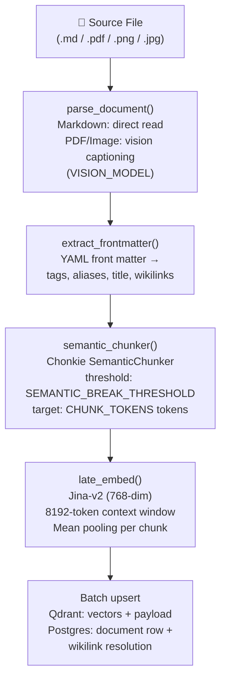

# Stage 1 — Ingestion

The ingestion stage converts raw vault files (Markdown, PDF, images) into discrete, embeddable chunks stored in Qdrant and tracked in PostgreSQL.

---

## Overview

**Business value:** Without quality ingestion, retrieval is blind. This stage determines the granularity, semantic coherence, and coverage of everything the retrieval system can access. A poorly chunked vault produces either too-large chunks (diluted relevance scores) or too-small chunks (missing context).

**Module:** `rag/ingest_v2/pipeline.py`
**Trigger:** File watcher (`rag/watcher.py`), API upload (`POST /api/documents/upload`), or manual CLI

---

## Prerequisites

- Qdrant running and reachable (`QDRANT_URL`)
- PostgreSQL running and migrated (`POSTGRES_DSN`)
- `VAULT_PATH` set to a valid directory
- Dependencies installed via `uv sync`

---

## Ingest v2 Pipeline Steps



---

## Step-by-Step: Triggering a Manual Ingest

### Single file

```bash
cd rag
uv run python -m ingest_v2.pipeline \
  --file "path/to/note.md" \
  --tenant-slug my-workspace
```

### Full vault

```bash
cd rag
uv run python -m ingest_v2.pipeline \
  --vault-path "$VAULT_PATH" \
  --tenant-slug my-workspace \
  --verbose
```

### Incremental (skip unchanged files)

The pipeline automatically skips files whose `content_hash` matches the stored hash in `app.documents`. Force a full re-ingest with `--force`:

```bash
uv run python -m ingest_v2.pipeline \
  --vault-path "$VAULT_PATH" \
  --tenant-slug my-workspace \
  --force
```

---

## Chunking Parameters

| Parameter | Default | Dynamic setting | Description |
|---|---|---|---|
| `CHUNK_TOKENS` | 400 | ✅ `CHUNK_TOKENS` | Target token count per chunk (tiktoken cl100k) |
| `CHUNK_OVERLAP` | 50 | ✅ `CHUNK_OVERLAP` | Token overlap between adjacent chunks |
| `SEMANTIC_BREAK_THRESHOLD` | 0.55 | ✅ `SEMANTIC_BREAK_THRESHOLD` | Cosine similarity floor between adjacent sentences |

### Semantic Chunking Logic

1. Sentences are split using a lightweight sentence tokenizer
2. Adjacent sentences are embedded using a fast local model
3. Cosine similarity is computed between consecutive sentence pairs
4. Where similarity drops below `SEMANTIC_BREAK_THRESHOLD`, a chunk boundary is inserted
5. Resulting segments are trimmed to the `CHUNK_TOKENS` target

> **📝 NOTE:** The semantic chunker uses a local embedding model for boundary detection only — this is separate from the retrieval embedding model. It runs offline during ingest and adds minimal latency per file.

---

## Supported File Types

| File type | Processing method |
|---|---|
| `.md` | Direct text parse + heading-path tree extraction |
| `.pdf` | Page rendering → vision captioning → Markdown assembly |
| `.png`, `.jpg`, `.jpeg`, `.heic` | Vision captioning → Markdown description |

> **⚠️ WARNING:** PDF and image ingestion uses the vision model (`VISION_MODEL`), which incurs Groq API token costs. Large PDFs (>20 pages) are capped at `VISION_PDF_MAX_IMAGES` pages. Set `VISION_PDF_CONCURRENCY` to control parallel page rendering.

---

## File Watcher (Continuous Ingest)

`rag/watcher.py` uses the `watchdog` library to monitor `VAULT_PATH` for file system events:

```bash
cd rag
uv run python -m watcher &
```

Events handled:
- `FileCreatedEvent` → ingest new file
- `FileModifiedEvent` → re-ingest if content hash changed
- `FileDeletedEvent` → archive document in Postgres + remove from Qdrant

The watcher runs as a background process alongside the API server. In production, it's managed as a separate systemd unit or Docker service.

---

## Incremental Ingest: How Content Hashing Works

Every chunk carries a `content_hash` (SHA-256 of the chunk text). The document-level hash is stored in `app.documents.content_hash`.

On each ingest trigger:
1. NEXUS computes the new file hash
2. Compares against the stored hash in `app.documents`
3. If unchanged → skip entirely (no Qdrant write, no token cost)
4. If changed → delete old Qdrant points for that file, re-chunk and upsert new points

This makes large-vault incremental ingestion efficient even when only a few files change per session.

---

## Output: Qdrant Point Structure

Each chunk becomes a Qdrant point:

```json
{
  "id": "550e8400-e29b-41d4-a716-446655440000",
  "vector": [0.023, -0.041, ...],
  "payload": {
    "tenant_id": "my-workspace",
    "file": "03-Resources/AI/LangGraph.md",
    "folder": "03-Resources",
    "title": "LangGraph",
    "heading_path": "## State Management > ### Checkpointing",
    "tags": ["ai", "langchain", "state"],
    "aliases": ["LangGraph SDK"],
    "content_hash": "sha256:abc123...",
    "chunk_index": 2,
    "chunk_total": 7,
    "modified_at": "2026-06-10T08:00:00Z",
    "indexed_at": "2026-06-10T08:01:23Z"
  }
}
```

---

## Known Gaps (as of Phase 53)

| Gap | Status |
|---|---|
| Code-fence preservation | ⏳ Pending — code blocks may be split across chunk boundaries |
| `source_kind` field | ⏳ Partial — `markdown` populated; `pdf`, `image` not yet distinguished |
| `language` field | ⏳ Not yet populated |
| Wikilink aliases in metadata | ⏳ Partial |

---

## Troubleshooting

| Symptom | Cause | Fix |
|---|---|---|
| Files not appearing after ingest | Content hash unchanged (cached) | Run with `--force` flag |
| PDF ingest slow | High `VISION_PDF_CONCURRENCY` contention | Reduce `VISION_PDF_CONCURRENCY` to 2 |
| `fastembed model not found` | Cache directory wrong or model not downloaded | Set `FASTEMBED_CACHE_DIR` explicitly; model downloads on first run |
| `tenant_id` not found in Qdrant | Wrong `--tenant-slug` passed | Verify slug matches `app.tenants.slug` in Postgres |

---

## Related Docs

- [Stage 2 — Metadata Extraction](stage-2-metadata-extraction.md)
- [Stage 3 — Hybrid Retrieval](stage-3-hybrid-retrieval.md)
- [Environment Variables — Ingest](../16-configuration-reference/environment-variables.md#ingest-pipeline)
- [POST /api/documents/upload](../03-api-reference/documents/upload.md)
