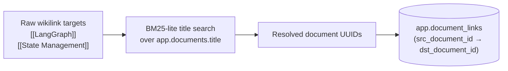

# Stage 2 — Metadata Extraction

Metadata extraction runs during ingestion and attaches structured, queryable context to every chunk stored in Qdrant. Rich metadata enables tenant-scoped filtering, faceted search, and the graph retrieval arm.

---

## Overview

**Business value:** Metadata is what turns raw chunk text into findable, filterable knowledge. Without `tenant_id`, chunks leak across workspaces. Without `heading_path`, answers can't be traced back to their source section. Without `wikilinks`, the graph retrieval arm is blind.

**Module:** `rag/ingest_v2/metadata.py`
**Runs:** Inline during the ingest pipeline, between chunking and Qdrant upsert

---

## Metadata Fields

Every chunk in Qdrant carries the following payload fields:

### Core Identity

| Field | Type | Source | Description |
|---|---|---|---|
| `tenant_id` | `str` | Caller-provided | Workspace slug. **Primary isolation key** — every retrieval query filters on this. |
| `file` | `str` | File path | Relative path from vault root (e.g., `03-Resources/AI/LangGraph.md`) |
| `folder` | `str` | Derived from `file` | First path component — maps to PARA bucket (e.g., `03-Resources`) |
| `title` | `str` | Frontmatter → H1 heading → filename | Human-readable document title |
| `heading_path` | `str` | AST traversal | Full heading breadcrumb to the chunk's location (e.g., `## State Management > ### Checkpointing`) |

### Content Identification

| Field | Type | Source | Description |
|---|---|---|---|
| `content_hash` | `str` | SHA-256 of chunk text | Deterministic hash for change detection and deduplication |
| `chunk_index` | `int` | Ingest pipeline | Zero-based index of this chunk within the document |
| `chunk_total` | `int` | Ingest pipeline | Total number of chunks in the document |

### Knowledge Graph

| Field | Type | Source | Description |
|---|---|---|---|
| `tags` | `list[str]` | Frontmatter `tags:` | Obsidian tags (e.g., `["ai", "langchain"]`) |
| `aliases` | `list[str]` | Frontmatter `aliases:` | Alternative names for this document |
| `wikilinks` | `list[str]` | Parsed from Markdown body | Outgoing wikilinks (`[[Note Title]]`) found in this chunk |

### Temporal

| Field | Type | Source | Description |
|---|---|---|---|
| `modified_at` | `datetime` | File system `mtime` | Last modified timestamp of the source file |
| `indexed_at` | `datetime` | Ingest time | When this chunk was last written to Qdrant |

### Classification (Partial — Phase 53+)

| Field | Type | Source | Status |
|---|---|---|---|
| `source_kind` | `str` | Derived from extension | ⏳ Partial: `markdown` only; `pdf`/`image` pending |
| `language` | `str` | Language detection | ⏳ Not yet implemented |

---

## Frontmatter Extraction

NEXUS uses the `python-frontmatter` library to parse YAML front matter from the top of Markdown files:

```markdown
---
title: LangGraph State Management
tags: [ai, langchain, state-machines]
aliases: [LangGraph SDK, LG State]
---

# LangGraph State Management

LangGraph uses a [[StateGraph]] to manage...
```

Extracted fields map directly to chunk payload fields. Files without frontmatter fall back to:
- `title` → first H1 heading → filename without extension
- `tags` → `[]`
- `aliases` → `[]`

---

## Heading Path Construction

NEXUS walks the Markdown AST to build a breadcrumb path for each chunk. For a chunk landing under `## Architecture > ### Nodes`, the `heading_path` field is:

```
## Architecture > ### Nodes
```

This allows the generation stage to include source context in citations:
```
[2] LangGraph.md — ## Architecture > ### Nodes
```

---

## Wikilink Extraction & Resolution

### Extraction (during chunking)

Wikilinks (`[[Title]]` or `[[Title|Alias]]`) are parsed from the chunk text using a regex pass. Extracted targets are stored in the chunk's `wikilinks` payload field.

### Resolution (post-ingest)

After all chunks for a file are upserted, `rag/ingest_v2/graph_index.py` resolves wikilinks to document UUIDs:



Unresolved links (targets without a matching document) are stored with `dst_document_id = NULL` — they won't participate in graph retrieval but are retained for future resolution when the target note is created.

---

## Document Row in PostgreSQL

Every ingested file creates or updates a row in `app.documents`:

```sql
INSERT INTO app.documents (
    id, tenant_id, file, title, folder, tags, aliases,
    source_kind, content_hash, chunk_total, modified_at, indexed_at
) VALUES (
    gen_random_uuid(), 'my-workspace', '03-Resources/AI/LangGraph.md',
    'LangGraph State Management', '03-Resources',
    '["ai", "langchain"]'::jsonb, '["LangGraph SDK"]'::jsonb,
    'markdown', 'sha256:abc123...', 7,
    '2026-06-10 08:00:00', now()
) ON CONFLICT (tenant_id, file) DO UPDATE SET ...;
```

This row is the authoritative record for change detection and is queried by the graph retrieval arm.

---

## Impact on Retrieval

| Metadata field | Used by |
|---|---|
| `tenant_id` | All 3 retrieval arms (mandatory filter) |
| `tags` | Optional future faceted filtering |
| `wikilinks` / `document_links` | Graph arm (wikilink traversal) |
| `heading_path` | Citation formatting in `generate_node` |
| `content_hash` | Incremental ingest deduplication |
| `modified_at` | Optional recency bias in reranker |
| `folder` | Optional PARA-scoped retrieval filters |

---

## Troubleshooting

| Symptom | Cause | Fix |
|---|---|---|
| `tags: []` for all chunks | Frontmatter missing or malformed YAML | Validate frontmatter with `python-frontmatter` CLI |
| `heading_path` is empty | Document has no Markdown headings | Add `#` headings to improve citation quality |
| Wikilinks unresolved (`dst_document_id = NULL`) | Target note not yet ingested | Ingest the target note, then re-ingest the source |
| Stale metadata after note edit | Incremental ingest skipping unchanged hash | Run ingest with `--force` |

---

## Related Docs

- [Stage 1 — Ingestion](stage-1-ingestion.md)
- [Stage 3 — Hybrid Retrieval](stage-3-hybrid-retrieval.md)
- [Orchestrator — Graph Architecture](../08-orchestrator/graph-architecture.md)
