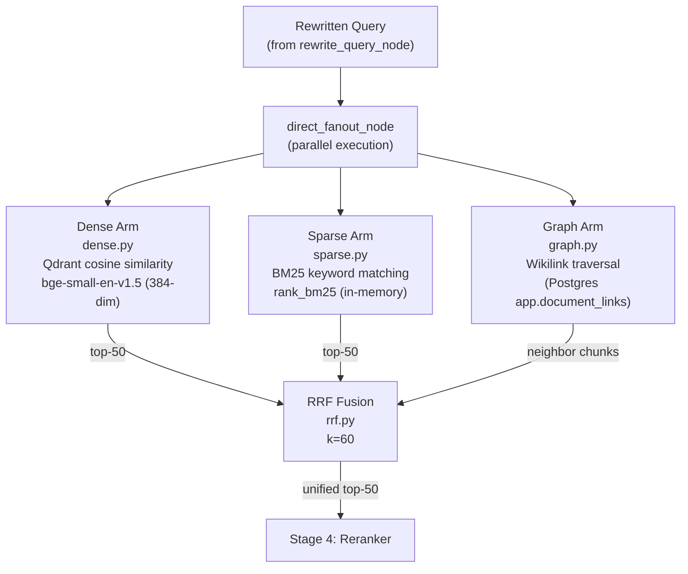
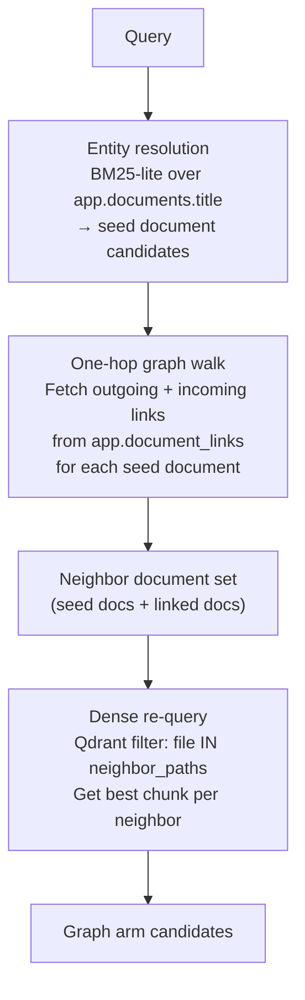

# Stage 3 — Hybrid Retrieval

NEXUS runs three retrieval arms in parallel and fuses their results using Reciprocal Rank Fusion (RRF). Each arm captures a different dimension of relevance: semantic similarity, keyword overlap, and conceptual relationships.

---

## Overview

**Business value:** No single retrieval method covers all queries well. Dense retrieval misses exact keyword matches; BM25 misses paraphrased queries; neither traverses the conceptual graph of a knowledge base. Hybrid retrieval with RRF fusion delivers higher recall than any single arm while controlling for noise.

**Modules:** `rag/retrieval/dense.py`, `rag/retrieval/sparse.py`, `rag/retrieval/graph.py`, `rag/retrieval/rrf.py`
**Runs:** Inside `direct_fanout_node` in the LangGraph orchestrator, per chat request

---

## Three-Arm Architecture



---

## Arm 1 — Dense Retrieval (`dense.py`)

Uses vector similarity search against the Qdrant collection.

### How it works

1. The query text is embedded using `BAAI/bge-small-en-v1.5` via fastembed (384 dimensions)
2. A Qdrant search is executed with a mandatory tenant filter
3. Returns the top `RETRIEVE_K` (default: 50) candidates by cosine similarity

```python
# Simplified
filter = Filter(must=[FieldCondition(key="tenant_id", match=MatchValue(value=tenant_slug))])
results = client.search(
    collection_name=settings.qdrant_collection,
    query_vector=embed(query),
    query_filter=filter,
    limit=retrieve_k
)
```

### Best for
- Paraphrased queries (same meaning, different words)
- Conceptual questions without specific keywords
- Cross-lingual queries (bge-small has multilingual capability)

### Limitations
- Struggles with rare proper nouns, model names, version numbers
- Cold-start: fastembed ONNX model must be cached before first query

---

## Arm 2 — Sparse Retrieval / BM25 (`sparse.py`)

Uses the BM25 ranking algorithm over the raw text of all indexed chunks.

### How it works

1. On first query (or after TTL expires), builds an in-memory BM25 index over all chunks for the tenant
2. Tokenizes using an alphanumeric regex (no stemming, for reproducibility)
3. Scores all documents and returns top `RETRIEVE_K`

```python
tokenizer = lambda text: re.findall(r'\b[a-zA-Z0-9]+\b', text.lower())
bm25 = BM25Okapi([tokenizer(chunk.text) for chunk in corpus])
scores = bm25.get_scores(tokenizer(query))
```

### BM25 Cache Behavior

| Event | Action |
|---|---|
| First query | Build index from Qdrant corpus (warm-up latency ~1–5s for large vaults) |
| Subsequent queries (within TTL) | Serve from cached index |
| TTL expiry (`BM25_CACHE_TTL_SECONDS`, default 3600s) | Rebuild on next query |
| Process restart | Cache lost — rebuild on next query |

> **⚠️ WARNING:** The BM25 index is held **in memory** and rebuilds per process. In a multi-worker Uvicorn setup, each worker maintains its own BM25 cache. BM25 persistence to disk (Phase 4 of the sparse arm roadmap) is not yet implemented.

### Best for
- Exact keyword queries (model names, error codes, specific terms)
- Short queries with high-information words
- Cases where bge-small misses due to vocabulary mismatch

---

## Arm 3 — Graph Retrieval (`graph.py`)

Traverses the wikilink knowledge graph to find conceptually related documents.

### How it works



### Step-by-step

1. **Entity resolution:** Run a BM25-lite search over `app.documents.title` to find the 3–5 most likely seed documents for the query
2. **One-hop traversal:** Query `app.document_links` for all outgoing AND incoming links from the seed documents
3. **Dense re-query:** Run a Qdrant search restricted to the union of seed + neighbor file paths, returning the best chunk per file
4. **Tenant scoping:** All three sub-steps filter on `tenant_id` — graph retrieval never crosses workspace boundaries

### Database query (simplified)

```sql
-- Fetch one-hop neighbors
SELECT dst_document_id FROM app.document_links
WHERE src_document_id = ANY(:seed_ids) AND tenant_id = :tenant_id
UNION
SELECT src_document_id FROM app.document_links
WHERE dst_document_id = ANY(:seed_ids) AND tenant_id = :tenant_id;
```

### Best for
- Questions that span multiple related notes (e.g., "how does X relate to Y?")
- When the answer lives in a note linked from the directly-queried note
- Exploratory queries about interconnected concepts

### Limitations
- Requires wikilinks to be present and resolved in `app.document_links`
- One-hop only — deep graph traversal is not implemented (Phase 31 scope)

---

## RRF Fusion (`rrf.py`)

Combines ranked lists from all three arms into a single unified ranking without requiring score normalization.

### Formula

For each document `d` appearing in result list `r` at rank `rank_r(d)`:

```
RRF_score(d) = Σ 1 / (k + rank_r(d))
```

Where `k = 60` (default — dampens the impact of very high ranks).

### Behavior

- A document appearing in all three arms ranks much higher than one appearing in only one
- A document ranked #1 in one arm but missing from others still appears — no arm is silenced
- The fusion produces a single sorted list of up to `RETRIEVE_K` unique documents

```python
def reciprocal_rank_fusion(result_lists: list[list[ScoredChunk]], k: int = 60) -> list[ScoredChunk]:
    scores: dict[str, float] = defaultdict(float)
    chunks: dict[str, ScoredChunk] = {}
    for results in result_lists:
        for rank, chunk in enumerate(results):
            scores[chunk.chunk_id] += 1.0 / (k + rank + 1)
            chunks[chunk.chunk_id] = chunk
    return sorted(chunks.values(), key=lambda c: scores[c.chunk_id], reverse=True)
```

### Tuning RRF

| Want | Adjustment |
|---|---|
| More keyword-match influence | Increase BM25 arm weight (not yet configurable; currently equal weights) |
| More graph-traversal influence | Ensure wikilinks are well-populated in vault |
| Higher recall overall | Increase `RETRIEVE_K` — more candidates feed the reranker |

---

## Configuration

| Parameter | Default | How to change |
|---|---|---|
| `RETRIEVE_K` | `50` | `PATCH /api/settings {"key": "RETRIEVE_K", "value": 80}` |
| RRF `k` constant | `60` | Hardcoded in `rrf.py` — requires code change |
| BM25 TTL | `3600s` | `BM25_CACHE_TTL_SECONDS` env var |

---

## Troubleshooting

| Symptom | Likely cause | Fix |
|---|---|---|
| Retrieval misses obvious notes | BM25 cold (first request) | Wait for warm-up or increase `RETRIEVE_K` |
| Graph arm returns nothing | No wikilinks resolved | Check `app.document_links` table; re-ingest if needed |
| Dense arm returns irrelevant results | Query too short or generic | Enable query rewriting (`rewrite_query_node`) |
| High retrieval latency (>500ms) | BM25 rebuild on large vault | Reduce vault size or implement BM25 persistence |

---

## Related Docs

- [Stage 4 — Reranking](stage-4-reranking.md)
- [Stage 2 — Metadata Extraction](stage-2-metadata-extraction.md) — wikilinks prerequisite for graph arm
- [Orchestrator — Retrieval Routing](../08-orchestrator/retrieval-routing.md)
- [Dynamic Settings](../16-configuration-reference/dynamic-settings.md)
