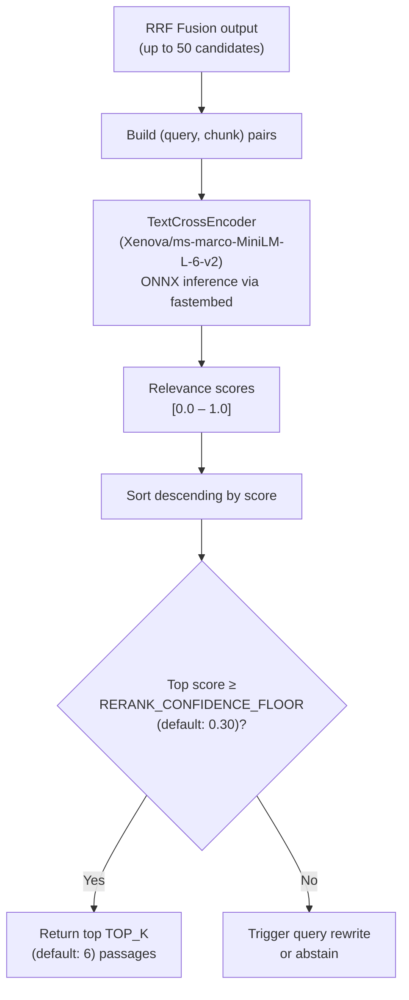

# Stage 4 — Reranking

The reranking stage applies a cross-encoder model to re-score the top-50 RRF-fused candidates and selects the final passages sent to the LLM. It is the primary precision control in the pipeline.

---

## Overview

**Business value:** RRF fusion improves recall but doesn't optimize for query-specific relevance — it aggregates signals from three arms without deeply understanding the query-passage relationship. The cross-encoder reads both query and passage together, producing much more accurate relevance scores at the cost of compute. It's the difference between "documents that are generally about this topic" and "passages that specifically answer this question."

**Module:** `rag/retrieval/rerank.py`
**Model:** `Xenova/ms-marco-MiniLM-L-6-v2` (ONNX, via fastembed `TextCrossEncoder`)
**Runs:** After RRF fusion, inside `rerank_node` in the LangGraph orchestrator

---

## How Cross-Encoding Works

A cross-encoder is a bi-encoder's more accurate counterpart. Instead of encoding query and passage independently and comparing vectors, the cross-encoder takes the concatenated `[query, passage]` pair as a single input and produces a single relevance score.

```
Input:  "What is LangGraph's checkpointing mechanism?"
        + "LangGraph persists state via PostgreSQL using AsyncPostgresSaver..."

Output: 0.87  ← single relevance score
```

This joint encoding captures nuanced query-passage interactions that vector similarity misses.

---

## Reranking Steps



---

## Configuration

| Parameter | Default | Dynamic setting | Description |
|---|---|---|---|
| `TOP_K` | `6` | ✅ | Final passages returned to LLM after reranking |
| `RERANK_CONFIDENCE_FLOOR` | `0.30` | ✅ | Minimum score for the top-ranked passage. Below this → rewrite or abstain |
| `RERANK_MODEL` | `Xenova/ms-marco-MiniLM-L-6-v2` | Env var | ONNX cross-encoder model |

### Changing TOP_K

```http
PATCH /api/settings
Authorization: Bearer <jwt>
Content-Type: application/json

{"key": "TOP_K", "value": 8}
```

Higher `TOP_K` → more context for the LLM → better answers for complex queries, higher token cost.

---

## Confidence Floor Behavior

The `RERANK_CONFIDENCE_FLOOR` gates whether a query gets answered at all:

| Top score | Behavior |
|---|---|
| `>= 0.30` (default) | Proceed to generation with top-`TOP_K` passages |
| `< 0.30` | `rerank_node` sets `low_confidence = True` in state |
| `low_confidence = True` | `guardrails_router` routes to `abstain_node` or query rewrite |

### Tuning the floor

- **Lower the floor** (e.g., `0.15`) → more answers, higher hallucination risk for off-topic queries
- **Raise the floor** (e.g., `0.50`) → more abstentions, higher-confidence responses only

> **💡 PRO TIP:** If users report "I don't know" responses on questions that *should* be answered, lower `RERANK_CONFIDENCE_FLOOR`. If they report hallucinated answers, raise it.

---

## Model Details

| Property | Value |
|---|---|
| Model | `Xenova/ms-marco-MiniLM-L-6-v2` |
| Framework | ONNX (via fastembed `TextCrossEncoder`) |
| Inference | Local CPU — no API cost |
| Input max tokens | 512 tokens (query + passage) |
| Output | Single float score per pair |
| Cache location | `FASTEMBED_CACHE_DIR` |

The model is downloaded once and cached locally. ONNX inference runs on CPU — typical latency for 50 pairs is 50–200ms on modern hardware.

---

## Recency Bias (Optional)

An optional recency bias can be applied after cross-encoder scoring by blending the cross-encoder score with a recency score derived from `modified_at`:

```
final_score = (1 - λ) × cross_encoder_score + λ × recency_score
```

Where `λ` defaults to `0.0` (recency bias disabled). This is available as a code-level configuration but not yet exposed as a dynamic setting.

---

## Output: ScoredChunk

The reranker returns a list of `ScoredChunk` objects:

```python
@dataclass
class ScoredChunk:
    chunk_id: str
    file: str
    heading_path: str
    content: str
    score: float          # cross-encoder score
    rrf_score: float      # original RRF score (preserved for debugging)
    tenant_id: str
```

These are passed directly to the `generate_node` as the `reranked_chunks` state field.

---

## Troubleshooting

| Symptom | Cause | Fix |
|---|---|---|
| Frequent "I don't know" on valid questions | `RERANK_CONFIDENCE_FLOOR` too high | Lower floor via `PATCH /api/settings` |
| Answers miss the best passage | `TOP_K` too low | Increase `TOP_K` to 8–10 |
| Reranker slow (>500ms) | Many candidates × long passages | Reduce `RETRIEVE_K` to feed fewer pairs |
| `fastembed model not found` | ONNX model not downloaded | Check `FASTEMBED_CACHE_DIR`; model downloads on first run |

---

## Related Docs

- [Stage 3 — Hybrid Retrieval](stage-3-hybrid-retrieval.md)
- [Stage 5 — Generation](stage-5-generation.md)
- [Guardrails](../14-guardrails/README.md)
- [Dynamic Settings](../16-configuration-reference/dynamic-settings.md)
