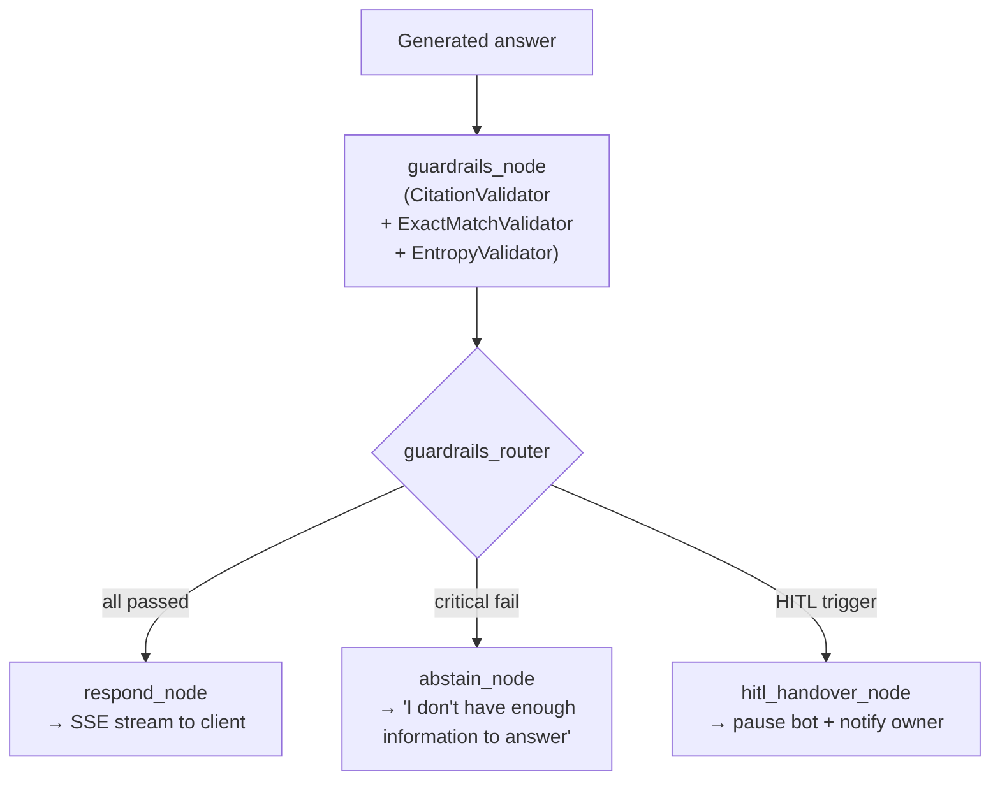

# Stage 5 — Generation

The generation stage takes the top-k reranked passages and synthesizes a grounded, cited, streaming answer using the Groq LLM. It is the final stage in the online query pipeline.

---

## Overview

**Business value:** Generation turns retrieved passages into coherent answers. The key constraints are citation enforcement (every factual claim traces to a source), streaming delivery (users see tokens as they arrive), and the guardrails gate (answers must pass validation before delivery). Together these produce responses that are both useful and accountable.

**Module:** `rag/orchestrator/nodes.py` (`generate_node`, `respond_node`)
**Primary model:** `llama-3.3-70b-versatile` via Groq
**Runs:** After `rerank_node`, inside the LangGraph orchestrator per chat request

---

## SSE Event Order

The response is delivered as a Server-Sent Events stream. Events arrive in this guaranteed sequence:

```
data: {"type": "status",   "content": "Searching knowledge base…"}
data: {"type": "sources",  "sources": [{...}, {...}]}
data: {"type": "token",    "content": "NEXUS"}
data: {"type": "token",    "content": " is"}
data: {"type": "token",    "content": " a"}
...
data: {"type": "followups","suggestions": ["What is PARA?", "How does RRF work?"]}
data: {"type": "done"}
```

| Event type | When sent | Content |
|---|---|---|
| `status` | Before retrieval | Human-readable progress message |
| `sources` | After reranking, before generation | List of source passages with metadata |
| `token` | During streaming generation | Single token from the LLM |
| `followups` | After generation completes | 3 follow-up question suggestions |
| `done` | End of stream | Empty — signals client to close connection |
| `error` | On pipeline failure | Error message string |

---

## Citation Enforcement

Every factual claim in the generated answer must carry a `[n]` citation referencing one of the provided passages. This is enforced at two levels:

### 1. Prompt-level instruction

The system prompt explicitly instructs the LLM:
```
You MUST cite every factual claim using [n] notation where n is the source number.
Unsupported claims are not permitted.
```

### 2. Guardrails validation

After generation, the `guardrails_node` runs `CitationValidator` which:
- Extracts all `[n]` references from the answer
- Verifies each referenced index maps to a real source
- Blocks the response if factual sentences lack citations

→ See [Guardrails — Citation Validator](../14-guardrails/citation-validator.md)

---

## Sources Object Structure

The `sources` event carries structured metadata for citation rendering:

```json
{
  "type": "sources",
  "sources": [
    {
      "index": 1,
      "file": "03-Resources/AI/LangGraph.md",
      "title": "LangGraph State Management",
      "heading_path": "## Architecture > ### Checkpointing",
      "excerpt": "LangGraph persists state via PostgreSQL using AsyncPostgresSaver...",
      "score": 0.87,
      "url": null
    }
  ]
}
```

The frontend renders these as clickable source cards beneath the answer.

---

## System Prompt Assembly

The active system prompt is assembled per-request by `ai_settings.py::assemble_system_prompt()`:

```
[Base system prompt from resources library]
+
[Persona suffix from tenant ai_settings.scenario_prompts.core_behavior]
+
[Situational overlay: intro / checkout / hitl — based on conversation state]
```

→ See [AI Customization — Persona Engine](../06-ai-customization/persona-engine.md)

---

## Follow-up Generation

After the main answer is complete, `generate_followups()` runs a separate, faster call using the follow-up model:

| Property | Value |
|---|---|
| Model | `llama-3.1-8b-instant` |
| Temperature | `0.5` |
| Count | 3 suggestions per turn |
| Prompt | Derives contextually relevant follow-up questions from the conversation |

Follow-ups are sent as the `followups` SSE event before `done`.

---

## Generation Parameters

| Parameter | Default | Override mechanism |
|---|---|---|
| Primary model | `llama-3.3-70b-versatile` | Dynamic setting `GROQ_MODEL` → per-tenant `model_choice` |
| Temperature | `0.3` | Per-tenant `ai_settings.model_params.temperature` |
| Max tokens | `1024` | Per-tenant `ai_settings.model_params.max_tokens` |
| Follow-up model | `llama-3.1-8b-instant` | Dynamic setting `FOLLOWUP_MODEL` |
| Follow-up temp | `0.5` | Hardcoded |

### Override precedence (most specific wins)

```
per-tenant model_params → GROQ_MODEL dynamic setting → GROQ_MODEL env var
```

---

## Guardrails Gate

Before the answer is delivered to the client, it passes through the `guardrails_node`:



→ See [Guardrails Overview](../14-guardrails/README.md)

---

## Surface-Aware Generation

The `generate_node` behaves differently based on the `surface` field in `NexusState`:

| Surface | System prompt source | Output format |
|---|---|---|
| `chat` | Resources library prompt | Markdown with `[n]` citations |
| `messenger` | `rag/orchestrator/prompts/system_brix.md` (Seina persona) | Plain text, conversational tone |

Messenger responses avoid Markdown formatting (bold, bullets, headings) because Meta Messenger renders plain text only.

---

## Abstention

When the reranker confidence floor is not met, or guardrails fail critically, the `abstain_node` sends:

```
data: {"type": "token", "content": "I don't have enough information in your knowledge base to answer this question confidently. Please rephrase or add relevant notes to your vault."}
data: {"type": "done"}
```

Abstention is preferable to a hallucinated response. The guardrails + confidence floor combination ensures NEXUS never fabricates information it can't source.

---

## Troubleshooting

| Symptom | Cause | Fix |
|---|---|---|
| Answers lack citations | Model ignoring citation instructions | Check active system prompt includes citation rules; lower `RERANK_CONFIDENCE_FLOOR` |
| Stream stops mid-response | Groq token limit hit | Reduce `TOP_K` to shorten context; increase `max_tokens` via AI settings |
| `status` event but no tokens | Abstention triggered | Lower `RERANK_CONFIDENCE_FLOOR` or check if relevant notes are ingested |
| Follow-ups are generic | Follow-up model temperature too low | Not currently configurable (hardcoded `0.5`) |
| Wrong persona for tenant | `ai_settings` not updated | `PUT /api/workspace/ai-settings` to set correct `core_behavior` prompt |

---

## Related Docs

- [Stage 4 — Reranking](stage-4-reranking.md)
- [Guardrails Overview](../14-guardrails/README.md)
- [AI Customization — Persona Engine](../06-ai-customization/persona-engine.md)
- [POST /api/chat/stream](../03-api-reference/chat/stream.md)
- [Orchestrator — Nodes Reference](../08-orchestrator/nodes-reference.md)
