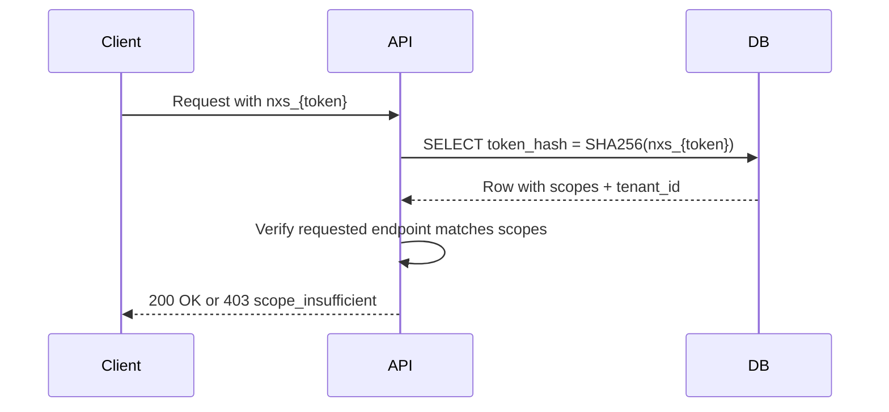

# API Tokens

Manage long-lived `nxs_` API tokens for programmatic access. Tokens are scoped, never expire unless revoked, and are an alternative to short-lived JWTs.

---

## List Tokens

```
GET /api/tokens
Authorization: Bearer {jwt_token}
```

Returns metadata only — the raw token value is shown once at creation and never again.

```json
{
  "tokens": [
    {
      "id": "uuid",
      "name": "CI/CD Pipeline",
      "scopes": ["chat", "documents"],
      "prefix": "nxs_abc1",
      "created_at": "2026-05-15T09:00:00Z",
      "last_used_at": "2026-06-13T18:32:00Z"
    }
  ]
}
```

---

## Create Token

```
POST /api/tokens
Authorization: Bearer {jwt_token}
Content-Type: application/json
```

```json
{
  "name": "CI/CD Pipeline",
  "scopes": ["chat", "documents"]
}
```

| Field | Type | Required | Notes |
|---|---|---|---|
| `name` | string | Yes | Human-readable label; max 80 chars |
| `scopes` | string[] | Yes | At least one scope required |

### Available Scopes

| Scope | Grants access to |
|---|---|
| `chat` | `POST /api/chat/stream`, `/api/chat/feedback`, `/api/chat/upload` |
| `documents` | `GET /api/documents`, `POST /api/documents/*` |
| `admin` | All management endpoints (treat as superscope — use sparingly) |

### Response

```json
{
  "id": "uuid",
  "name": "CI/CD Pipeline",
  "scopes": ["chat", "documents"],
  "token": "nxs_abc1234567890abcdef...",
  "prefix": "nxs_abc1",
  "created_at": "2026-06-14T08:00:00Z"
}
```

> **🔒 SECURITY:** The `token` field is returned **once only** at creation. Store it immediately in a secret manager. There is no way to retrieve the raw value again — only revoke and recreate.

---

## Revoke Token

```
DELETE /api/tokens/{token_id}
Authorization: Bearer {jwt_token}
```

Returns `204 No Content`. The token is immediately invalidated — any in-flight requests using it will receive `401`.

---

## How Tokens Are Verified



Tokens are stored as `SHA-256(raw_token)` — the plaintext is never persisted.

---

## Permissions

Creating and revoking tokens requires JWT auth (not another API token). The `admin` scope cannot be self-granted — it must be assigned by a superuser.

---

## Error Responses

| HTTP code | Cause |
|---|---|
| `401` | Missing or expired JWT (token management requires JWT auth) |
| `403` | Attempting to grant `admin` scope without superuser |
| `404` | Token ID not found or belongs to another user |
| `422` | Missing `name` or empty `scopes` array |

---

## Related Docs

- [API Tokens (conceptual)](../../05-authentication/api-tokens.md)
- [Authentication in the API](../authentication-in-api.md)
- [RBAC Enforcement](../../05-authentication/rbac-enforcement.md)
