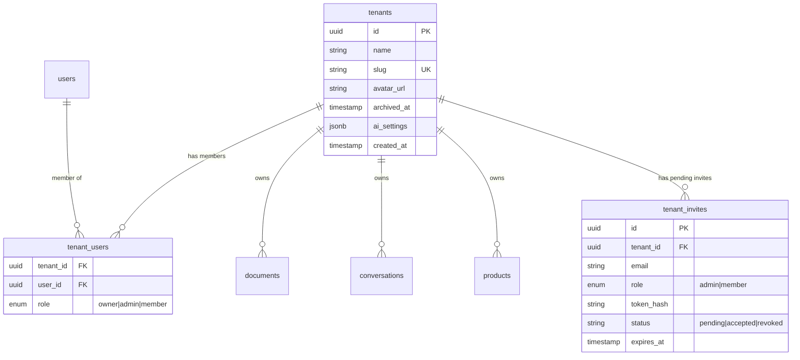
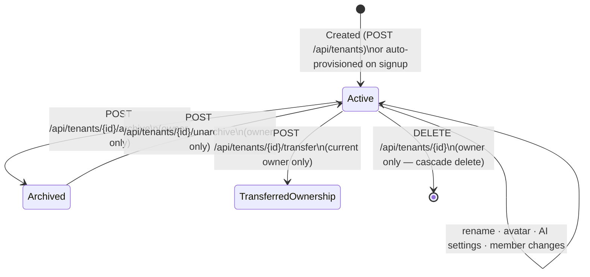

# Workspace Management

Workspaces (tenants) are the primary unit of isolation in NEXUS. Every user, document, conversation, product, and AI configuration belongs to exactly one workspace. This section covers the full lifecycle: creation, member management, invites, branding, and the danger zone.

---

## Architecture



---

## Workspace Lifecycle



---

## RBAC Summary

| Role | Description | Key exclusive permissions |
|---|---|---|
| `owner` | 1 per workspace | Archive, transfer, hard-delete, JWT rotation |
| `admin` | 0 or more | Invite, remove members, role changes, AI settings |
| `member` | 0 or more | Chat, read documents and products |

→ Full permission matrix: [RBAC Model](rbac-model.md)

---

## Documents in This Section

| Document | Read when |
|---|---|
| [RBAC Model](rbac-model.md) | Understanding roles, permissions, constraint enforcement |
| [Creating Workspaces](creating-workspaces.md) | First workspace setup, slug rules, auto-provisioning |
| [Member Management](member-management.md) | Adding/removing members, changing roles |
| [Token-Based Invites](token-based-invites.md) | Email invite flow, `/join` route, token lifecycle |
| [Workspace Lifecycle](workspace-lifecycle.md) | Rename, avatar, archive, ownership transfer |
| [Avatar & Branding](avatar-branding.md) | MinIO WebP uploads, CDN presigned URLs |
| [Usage Telemetry](usage-telemetry.md) | Document counts, member counts, Qdrant chunks, 7-day messages |
| [Danger Zone](danger-zone.md) | Archive, ownership transfer, hard-delete with Qdrant cascade |

---

## Quick Reference

```bash
# Create workspace
curl -X POST /api/tenants \
  -H "Authorization: Bearer <jwt>" \
  -d '{"name": "Acme Corp"}'

# List members
curl /api/tenants/{id}/members -H "Authorization: Bearer <jwt>"

# Invite a member
curl -X POST /api/tenants/{id}/invites \
  -H "Authorization: Bearer <jwt>" \
  -d '{"email": "colleague@example.com", "role": "admin"}'

# Get usage stats
curl /api/tenants/{id}/usage -H "Authorization: Bearer <jwt>"
```

---

## Related Docs

- [Multi-Tenancy Model](../01-getting-started/multi-tenancy-model.md) — isolation architecture
- [Authentication — RBAC Enforcement](../05-authentication/rbac-enforcement.md)
- [AI Customization](../06-ai-customization/README.md) — per-workspace AI settings
