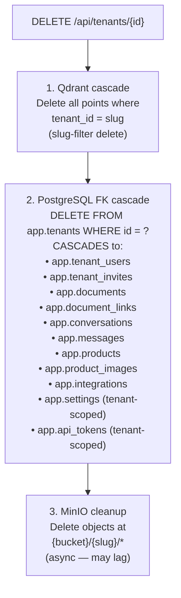

# Danger Zone

The danger zone covers irreversible or high-impact workspace operations: ownership transfer and hard-delete. All require the `owner` role.

---

## Operations Overview

| Operation | Reversible? | Data loss? | Endpoint |
|---|---|---|---|
| Archive | ✅ Yes (unarchive) | None | `POST /api/tenants/{id}/archive` |
| Unarchive | ✅ Yes | None | `POST /api/tenants/{id}/unarchive` |
| Transfer ownership | ⚠️ Only by new owner | None | `POST /api/tenants/{id}/transfer` |
| Hard-delete | ❌ No | All data destroyed | `DELETE /api/tenants/{id}` |

> **⚠️ WARNING:** Hard-delete is permanent. All workspace data — documents, conversations, products, members, Qdrant vectors, and MinIO objects — is destroyed. There is no recovery path. The API does not require a confirmation token, so client applications should implement a "type workspace name to confirm" UI gate before calling this endpoint.

---

## Ownership Transfer

Transfers the `owner` role from the current owner to another workspace member.

```http
POST /api/tenants/{tenant_id}/transfer
Authorization: Bearer <owner-jwt>
Content-Type: application/json

{
  "new_owner_user_id": "661f9511-e29b-41d4-a716-446655440001"
}
```

**Preconditions:**
- The target user must already be a member of the workspace
- The caller must be the current `owner`

**Effect:**
- `new_owner_user_id` role → `owner`
- Previous owner role → `admin`

**Response:**

```json
{
  "message": "Ownership transferred successfully",
  "new_owner_id": "661f9511-...",
  "previous_owner_new_role": "admin"
}
```

> **📝 NOTE:** The previous owner retains `admin` access after transfer — they are not removed from the workspace. To fully remove the previous owner after transfer, the new owner must use `DELETE /api/tenants/{id}/members/{user_id}`.

---

## Hard-Delete Workspace

Permanently destroys the workspace and all associated data.

```http
DELETE /api/tenants/{tenant_id}
Authorization: Bearer <owner-jwt>
```

**Cascade behavior:**



**Response:** `204 No Content`

> **⚠️ WARNING:** The Qdrant cascade runs **before** the Postgres delete. If Qdrant is unreachable, the API returns `503` and the delete is aborted — no data is lost. If Qdrant succeeds but Postgres fails, Qdrant vectors are orphaned. In this edge case, re-run the delete after Postgres is healthy.

---

## Pre-Delete Checklist

Before hard-deleting a workspace, verify:

- [ ] All members have been notified
- [ ] Important conversations or documents have been exported
- [ ] n8n automations referencing this workspace have been disabled
- [ ] Messenger page binding (if any) has been unlinked via `DELETE /api/integrations/messenger/pages/{page_id}`
- [ ] No active API tokens are in use by external integrations

---

## Archived vs. Deleted

| | Archived | Deleted |
|---|---|---|
| Data preserved | ✅ Yes | ❌ No |
| Recoverable | ✅ Unarchive | ❌ Never |
| Members can access | ❌ No | ❌ No (workspace gone) |
| Appears in tenant list | ✅ Yes (with archived_at) | ❌ No |
| Qdrant vectors | ✅ Intact | ❌ Deleted |
| Billing impact | Same | Reduced (fewer resources) |

**Prefer archiving over deleting** unless storage cost is a concern or regulatory requirements mandate data deletion.

---

## Troubleshooting

| Symptom | Cause | Fix |
|---|---|---|
| `503` on DELETE | Qdrant unreachable | Restore Qdrant connectivity; retry delete |
| `403 Owner role required` | Caller is admin, not owner | Transfer ownership first or request owner to perform the operation |
| Workspace still appears after delete | Frontend cache | Hard-refresh; workspace list re-fetches on navigation |
| MinIO objects not cleaned up | MinIO cleanup is async | Objects are cleaned asynchronously; check MinIO console after ~60s |

---

## Related Docs

- [Workspace Lifecycle](workspace-lifecycle.md) — archive/unarchive
- [RBAC Model](rbac-model.md)
- [API Reference — Workspace Lifecycle](../03-api-reference/workspaces/lifecycle.md)
