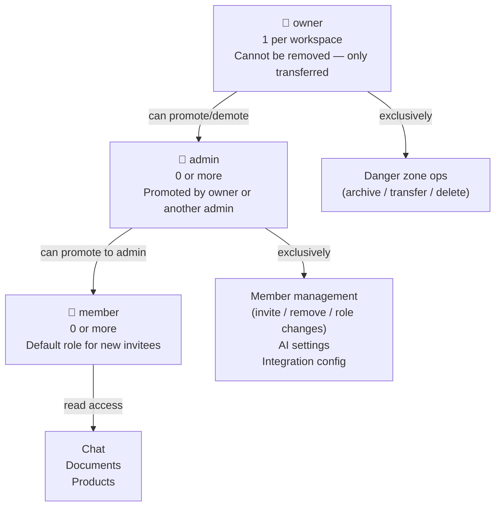

# RBAC Model

NEXUS enforces a 3-tier role hierarchy within each workspace. Roles are stored in `app.tenant_users.role` and validated at the application layer (FastAPI deps) and the database layer (CHECK constraint).

---

## Role Hierarchy



---

## Full Permission Matrix

| Operation | `member` | `admin` | `owner` | Required dependency |
|---|:---:|:---:|:---:|---|
| **Chat & Data** | | | | |
| Send chat messages | ✅ | ✅ | ✅ | `require_auth_or_token("chat:write")` |
| Read documents | ✅ | ✅ | ✅ | `require_auth_or_token("documents:read")` |
| Upload documents | — | ✅ | ✅ | `require_auth_or_token("documents:write")` |
| Read products | ✅ | ✅ | ✅ | `require_auth_or_token` |
| Manage products | — | ✅ | ✅ | `require_manager` |
| Read dashboard stats | ✅ | ✅ | ✅ | `require_auth_or_token("dashboard:read")` |
| **Member Management** | | | | |
| List members | — | ✅ | ✅ | `require_manager` |
| Invite new members | — | ✅ | ✅ | `require_manager` |
| Change member roles | — | ✅ | ✅ | `require_manager` |
| Remove members | — | ✅ | ✅ | `require_manager` |
| Resend/revoke invites | — | ✅ | ✅ | `require_manager` |
| **Workspace Settings** | | | | |
| Read AI settings | — | ✅ | ✅ | `require_manager` |
| Update AI settings | — | ✅ | ✅ | `require_manager` |
| Read dynamic settings | — | ✅ | ✅ | `require_manager` |
| Update dynamic settings | — | — | ✅ | `require_owner` |
| Manage integrations | — | ✅ | ✅ | `require_manager` |
| Upload workspace avatar | — | ✅ | ✅ | `require_manager` |
| Rename workspace | — | ✅ | ✅ | `require_manager` |
| **Danger Zone** | | | | |
| Archive workspace | — | — | ✅ | `require_owner` |
| Unarchive workspace | — | — | ✅ | `require_owner` |
| Transfer ownership | — | — | ✅ | `require_owner` |
| Hard-delete workspace | — | — | ✅ | `require_owner` |
| Rotate JWT secret | — | — | ✅ | `require_owner` |

---

## Role Assignment Rules

### At workspace creation
The creating user automatically becomes `owner` via `auth/manager.py::_provision_personal_tenant()`.

### At invite acceptance
New members are assigned the role specified in the invite (`admin` or `member`). Owners cannot be created via invite — ownership is transferred via the transfer endpoint.

### Role changes
```http
PATCH /api/tenants/{id}/members/{user_id}
Authorization: Bearer <manager-jwt>
Content-Type: application/json

{"role": "admin"}
```

**Constraints:**
- Admins can promote members to admin and demote admins to member
- Only the owner can demote an admin to member
- The owner's own role cannot be changed via this endpoint — use ownership transfer instead

### Owner constraint
Each workspace has exactly one `owner`. The `require_owner` dep enforces this by checking `role == "owner"` in `app.tenant_users`.

---

## Database Enforcement

```sql
-- Migration 0008: phase50_rbac_admin
ALTER TABLE app.tenant_users
  ADD CONSTRAINT tenant_users_role_check
  CHECK (role IN ('owner', 'admin', 'member'));
```

Invalid role strings are rejected at the database level before the application-level check runs. This provides defense in depth.

---

## Checking Your Own Role

```http
GET /api/tenants/{id}
Authorization: Bearer <jwt>
```

The response includes a `my_role` field:

```json
{
  "id": "...",
  "name": "Acme Corp",
  "slug": "acme-corp",
  "my_role": "admin",
  "member_count": 5
}
```

---

## Related Docs

- [RBAC Enforcement](../05-authentication/rbac-enforcement.md) — FastAPI dependency implementation
- [Creating Workspaces](creating-workspaces.md)
- [Member Management](member-management.md)
- [Danger Zone](danger-zone.md)
