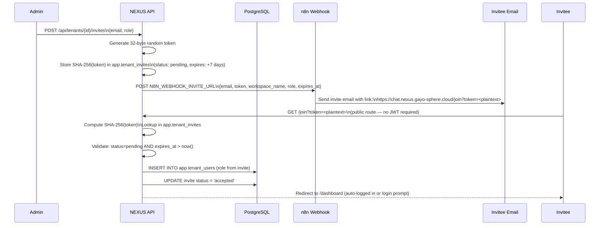

# Token-Based Invites

NEXUS uses a SHA-256 token-based invite system to add new members to a workspace. Invites are delivered via email (n8n webhook) and accepted through a public `/join` route requiring no prior authentication.

---

## Invite Flow



---

## Prerequisites

- `N8N_WEBHOOK_INVITE_URL` environment variable set to a valid n8n webhook URL
- n8n workflow configured to send invite emails (template: workspace name, role, accept link)
- Caller has `admin` or `owner` role in the workspace

---

## Creating an Invite

```http
POST /api/tenants/{tenant_id}/invites
Authorization: Bearer <manager-jwt>
Content-Type: application/json

{
  "email": "colleague@example.com",
  "role": "member"
}
```

**Valid roles for invites:** `admin` or `member` only. `owner` cannot be assigned via invite.

**Response:**

```json
{
  "id": "550e8400-e29b-41d4-a716-446655440000",
  "email": "colleague@example.com",
  "role": "member",
  "status": "pending",
  "expires_at": "2026-06-20T00:00:00Z",
  "created_at": "2026-06-13T00:00:00Z"
}
```

The plaintext token is **not** returned in the response — it is sent only via the n8n email webhook.

---

## Invite Token Lifecycle

| State | Meaning | Next transition |
|---|---|---|
| `pending` | Sent, not yet accepted | → `accepted` on `/join` success, or → `revoked` if cancelled |
| `accepted` | Invitee joined the workspace | Terminal |
| `revoked` | Cancelled by admin/owner | Terminal |

**Expiry:** Invites expire after **7 days** (`expires_at = created_at + 7 days`). Expired invites return a `400 Bad Request` on `/join`.

---

## Listing Pending Invites

```http
GET /api/tenants/{tenant_id}/invites
Authorization: Bearer <manager-jwt>
```

Response:

```json
[
  {
    "id": "...",
    "email": "colleague@example.com",
    "role": "member",
    "status": "pending",
    "expires_at": "2026-06-20T00:00:00Z"
  }
]
```

---

## Resending an Invite

```http
POST /api/tenants/{tenant_id}/invites/{invite_id}/resend
Authorization: Bearer <manager-jwt>
```

Generates a **new token**, updates the expiry to +7 days from now, fires the n8n webhook again with the new link. The old token is immediately invalid.

---

## Revoking an Invite

```http
DELETE /api/tenants/{tenant_id}/invites/{invite_id}
Authorization: Bearer <manager-jwt>
```

Sets `status = 'revoked'`. The token is invalid for `/join`. Returns `204 No Content`.

---

## The `/join` Route

The `/join?token=<plaintext>` route is **public** — no JWT or authentication required. This allows invitees who don't yet have a NEXUS account to accept the invite.

**Acceptance flow:**
1. Token is hashed and looked up in `app.tenant_invites`
2. Validates: `status = 'pending'` AND `expires_at > now()`
3. If the invitee email already has a NEXUS account: adds `TenantUser` row, redirects to dashboard
4. If new user: creates account, adds `TenantUser` row, prompts to set password, redirects

---

## Security Model

| Mechanism | Purpose |
|---|---|
| SHA-256 hash stored in DB | Plaintext token never persisted — compromise of DB doesn't expose tokens |
| 7-day expiry | Limits window for leaked invite links |
| Single-use | Token marked `accepted` on first use — replay blocked |
| Role specified at invite time | Invitee cannot choose their own role |
| Revocation | Admin/owner can cancel at any time before acceptance |

> **⚠️ WARNING:** The `/join` URL contains the plaintext token as a query parameter. Treat invite links as single-use secrets. Do not share them publicly or in group channels.

---

## n8n Webhook Payload

When an invite is created (or resent), NEXUS posts to `N8N_WEBHOOK_INVITE_URL`:

```json
{
  "email": "colleague@example.com",
  "role": "member",
  "workspace_name": "Acme Corp",
  "accept_url": "https://chat.nexus.gayo-sphere.cloud/join?token=abc123...",
  "expires_at": "2026-06-20T00:00:00Z",
  "invited_by": "admin@acme.com"
}
```

Configure your n8n workflow to use these fields in the email template.

---

## Troubleshooting

| Symptom | Cause | Fix |
|---|---|---|
| Invite email not received | `N8N_WEBHOOK_INVITE_URL` not set or n8n workflow inactive | Check env var; test n8n webhook manually |
| `/join` returns `400 Invalid or expired invite` | Token expired (>7 days) or revoked | Resend invite |
| `/join` returns `400 Already accepted` | Invitee already joined | Member already exists — check via `GET /api/tenants/{id}/members` |
| Invitee can't find invite email | Spam filter or wrong email | Check spam; resend to correct address |

---

## Related Docs

- [Member Management](member-management.md)
- [RBAC Model](rbac-model.md)
- [Multi-Tenancy Model](../01-getting-started/multi-tenancy-model.md)
- [Integrations — n8n Automation](../10-integrations/n8n-automation.md)
