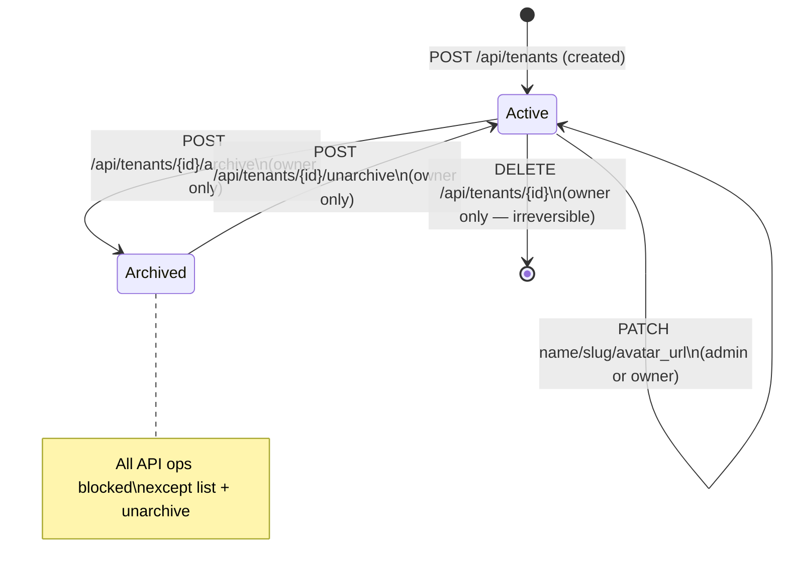

# Workspace Lifecycle

Workspaces move through defined states: active → archived → active, or active → deleted. This document covers rename, slug management, archive/unarchive, and the preconditions for each transition.

---

## Lifecycle State Machine



---

## Rename a Workspace

```http
PATCH /api/tenants/{tenant_id}
Authorization: Bearer <manager-jwt>
Content-Type: application/json

{
  "name": "Acme Corp International"
}
```

**Name** can be changed freely at any time. The display name in the UI updates immediately.

---

## Change the Slug

```http
PATCH /api/tenants/{tenant_id}
Authorization: Bearer <manager-jwt>
Content-Type: application/json

{
  "slug": "acme-intl"
}
```

> **⚠️ WARNING:** Slug changes are **blocked** if the workspace has indexed documents. The slug is embedded in every Qdrant point's `tenant_id` payload — changing it without re-indexing would make all existing documents unfindable.

**Error response when blocked:**
```json
{"detail": "Cannot change slug: workspace has indexed documents"}
```

**To change slug with existing documents:**
1. Delete or archive all documents in the workspace
2. Change the slug
3. Re-ingest documents under the new slug

---

## Archive a Workspace

Archiving soft-deletes the workspace. The workspace remains in the database but all API operations are blocked for members.

```http
POST /api/tenants/{tenant_id}/archive
Authorization: Bearer <owner-jwt>
```

**Response:** `200 OK` with updated workspace object (`archived_at` set to current time).

**Effect:**
- `archived_at` is set in `app.tenants`
- `get_current_tenant()` dependency returns `403 Forbidden` for all ops except list and unarchive
- Documents, conversations, and data are fully preserved
- Members retain their roles — they simply can't access the workspace

---

## Unarchive a Workspace

```http
POST /api/tenants/{tenant_id}/unarchive
Authorization: Bearer <owner-jwt>
```

Sets `archived_at = NULL`. All operations immediately available again. Members regain access.

---

## Archived Workspace Exception: List

The `GET /api/tenants` endpoint still returns archived workspaces in the list (with `archived_at` populated) so the owner can discover and unarchive them. No other operations are permitted on an archived workspace.

---

## Slug Immutability After Ingest

This constraint is worth repeating because it's a common source of confusion:

| State | Can change slug? |
|---|---|
| No documents ingested | ✅ Yes |
| Documents exist in Qdrant | ❌ No — blocked with 409 |

The check runs at the application layer in the PATCH handler:

```python
doc_count = await db.scalar(
    select(func.count()).select_from(Document)
    .where(Document.tenant_id == tenant.id)
)
if doc_count > 0 and new_slug != tenant.slug:
    raise HTTPException(409, "Cannot change slug: workspace has indexed documents")
```

---

## Troubleshooting

| Symptom | Cause | Fix |
|---|---|---|
| `409 Cannot change slug` | Documents exist | Delete documents first, or choose a different slug |
| `403 Workspace is archived` | Workspace archived | Owner must call `POST /api/tenants/{id}/unarchive` |
| `403 Owner role required` | Trying to archive as admin | Only owners can archive |
| Name change not reflected in UI | Frontend cache | Hard-refresh or re-fetch workspace details |

---

## Related Docs

- [Avatar & Branding](avatar-branding.md)
- [Danger Zone](danger-zone.md) — ownership transfer and hard-delete
- [RBAC Model](rbac-model.md)
