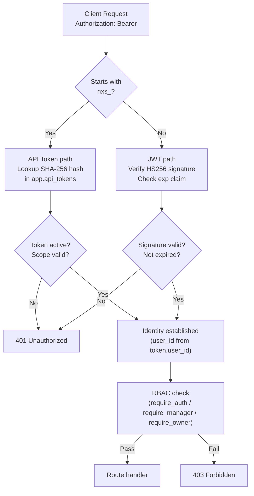

# Authentication

NEXUS uses a dual-scheme authentication system: **Bearer JWTs** for interactive sessions and **`nxs_` API tokens** for programmatic integrations. Authorization is role-based (RBAC) at both the user level and the workspace membership level.

---

## Authentication Architecture



---

## Authentication Schemes

| Scheme | Token format | Lifetime | Use case |
|---|---|---|---|
| **Bearer JWT** | `eyJ…` (base64url) | 3600 seconds | Interactive users, browser sessions |
| **API Token** | `nxs_` + random bytes | Indefinite (until revoked) | Programmatic integrations, scripts |

Both are passed as:
```http
Authorization: Bearer <token>
```

---

## RBAC Overview

Authentication establishes identity. Authorization is determined by the authenticated user's **role** in the target workspace:

| Role | Granted by | Key permissions |
|---|---|---|
| `owner` | Auto-assigned on workspace creation | All operations including danger zone |
| `admin` | Promoted by owner or another admin | Member management, settings, invites |
| `member` | Invited | Chat, read documents and products |

The three FastAPI dependency gates:
- `require_auth()` — valid JWT or API token, any role
- `require_manager()` — role must be `owner` or `admin`
- `require_owner()` — role must be `owner` only

---

## Documents in This Section

| Document | Read when |
|---|---|
| [JWT Authentication](jwt-authentication.md) | Setting up login, understanding token lifecycle, rotating secrets |
| [API Tokens](api-tokens.md) | Creating scoped tokens for integrations, understanding scopes |
| [RBAC Enforcement](rbac-enforcement.md) | Understanding permission gates, implementing role checks |
| [Session Management](session-management.md) | Token storage strategy, stateless JWTs, future DB backend |

---

## Quick Reference

```bash
# Login and get JWT
curl -X POST https://chat.nexus.gayo-sphere.cloud/api/auth/jwt/login \
  -d "username=you@example.com&password=yourpass"

# Use JWT
curl https://chat.nexus.gayo-sphere.cloud/api/documents \
  -H "Authorization: Bearer eyJ..."

# Create API token (requires JWT)
curl -X POST https://chat.nexus.gayo-sphere.cloud/api/tokens \
  -H "Authorization: Bearer eyJ..." \
  -H "Content-Type: application/json" \
  -d '{"name": "My Integration", "scopes": ["chat:read", "chat:write"]}'

# Use API token
curl -X POST https://chat.nexus.gayo-sphere.cloud/api/chat/stream \
  -H "Authorization: Bearer nxs_abc123..." \
  -H "Content-Type: application/json" \
  -d '{"message": "Hello", "session_id": "s1"}'
```

---

## Related Docs

- [API Reference — Authentication](../03-api-reference/authentication-in-api.md)
- [Workspace Management — RBAC Model](../04-workspace-management/rbac-model.md)
- [Configuration — JWT Secret](../16-configuration-reference/environment-variables.md#authentication--jwt)
