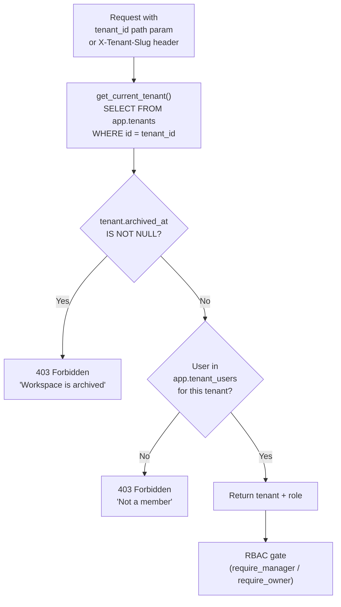

# RBAC Enforcement

NEXUS enforces role-based access control through FastAPI dependency injection. Each endpoint declares the minimum role required via one of three dependency functions in `rag/routers/deps.py`.

---

## Dependency Functions

### `require_auth()`

Validates any active JWT or API token. Does not check workspace role. Used on endpoints accessible to any authenticated user regardless of workspace membership.

**Used on:** `/api/health` (partially), `/api/changelog`, `/api/profile`, `/api/tokens`

### `require_auth_or_token(scope)`

Factory that accepts either a valid JWT or a scoped API token. The `scope` parameter specifies the minimum API token scope required if a token is used. JWTs bypass scope checks.

```python
# Endpoint accessible with JWT or a token with chat:write scope
@router.post("/stream")
async def stream(
    user=Depends(require_auth_or_token("chat:write"))
):
    ...
```

**Used on:** `/api/chat/stream`, `/api/documents/*`, `/api/dashboard/stats`

### `require_manager()`

Requires the authenticated user to hold the `owner` or `admin` role in the current workspace (`current_tenant`). Returns `403 Forbidden` for `member` role.

```python
@router.patch("/{tenant_id}/members/{user_id}")
async def update_member_role(
    tenant_id: UUID,
    user_id: UUID,
    user=Depends(require_manager)
):
    ...
```

**Used on:** Member management, invite management, AI settings, workspace rename/avatar, integration management

### `require_owner()`

Requires the `owner` role specifically. Returns `403 Forbidden` for `admin` and `member`.

**Used on:** Archive, unarchive, ownership transfer, hard-delete, JWT secret rotation

---

## Permission Matrix

| Endpoint | `member` | `admin` | `owner` | API Token |
|---|:---:|:---:|:---:|:---:|
| `POST /api/chat/stream` | ✅ | ✅ | ✅ | `chat:write` |
| `GET /api/documents` | ✅ | ✅ | ✅ | `documents:read` |
| `POST /api/documents/upload` | — | ✅ | ✅ | `documents:write` |
| `GET /api/tenants/{id}/members` | — | ✅ | ✅ | — |
| `PATCH /api/tenants/{id}/members/{uid}` | — | ✅ | ✅ | — |
| `POST /api/tenants/{id}/invites` | — | ✅ | ✅ | — |
| `PATCH /api/tenants/{id}` (rename) | — | ✅ | ✅ | — |
| `GET /api/workspace/ai-settings` | — | ✅ | ✅ | — |
| `PUT /api/workspace/ai-settings` | — | ✅ | ✅ | — |
| `GET /api/settings` | — | ✅ | ✅ | — |
| `PATCH /api/settings` | — | — | ✅ | — |
| `POST /api/tenants/{id}/archive` | — | — | ✅ | — |
| `POST /api/tenants/{id}/unarchive` | — | — | ✅ | — |
| `POST /api/tenants/{id}/transfer` | — | — | ✅ | — |
| `DELETE /api/tenants/{id}` | — | — | ✅ | — |
| `POST /api/settings/rotate-jwt` | — | — | ✅ | — |
| `GET /api/dashboard/stats` | ✅ | ✅ | ✅ | `dashboard:read` |

---

## How Workspace Context Is Resolved

Most endpoints require a `current_tenant` dependency that resolves the workspace from the request:



---

## Implementation in `deps.py`

```python
# rag/routers/deps.py

async def require_manager(
    current_user: User = Depends(current_active_user),
    tenant: Tenant = Depends(get_current_tenant),
    db: AsyncSession = Depends(get_async_session),
) -> tuple[User, Tenant]:
    stmt = select(TenantUser).where(
        TenantUser.tenant_id == tenant.id,
        TenantUser.user_id == current_user.id,
        TenantUser.role.in_(["owner", "admin"])
    )
    result = await db.execute(stmt)
    if not result.scalar_one_or_none():
        raise HTTPException(status_code=403, detail="Manager role required")
    return current_user, tenant


async def require_owner(
    current_user: User = Depends(current_active_user),
    tenant: Tenant = Depends(get_current_tenant),
    db: AsyncSession = Depends(get_async_session),
) -> tuple[User, Tenant]:
    stmt = select(TenantUser).where(
        TenantUser.tenant_id == tenant.id,
        TenantUser.user_id == current_user.id,
        TenantUser.role == "owner"
    )
    result = await db.execute(stmt)
    if not result.scalar_one_or_none():
        raise HTTPException(status_code=403, detail="Owner role required")
    return current_user, tenant
```

---

## Role Enforcement at the Database Level

Roles are enforced at both the application layer (FastAPI deps) and the database layer (CHECK constraint):

```sql
-- Migration 0008: phase50_rbac_admin
ALTER TABLE app.tenant_users
  ADD CONSTRAINT tenant_users_role_check
  CHECK (role IN ('owner', 'admin', 'member'));
```

This prevents invalid roles from being written even if application-level validation is bypassed.

---

## Troubleshooting

| Symptom | Cause | Fix |
|---|---|---|
| `403 Manager role required` | User has `member` role | Ask workspace owner/admin to promote your role |
| `403 Owner role required` | User has `admin` role | Only the owner can perform this action |
| `403 Workspace is archived` | Workspace archived | Owner must unarchive via `POST /api/tenants/{id}/unarchive` |
| `403 Not a member` | User not in the workspace | Owner/admin must invite the user |

---

## Related Docs

- [JWT Authentication](jwt-authentication.md)
- [API Tokens](api-tokens.md)
- [Workspace Management — RBAC Model](../04-workspace-management/rbac-model.md)
