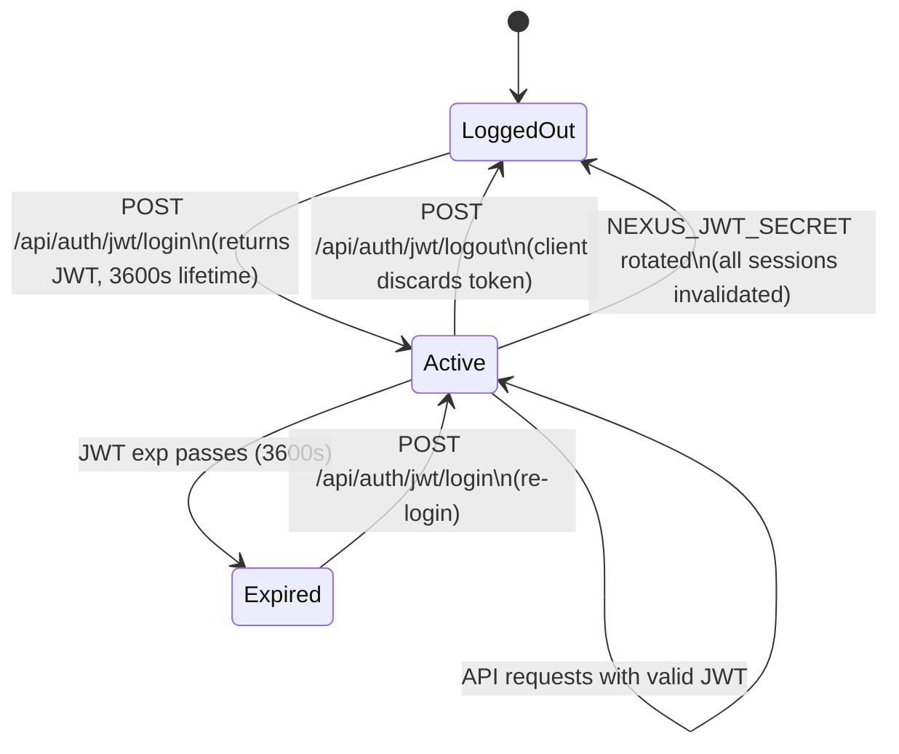

# Session Management

NEXUS uses a stateless JWT strategy for authentication. Sessions exist only on the client side — the server holds no session state.

---

## Current Strategy: Stateless JWT

| Property | Detail |
|---|---|
| Server-side session storage | None |
| Token revocation | Only via `NEXUS_JWT_SECRET` rotation (invalidates all sessions) |
| Token refresh | Not available — re-login on expiry |
| Multi-device logout | Not available without secret rotation |
| Concurrent sessions | Unlimited — all valid JWTs for a user are active simultaneously |

### Why Stateless

Stateless JWTs eliminate the need for a session store (Redis or Postgres), removing a failure point and reducing read load. The tradeoff is coarse revocation — you can't invalidate one token without invalidating all.

---

## Client-Side Storage

The nexus-ui frontend stores the JWT in `localStorage`:

```javascript
// On login success
localStorage.setItem('nexus_token', accessToken);
localStorage.setItem('nexus_token_exp', Date.now() + 3595000); // ~1h

// On each request
const token = localStorage.getItem('nexus_token');
const exp = parseInt(localStorage.getItem('nexus_token_exp'));
if (Date.now() > exp) {
  redirectToLogin();
}
```

> **⚠️ WARNING:** `localStorage` is accessible to JavaScript on the same origin. For higher-security deployments, consider `httpOnly` cookies (requires a cookie-based auth backend, not currently implemented).

---

## Future: Database Strategy

`rag/auth/config.py` reserves a `DatabaseStrategy` table (`app.access_token`) for a future stateful token backend. When activated, this would enable:

- Per-token revocation without rotating the master secret
- Single-device logout
- Token audit log

The table exists in the schema (created in migration `0001_phase27_part1_users.py`) but the `DatabaseStrategy` is not currently wired into the auth backend. Only `JWTStrategy` is active.

---

## LangGraph Thread Persistence

Conversation state is persisted separately from authentication. The LangGraph `PostgresCheckpointer` stores `NexusState` per `(session_id, tenant_id)` thread:

```python
# Each chat turn reconstructs state from Postgres
config = {"configurable": {"thread_id": f"{tenant_id}:{session_id}"}}
result = await graph.ainvoke(input, config=config)
```

This is independent of JWT validity — a conversation thread persists even after the user's token expires. The user must re-authenticate to continue chatting, but the conversation history is retained.

---

## Session Lifecycle Summary



---

## Related Docs

- [JWT Authentication](jwt-authentication.md)
- [API Tokens](api-tokens.md) — stateless long-lived alternative
- [Orchestrator — State Persistence](../08-orchestrator/state-persistence.md)
