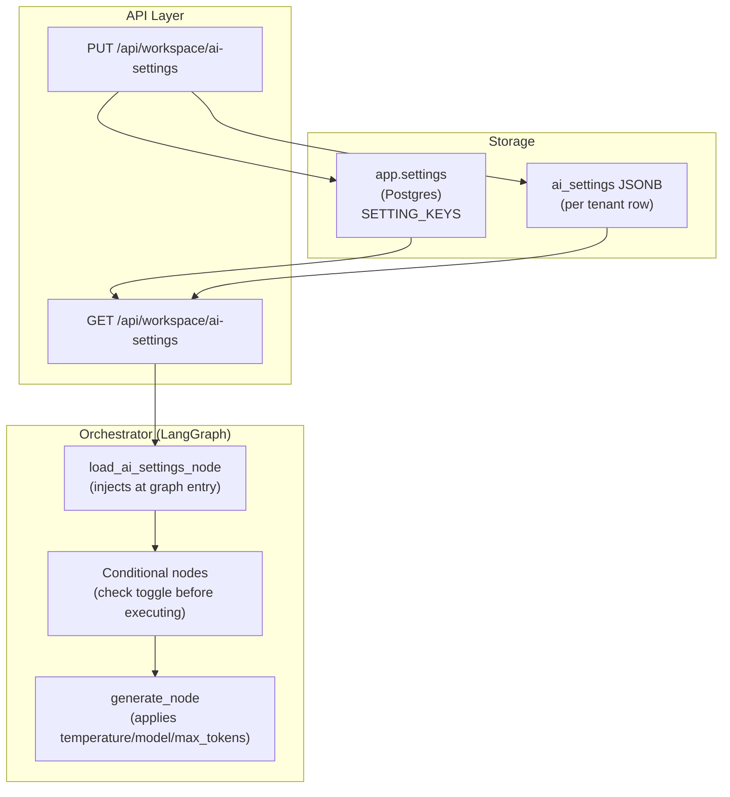

# AI Customization

NEXUS gives each workspace a full AI configuration layer — persona scripts, node toggles, model parameters, and a Prompt Studio UI. Every setting is tenant-scoped; changes in one workspace never affect another.

---

## Feature Matrix

| Feature | Phase | Description |
|---|---|---|
| Scenario prompts (persona) | 45 | Per-scenario system prompt overrides: `intro`, `core`, `checkout`, `hitl` |
| Knowledge boundary harden | 46 | Strict out-of-scope handling; prevents hallucination on uncovered topics |
| Workflow node toggles | 47 | Enable/disable 6 individual LangGraph nodes per tenant |
| Model parameters | 48 | temperature, max_tokens, model_choice with allowlist enforcement |
| Prompt Studio UI | 49 | Visual configuration interface at `/settings/workspaces/:slug → AI` |

---

## Architecture



AI settings are loaded once per conversation turn at the LangGraph entry node and injected into `NexusState`. Individual nodes read their toggle from state before executing.

---

## Settings Precedence

```
Dynamic global settings (app.settings SETTING_KEYS)
    ↓ overridden by
Tenant AI settings (ai_settings JSONB on app.tenants)
    ↓ overridden by
Per-request params (query-time overrides, if enabled)
```

When a tenant has no AI settings configured, the global defaults from `app.settings` apply.

---

## Quick Reference

| Task | Endpoint |
|---|---|
| Retrieve current AI settings | `GET /api/workspace/ai-settings` |
| Update AI settings | `PUT /api/workspace/ai-settings` |
| Open Prompt Studio | `/settings/workspaces/:slug` → **AI** tab |
| Reset to defaults | `PUT /api/workspace/ai-settings` with empty body `{}` |

---

## Section Contents

| Doc | Description |
|---|---|
| [AI Settings Schema](ai-settings-schema.md) | Full JSON schema with field types, defaults, and validation |
| [Persona Engine](persona-engine.md) | Scenario prompts: intro / core / checkout / HITL |
| [Node Toggles](node-toggles.md) | 6 toggleable LangGraph nodes, effects, and defaults |
| [Model Parameters](model-parameters.md) | temperature, max_tokens, model_choice allowlist |
| [Prompt Studio](prompt-studio.md) | UI navigation guide + tab layout |
| [SDR Persona](sdr-persona.md) | Sales mode: SDR persona, checkout link, CRM lead capture |

---

## Related Docs

- [Dynamic Settings](../16-configuration-reference/dynamic-settings.md) — global defaults that AI settings override
- [Orchestrator — Nodes Reference](../08-orchestrator/nodes-reference.md) — full node catalogue
- [Workspace Management](../04-workspace-management/README.md) — where AI settings live in the tenant model
