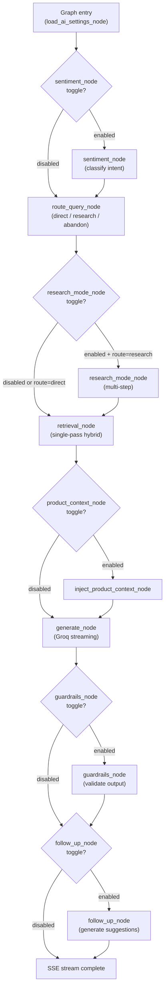

# Node Toggles

Six LangGraph nodes can be individually enabled or disabled per workspace. Disabled nodes are skipped at runtime — the graph branches around them.

---

## Toggle Reference

| Node key | Default | What it does when enabled |
|---|---|---|
| `sentiment_node` | `true` | Classifies user message sentiment; result stored in `NexusState.sentiment`; downstream nodes may adjust tone |
| `product_context_node` | `true` | Fetches matching products from catalog; injects structured product cards into LLM context |
| `sales_tools_node` | `true` | Makes `generate_checkout_link` and `capture_lead` tools available to the LLM |
| `guardrails_node` | `true` | Runs `CitationValidator`, `ExactMatchValidator`, `EntropyValidator` on LLM output before streaming |
| `research_mode_node` | `true` | Enables multi-step research: decompose → subquery loop → accumulate → generate |
| `follow_up_node` | `true` | Generates 2–3 follow-up question suggestions after each response |

---

## Graph Routing



---

## Effect Matrix

| Toggle off | Impact on response quality | When to disable |
|---|---|---|
| `sentiment_node` | No tone adaptation; all responses same register | High-volume, latency-sensitive deployments |
| `product_context_node` | No product cards injected; LLM must rely on trained knowledge | Non-commercial knowledge bases with no product catalog |
| `sales_tools_node` | No checkout links or CRM capture; LLM cannot call sales tools | Workspaces not using NEXUS for commerce |
| `guardrails_node` | Output passes unvalidated; citations not enforced | Development/testing only — never in production |
| `research_mode_node` | Complex multi-part questions answered in one retrieval pass; may miss sub-topics | Simple FAQ bots; when latency > depth |
| `follow_up_node` | No follow-up suggestions in response | Messenger/chat surfaces where suggestions clutter UX |

> **⚠️ WARNING:** Disabling `guardrails_node` removes citation enforcement. Responses may contain hallucinated facts presented as sourced. Only disable for internal testing.

---

## API Usage

Disable two nodes:

```bash
curl -X PUT https://chat.nexus.gayo-sphere.cloud/api/workspace/ai-settings \
  -H "Authorization: Bearer $TOKEN" \
  -H "Content-Type: application/json" \
  -d '{
    "node_toggles": {
      "follow_up_node": false,
      "research_mode_node": false
    }
  }'
```

Re-enable a node (send `true` explicitly):

```bash
curl -X PUT https://chat.nexus.gayo-sphere.cloud/api/workspace/ai-settings \
  -H "Authorization: Bearer $TOKEN" \
  -H "Content-Type: application/json" \
  -d '{
    "node_toggles": {
      "research_mode_node": true
    }
  }'
```

---

## Troubleshooting

| Symptom | Cause | Fix |
|---|---|---|
| Follow-up questions missing | `follow_up_node: false` | Set to `true` via PUT |
| Product cards not showing | `product_context_node: false` OR no products ingested | Check toggle + verify `GET /api/products` returns rows |
| Checkout link not generated | `sales_tools_node: false` | Enable toggle; also verify `N8N_WEBHOOK_CHECKOUT_URL` set |
| Citations not enforced | `guardrails_node: false` | Re-enable; only disable for dev/test |
| Research mode not triggering | `research_mode_node: false` OR query routed as `direct` | Enable toggle; check `route_query_node` routing thresholds |

---

## Related Docs

- [AI Settings Schema](ai-settings-schema.md)
- [Orchestrator — Nodes Reference](../08-orchestrator/nodes-reference.md)
- [Guardrails](../14-guardrails/README.md)
- [Sales Tools](../08-orchestrator/sales-tools.md)
