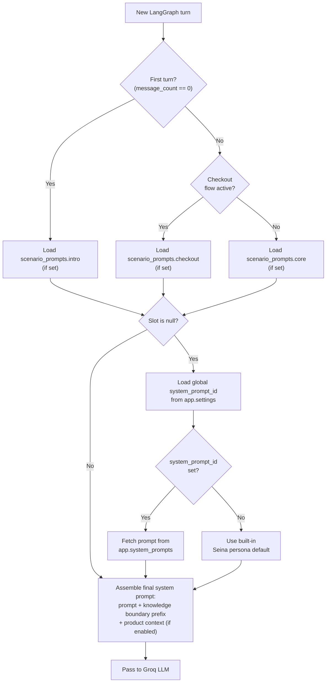

# Persona Engine

The persona engine controls what system prompt the LLM sees based on the current conversation scenario. Each scenario maps to a slot in `scenario_prompts`.

---

## Scenario Slots

| Slot | When Active | Fallback |
|---|---|---|
| `intro` | First turn of a new conversation (`message_count == 0`) | Global `system_prompt_id` setting → built-in Seina default |
| `core` | All mid-conversation turns | Global `system_prompt_id` → built-in Seina default |
| `checkout` | Sales node detects checkout intent or `generate_checkout_link` is invoked | `core` prompt |
| `hitl` | HITL handover triggered | Built-in HITL summary template |

---

## Injection Flow



---

## Built-In Seina Persona

When no scenario prompt is configured and no `system_prompt_id` is set, NEXUS uses the Seina persona defined in `rag/orchestrator/prompts/system_brix.md`.

Key characteristics of the default persona:
- Name: **Seina**
- Tone: Professional, warm, concise
- Product recall: Refers to products using feminine pronouns (per Phase 38 persona rules)
- Greeting gate: Sends a warm greeting only on `intro`, never mid-conversation
- CRM capture: Politely collects lead info when checkout intent detected
- Transactional grace: Apologizes and redirects when out-of-scope questions arise

> **📝 NOTE:** The Seina persona is the workspace-level default. It is overridden entirely when a `core` scenario prompt is set — there is no merging of persona traits with custom prompts.

---

## Knowledge Boundary Enforcement (Phase 46)

When knowledge boundary hardening is active, a strict prefix is prepended to the assembled system prompt regardless of which scenario slot is loaded:

```
You must ONLY answer questions based on the provided context.
If the answer cannot be found in the context, respond with:
"I don't have information about that in my current knowledge base."
Do not speculate or answer from general knowledge.
```

This prefix cannot be disabled via `scenario_prompts` — it is controlled by a separate feature flag (`knowledge_boundary_enabled`, default `true`).

---

## Writing Effective Scenario Prompts

### `intro` prompt guidelines

- Open with persona name and brand voice
- Set expectations for what the assistant can help with
- Keep under 200 words — this is injected alongside the user's first message

```
You are Maya, Acme Corp's AI product consultant. You help customers discover the right
product for their needs, answer questions about our catalog, and guide them through
purchasing. You are warm, knowledgeable, and concise. Start by greeting the customer
and asking how you can help.
```

### `core` prompt guidelines

- Reinforce scope constraints (what the assistant should and shouldn't answer)
- Do not re-introduce yourself — `core` fires on turns 2+
- If using product context, reference that it will be injected automatically

```
You are a product expert for Acme Corp. Answer questions about our products and services
only. For technical support or billing issues, direct customers to support@acme.com.
Product details are provided in your context — always cite specific products by name.
```

### `checkout` prompt guidelines

- Confirm intent before generating a link
- Include key transaction details in the prompt
- Can reference `{{product_name}}` and `{{price}}` template variables (resolved at runtime)

```
The customer is ready to purchase {{product_name}} at {{price}}.
Guide them step by step: confirm the product, explain what happens after they click
the checkout link, and offer to answer any last questions before proceeding.
```

### `hitl` prompt guidelines

- Instruct the model to summarize context for the human agent
- Keep the handover message factual, not conversational

```
Summarize the conversation for the incoming human agent.
Include: what the customer asked, what was answered, and any unresolved issues.
Be concise. Do not generate a follow-up question.
```

---

## Troubleshooting

| Symptom | Cause | Fix |
|---|---|---|
| Custom prompt not appearing | Prompt stored as `null` | Verify via `GET /api/workspace/ai-settings`; re-PUT with value |
| Intro prompt fires on turn 2+ | `message_count` off by one | Check `NexusState.message_count` logic in orchestrator |
| Seina default not replaced | `core` slot is `null` but global `system_prompt_id` set | Expected — global prompt takes precedence over built-in Seina |
| Knowledge boundary prefix missing | `knowledge_boundary_enabled = false` | Check `app.settings` for this key |

---

## Related Docs

- [AI Settings Schema](ai-settings-schema.md)
- [SDR Persona](sdr-persona.md) — checkout / CRM scenario detail
- [Orchestrator — Nodes Reference](../08-orchestrator/nodes-reference.md)
- [Dynamic Settings](../16-configuration-reference/dynamic-settings.md)
