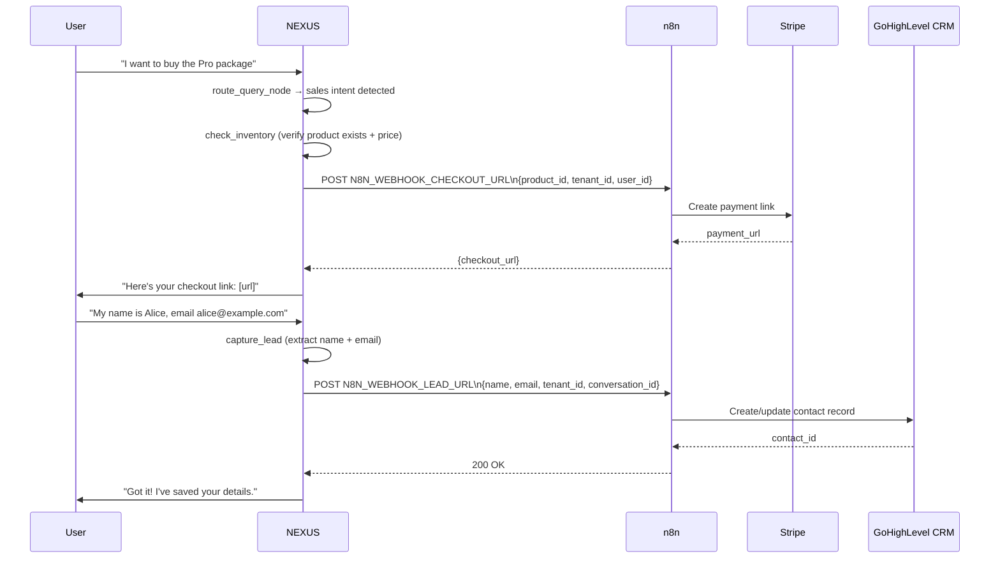

# SDR Persona

SDR (Sales Development Representative) mode activates the sales toolchain: checkout link generation and CRM lead capture via n8n webhooks.

---

## Prerequisites

| Requirement | Config |
|---|---|
| n8n checkout webhook | `N8N_WEBHOOK_CHECKOUT_URL` env var set |
| n8n lead capture webhook | `N8N_WEBHOOK_LEAD_URL` env var set |
| Sales tools node enabled | `node_toggles.sales_tools_node: true` |
| Product catalog populated | Products with prices ingested via `/api/products` |

---

## How SDR Mode Works



---

## Sales Tools

### `generate_checkout_link`

Generates a Stripe payment link for a product via n8n.

**Trigger conditions** (any of):
- User expresses purchase intent ("I want to buy", "how do I purchase", "add to cart")
- `checkout` scenario prompt is active
- LLM calls the tool directly based on conversation context

**Payload sent to `N8N_WEBHOOK_CHECKOUT_URL`:**

```json
{
  "product_id": "uuid",
  "product_name": "Pro Package",
  "price": 99.00,
  "currency": "USD",
  "tenant_id": "acme-corp",
  "user_id": "optional-messenger-psid",
  "conversation_id": "thread-uuid"
}
```

**Response expected from n8n:**

```json
{
  "checkout_url": "https://buy.stripe.com/..."
}
```

The URL is embedded in the LLM response as a clickable link.

---

### `capture_lead`

Extracts contact information from conversation and pushes to CRM.

**Trigger conditions** (any of):
- User provides name + email/phone in a single turn
- LLM detects lead qualification intent
- Post-checkout flow (captures contact after link sent)

**Payload sent to `N8N_WEBHOOK_LEAD_URL`:**

```json
{
  "name": "Alice Smith",
  "email": "alice@example.com",
  "phone": "+1-555-0100",
  "tenant_id": "acme-corp",
  "source": "messenger",
  "conversation_id": "thread-uuid",
  "metadata": {
    "product_interest": "Pro Package",
    "intent_score": 0.87
  }
}
```

`phone` and `metadata` are optional. `intent_score` comes from the sentiment node (requires `sentiment_node: true`).

---

## Dedup Gate

`product_branch.py` enforces a dedup check before re-generating checkout links. If a checkout link for the same product was sent in the **last 3 assistant messages**, the tool will not regenerate a new link. This prevents duplicate link spam in Messenger conversations.

---

## Configuring SDR Persona via AI Settings

Recommended scenario prompt configuration for SDR mode:

```json
{
  "scenario_prompts": {
    "intro": "You are an SDR for Acme Corp. Your goal is to understand the customer's needs, recommend the right product, and guide them to purchase. Be warm, confident, and outcome-focused.",
    "core": "Help the customer find the right product. When they express purchase intent, use the checkout tool. When they share contact details, use the lead capture tool.",
    "checkout": "The customer is ready to buy {{product_name}} at {{price}}. Confirm the product with them, then generate the checkout link. Offer to answer any last questions."
  },
  "node_toggles": {
    "sales_tools_node": true,
    "product_context_node": true,
    "sentiment_node": true
  }
}
```

---

## Troubleshooting

| Symptom | Cause | Fix |
|---|---|---|
| Checkout link not generated | `N8N_WEBHOOK_CHECKOUT_URL` not set | Add env var; restart service |
| `sales_tools_node: false` | Node toggled off | Enable in AI settings |
| Lead not appearing in CRM | `N8N_WEBHOOK_LEAD_URL` not set or n8n workflow paused | Check env var + n8n workflow active status |
| Duplicate checkout links sent | Dedup gate bypassed | Check `product_branch.py` last-3-message window; verify assistant message count in state |
| `checkout_url` missing from n8n response | n8n workflow error | Check n8n execution logs for Stripe API errors |

---

## Related Docs

- [Persona Engine](persona-engine.md) — checkout scenario prompt
- [Node Toggles](node-toggles.md) — `sales_tools_node`
- [Orchestrator — Sales Tools](../08-orchestrator/sales-tools.md)
- [Messenger Integration](../07-messenger-integration/README.md) — Messenger delivery context
- [n8n Automation](../10-integrations/n8n-automation.md) — webhook workflow setup
