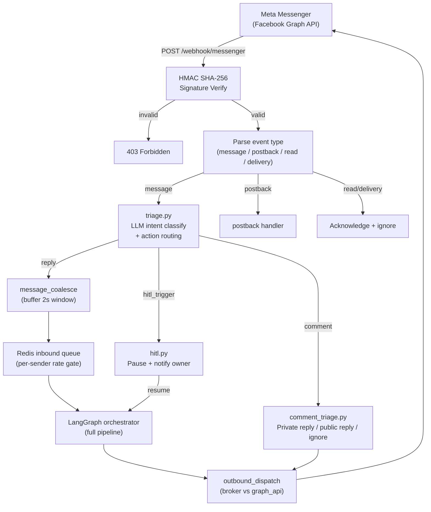

# Messenger Integration

NEXUS connects to Meta Messenger as a conversational AI channel. Inbound messages route through a 14-module subsystem: webhook verification → triage → LangGraph orchestration → reply dispatch. Human-in-the-loop (HITL) handover pauses the bot when a human agent is needed.

---

## Architecture

---

## Module Overview

| Module | File | Responsibility |
|---|---|---|
| Webhook receiver | `routers/messenger.py` | Verify token + event routing |
| Signature verifier | `messenger/security.py` | HMAC SHA-256 `X-Hub-Signature-256` check |
| Triage | `messenger/triage.py` | LLM-based intent classification + action dispatch |
| Message coalescer | `messenger/coalesce.py` | Buffer rapid multi-part messages into one |
| Inbound queue | `messenger/queue.py` | Redis-backed per-sender rate gate |
| LangGraph bridge | `messenger/bridge.py` | Calls orchestrator with Messenger-scoped NexusState |
| Outbound dispatcher | `messenger/sender.py` | Sends replies via Graph API or broker |
| HITL handler | `messenger/hitl.py` | Pause key, owner notification, resume flow |
| Comment triage | `messenger/comment_triage.py` | Page post comment classification + reply |
| Page manager | `messenger/pages.py` | Bind Meta pages to tenants |
| Retry queue | `messenger/retry.py` | Dead-letter + exponential backoff |
| Rate limiter | `messenger/rate_limit.py` | Per-sender message rate limiting |
| Security / PII | `messenger/security.py` | HMAC verify + PII detection |
| Settings | `messenger/config.py` | Messenger-specific env config |

---

## Quick Setup Checklist

1. Create a Meta App with Messenger product enabled
2. Generate a Page Access Token and set `MESSENGER_PAGE_TOKEN`
3. Configure the verify token and set `MESSENGER_VERIFY_TOKEN`
4. Set the webhook URL to `https://chat.nexus.gayo-sphere.cloud/webhook/messenger`
5. Subscribe to `messages`, `messaging_postbacks`, `message_reads`, `feed` events
6. Set `MESSENGER_APP_SECRET` for HMAC signature verification
7. Bind the page to a tenant via `POST /api/integrations/messenger/pages`

→ Detailed steps: [Meta Webhook Setup](meta-webhook-setup.md)

---

## Section Contents

| Doc | Description |
|---|---|
| [Meta Webhook Setup](meta-webhook-setup.md) | App config, verify token, event subscriptions |
| [Inbound Message Flow](inbound-message-flow.md) | End-to-end sequence: webhook → orchestrator → reply |
| [Outbound Dispatch](outbound-dispatch.md) | Sender targets, retry queue, dead-letter |
| [HITL Handover](hitl-handover.md) | Trigger conditions, Redis pause key, owner notification |
| [Comment Triage](comment-triage.md) | Page post comments: classify → private/public reply |
| [Page Management](page-management.md) | Binding Meta pages to tenants |
| [Rate Limits & Coalescing](rate-limits-coalescing.md) | Per-sender limits, coalesce window |
| [Security & PII](security-pii.md) | HMAC verification, PII detection and redaction |

---

## Environment Variables

| Variable | Required | Description |
|---|---|---|
| `MESSENGER_APP_ID` | Yes | Meta App ID |
| `MESSENGER_APP_SECRET` | Yes | Used for HMAC SHA-256 signature verification |
| `MESSENGER_VERIFY_TOKEN` | Yes | Webhook verification token (set in Meta App Dashboard) |
| `MESSENGER_PAGE_TOKEN` | Yes | Page Access Token for Graph API calls |
| `HITL_PAUSE_DURATION_S` | No | HITL pause duration in seconds (default: `3600`) |
| `N8N_WEBHOOK_NOTIFY_URL` | No | n8n webhook for HITL owner notification emails |

---

## Related Docs

- [AI Customization — SDR Persona](../06-ai-customization/sdr-persona.md)
- [Orchestrator](../08-orchestrator/README.md)
- [n8n Automation](../10-integrations/n8n-automation.md)
- [Rate Limits](../03-api-reference/rate-limits.md)
