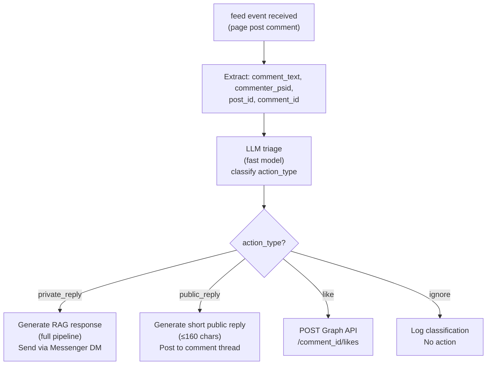

# Comment Triage

NEXUS can monitor Facebook Page post comments and respond automatically. Comment triage classifies each comment and routes to the appropriate action.

---

## Prerequisites

- `feed` webhook event subscribed (see [Meta Webhook Setup](meta-webhook-setup.md))
- Page bound to a tenant
- `MESSENGER_PAGE_TOKEN` has `pages_read_engagement` permission

---

## Action Types

| Action | When | Response method |
|---|---|---|
| `private_reply` | Comment contains a question or purchase intent | Send a private Messenger message to the commenter |
| `public_reply` | Comment is a public inquiry suitable for public response | Reply directly to the comment thread |
| `like` | Positive comment (praise, thanks) | Like the comment only; no text reply |
| `ignore` | Spam, irrelevant, or offensive | No action; log the classification |

---

## Classification Flow



---

## Private Reply

For questions or purchase intent, NEXUS opens a Messenger DM thread with the commenter:

```http
POST https://graph.facebook.com/v19.0/me/messages
Authorization: Bearer {PAGE_TOKEN}

{
  "recipient": {"comment_id": "{comment_id}"},
  "message": {"text": "Hi! I saw your comment — happy to help. {generated_response}"},
  "messaging_type": "RESPONSE"
}
```

The full RAG pipeline runs to generate the response — the same pipeline as standard Messenger messages.

> **📝 NOTE:** Private replies via `comment_id` are only possible within 7 days of the comment being posted. After 7 days, the `recipient.comment_id` method fails — NEXUS falls back to `recipient.id` (PSID) if available, otherwise logs as undeliverable.

---

## Public Reply

For general inquiries suitable for public response, NEXUS posts a reply to the comment thread:

```http
POST https://graph.facebook.com/v19.0/{comment_id}/comments
Authorization: Bearer {PAGE_TOKEN}

{
  "message": "Thanks for your question! {short_response}"
}
```

Public replies are capped at 160 characters to keep them concise on the page post.

---

## Like Action

For positive comments, NEXUS likes the comment without sending a message:

```http
POST https://graph.facebook.com/v19.0/{comment_id}/likes
Authorization: Bearer {PAGE_TOKEN}
```

---

## Triage Prompt

The comment triage LLM call uses a focused prompt distinct from the main chat pipeline:

```
Classify this Facebook comment. Choose one action:
- private_reply: Contains a question, complaint, or purchase intent → send a DM
- public_reply: General inquiry appropriate for a public answer
- like: Positive feedback or thanks → just like the comment
- ignore: Spam, irrelevant, or offensive content

Comment: "{comment_text}"

Respond with JSON: {"action": "...", "reason": "..."}
```

---

## Troubleshooting

| Symptom | Cause | Fix |
|---|---|---|
| Comments not being processed | `feed` event not subscribed | Re-subscribe in Meta App Dashboard |
| Private reply fails | 7-day window expired or PSID unavailable | Logged as undeliverable; no fix — window expired |
| All comments classified as `ignore` | Triage prompt too conservative | Adjust classification thresholds in `comment_triage.py` |
| Public reply exceeds character limit | Response generation too verbose | The 160-char cap enforced client-side before POST |

---

## Related Docs

- [Meta Webhook Setup](meta-webhook-setup.md) — `feed` event subscription
- [Inbound Message Flow](inbound-message-flow.md) — how `comment` events branch from message events
- [Outbound Dispatch](outbound-dispatch.md)
