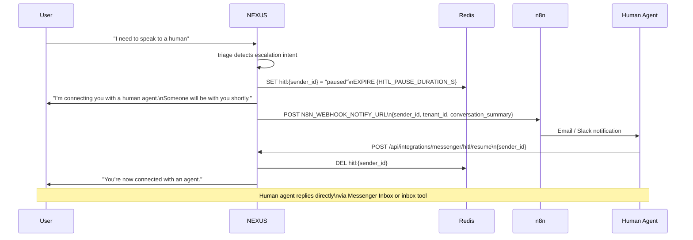

# HITL Handover

Human-in-the-loop (HITL) pauses the bot and notifies a human agent when escalation is needed. The bot remains paused until the pause key expires or a human explicitly resumes it.

---

## Trigger Conditions

HITL is triggered by the triage node or the guardrails router:

| Trigger source | Condition |
|---|---|
| `triage.py` | User explicitly requests human agent ("talk to a person", "I want to speak to someone") |
| `triage.py` | High frustration detected (sentiment score < threshold) |
| `guardrails_router` | All 3 guardrail validators fail → abstain → escalate path |
| Manual | `POST /api/integrations/messenger/hitl/trigger` (admin endpoint) |

---

## HITL Flow



---

## Pause Key

While HITL is active, a Redis key gates all inbound messages:

```
KEY:    hitl:{sender_id}
VALUE:  "paused"
TTL:    HITL_PAUSE_DURATION_S (default: 3600 seconds)
```

On every inbound message, NEXUS checks this key before routing to LangGraph. If the key exists, the message is acknowledged but not processed by the bot.

```python
pause_key = f"hitl:{sender_id}"
if await redis.exists(pause_key):
    # Bot is paused — do not route to LangGraph
    return  # Acknowledge webhook; human agent handles via Inbox
```

---

## Owner Notification

When HITL triggers, NEXUS POSTs to `N8N_WEBHOOK_NOTIFY_URL`:

```json
{
  "event": "hitl_triggered",
  "sender_id": "psid",
  "tenant_id": "acme-corp",
  "tenant_name": "Acme Corp",
  "conversation_id": "thread-uuid",
  "trigger_reason": "user_requested",
  "conversation_summary": "User asked about pricing, became frustrated with bot responses.",
  "triggered_at": "2026-06-13T12:00:00Z",
  "pause_expires_at": "2026-06-13T13:00:00Z"
}
```

n8n routes this to email, Slack, or both depending on the workflow configuration.

---

## Resume Options

### Manual resume (human agent)

```bash
curl -X POST https://chat.nexus.gayo-sphere.cloud/api/integrations/messenger/hitl/resume \
  -H "Authorization: Bearer $TOKEN" \
  -d '{"sender_id": "psid"}'
```

Deletes the Redis pause key immediately. Bot resumes on the next user message.

### Automatic expiry

If the pause key TTL expires (`HITL_PAUSE_DURATION_S`), the bot automatically resumes. Default is 3600s (1 hour). Configure via env:

```bash
HITL_PAUSE_DURATION_S=7200  # 2 hours
```

---

## HITL Handover Message

The message sent to the user when HITL triggers is sourced from the `hitl` scenario prompt (if configured) or the built-in default:

```
I'm connecting you with a human agent. Please hold on — someone will be with you shortly.
```

Configure a custom message via the [Persona Engine](../06-ai-customization/persona-engine.md) `hitl` slot.

---

## Checking HITL Status

```bash
# Check if a sender is paused
redis-cli EXISTS hitl:{sender_id}

# Check remaining pause TTL
redis-cli TTL hitl:{sender_id}

# List all active HITL pauses
redis-cli KEYS "hitl:*"
```

---

## Troubleshooting

| Symptom | Cause | Fix |
|---|---|---|
| Bot not resuming after agent finishes | Pause key still in Redis | Call resume endpoint or wait for TTL expiry |
| HITL triggered unexpectedly | Triage sentiment threshold too sensitive | Adjust `HITL_SENTIMENT_THRESHOLD` config |
| Owner not receiving notification | `N8N_WEBHOOK_NOTIFY_URL` not set or n8n workflow paused | Set env var; verify n8n workflow is active |
| Bot resumes before agent finishes | `HITL_PAUSE_DURATION_S` too short | Increase TTL; use manual resume for critical conversations |

---

## Related Docs

- [Inbound Message Flow](inbound-message-flow.md) — where HITL gate sits in the flow
- [Persona Engine — HITL Prompt](../06-ai-customization/persona-engine.md)
- [n8n Automation](../10-integrations/n8n-automation.md)
- [Guardrails — HITL Fallback](../14-guardrails/hitl-fallback.md)
