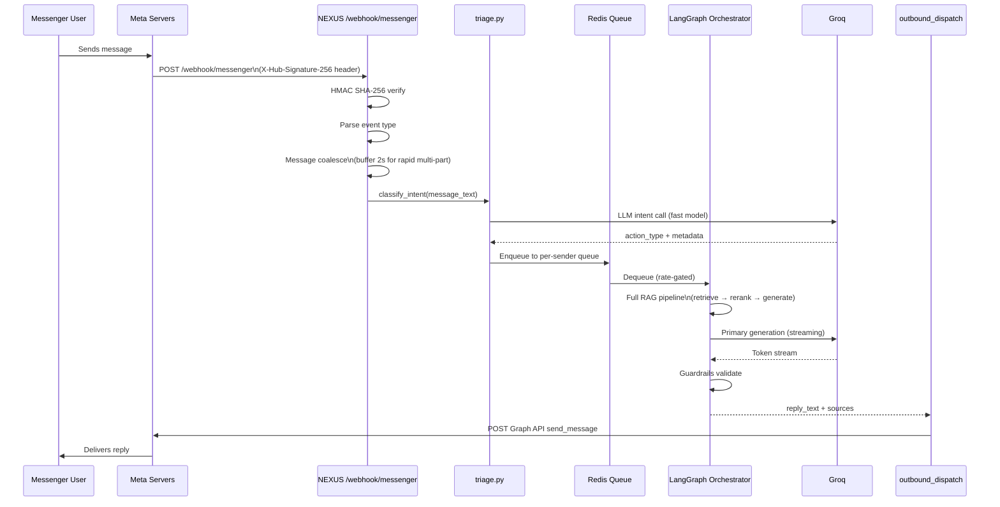

# Inbound Message Flow

End-to-end sequence from a Meta Messenger message arriving at NEXUS to a reply being sent back.

---

## Full Sequence



---

## Stage Detail

### 1. Webhook Receipt

`POST /webhook/messenger` receives the raw Meta event payload. Before any processing:

1. `X-Hub-Signature-256` header extracted
2. HMAC SHA-256 computed over raw body using `MESSENGER_APP_SECRET`
3. Signatures compared — mismatch returns `403` immediately

→ See [Security & PII](security-pii.md) for signature verification code.

---

### 2. Event Parsing

Meta sends event objects nested inside `entry[].messaging[]`. NEXUS extracts:

| Event type | Detected by | Action |
|---|---|---|
| `message` (text) | `messaging[].message.text` exists | Route to triage |
| `message` (attachment) | `messaging[].message.attachments` | Route to attachment handler |
| `postback` | `messaging[].postback` | Route to postback handler |
| `read` | `messaging[].read` | Acknowledge + ignore |
| `delivery` | `messaging[].delivery` | Acknowledge + ignore |

---

### 3. Message Coalescing

When a user sends multiple short messages in rapid succession (common on mobile), NEXUS buffers them into a single orchestrator call:

- **Window:** 2 seconds after first message from a given `sender.id`
- **Storage:** Redis key `coalesce:{sender_id}` with 2s TTL
- **Result:** Concatenated messages processed as one turn

This prevents duplicate in-flight orchestrator calls for the same logical query.

---

### 4. Triage

`triage.py` uses a fast LLM call (8b model) to classify intent before the full pipeline runs:

| Action type | Condition | Next step |
|---|---|---|
| `reply` | Normal message requiring a bot response | Enqueue to LangGraph |
| `hitl_trigger` | Detected frustration, escalation request, or "talk to a human" | HITL handover |
| `ignore` | Spam, test message, or echo | Acknowledge + drop |
| `comment` | `feed` event (page post comment) | Route to comment_triage |

Triage metadata (intent classification, confidence) is attached to `NexusState` and used by downstream nodes.

---

### 5. Redis Queue

Messages are enqueued per sender (`queue:{sender_id}`) before the orchestrator:

- **Rate gate:** Maximum 1 in-flight orchestrator call per sender at a time
- **TTL:** Messages expire after 60 seconds if not consumed
- **Backpressure:** New messages queue behind the in-flight call

This prevents a user from triggering multiple simultaneous pipeline runs.

---

### 6. LangGraph Orchestration

The orchestrator runs the full pipeline with a Messenger-scoped `NexusState`:

```python
state = NexusState(
    tenant_id=page_binding.tenant_id,
    user_id=sender_psid,
    thread_id=f"messenger:{sender_psid}",
    surface="messenger",
    message=coalesced_text,
    ...
)
```

The `surface="messenger"` flag affects:
- Response length target (shorter, mobile-optimized)
- Citation format (inline text, no markdown links)
- Follow-up format (quick reply buttons, not plain text suggestions)

---

### 7. Reply Dispatch

Generated response is sent via `outbound_dispatch`:

- **Primary path:** Direct Graph API call (`POST graph.facebook.com/v19.0/me/messages`)
- **Broker path:** Via message broker (if configured) for reliability + retry

Messenger has a 24-hour messaging window — the bot can only send proactive messages within 24h of the last user message. Outside this window, the Graph API returns `(#10) Application does not have permission`.

---

## Error Handling

| Error | Behavior |
|---|---|
| HMAC mismatch | `403` returned immediately; event dropped |
| Triage LLM timeout | Fallback to `reply` action with `confidence=0` |
| Orchestrator timeout | Error message sent to user; event logged |
| Graph API send failure | Retry queue with exponential backoff (max 3 attempts) |
| 24h window expired | Log `messaging_window_expired`; no retry |

---

## Troubleshooting

| Symptom | Cause | Fix |
|---|---|---|
| Bot not replying | Queue backed up | Check `LLEN queue:{sender_id}` in Redis |
| Duplicate replies | Coalesce window missed | Check Redis `coalesce:{sender_id}` key TTL |
| Triage routing to HITL unexpectedly | LLM misclassification | Adjust triage prompt; lower sensitivity |
| `messaging_window_expired` in logs | >24h since last user message | Cannot reply; wait for user to message again |

---

## Related Docs

- [Security & PII](security-pii.md) — HMAC verification
- [Rate Limits & Coalescing](rate-limits-coalescing.md)
- [HITL Handover](hitl-handover.md)
- [Outbound Dispatch](outbound-dispatch.md)
- [Orchestrator](../08-orchestrator/README.md)
