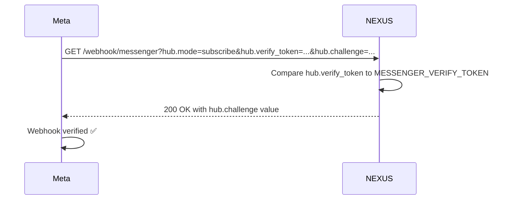

# Meta Webhook Setup

Step-by-step guide to connecting a Meta App to NEXUS.

---

## Prerequisites

- Meta Developer account at developers.facebook.com
- A Facebook Page owned by the developer account
- NEXUS deployed and reachable at a public HTTPS URL
- `MESSENGER_VERIFY_TOKEN` set in NEXUS `.env`

---

## Step 1: Create a Meta App

1. Go to [developers.facebook.com/apps](https://developers.facebook.com/apps)
2. Click **Create App**
3. Select **Business** type → Next
4. Enter app name and contact email
5. Click **Create App**

---

## Step 2: Add Messenger Product

1. From the App Dashboard, click **Add Product**
2. Find **Messenger** → click **Set Up**
3. Under **Access Tokens**, click **Add or Remove Pages** → select your Page
4. Copy the **Page Access Token** → set as `MESSENGER_PAGE_TOKEN` in NEXUS `.env`

---

## Step 3: Configure the Webhook

1. In the Messenger settings, scroll to **Webhooks**
2. Click **Add Callback URL**
3. Set fields:

| Field | Value |
|---|---|
| Callback URL | `https://chat.nexus.gayo-sphere.cloud/webhook/messenger` |
| Verify Token | Same value as `MESSENGER_VERIFY_TOKEN` in your `.env` |

4. Click **Verify and Save**

NEXUS responds to the verification request:

```python
# rag/routers/messenger.py
@router.get("/webhook/messenger")
async def verify_webhook(
    hub_mode: str = Query(alias="hub.mode"),
    hub_verify_token: str = Query(alias="hub.verify_token"),
    hub_challenge: str = Query(alias="hub.challenge"),
):
    if hub_mode == "subscribe" and hub_verify_token == settings.MESSENGER_VERIFY_TOKEN:
        return PlainTextResponse(hub_challenge)
    raise HTTPException(403)
```

---

## Step 4: Subscribe to Webhook Events

In the Webhooks section, click **Add Subscriptions** for your page and enable:

| Event | Required | Purpose |
|---|---|---|
| `messages` | Yes | Inbound user messages |
| `messaging_postbacks` | Yes | Quick reply / button payloads |
| `message_reads` | No | Read receipt tracking |
| `message_deliveries` | No | Delivery confirmation |
| `feed` | Conditional | Page post comments (required for comment triage) |

---

## Step 5: Set App Secret

1. In App Settings → Basic, copy the **App Secret**
2. Set as `MESSENGER_APP_SECRET` in NEXUS `.env`

This is used by NEXUS for HMAC SHA-256 signature verification on every inbound webhook call.

---

## Step 6: Bind Page to Tenant

After webhook setup, bind the Meta page to a NEXUS workspace:

```bash
curl -X POST https://chat.nexus.gayo-sphere.cloud/api/integrations/messenger/pages \
  -H "Authorization: Bearer $TOKEN" \
  -H "Content-Type: application/json" \
  -d '{
    "page_id": "123456789",
    "page_name": "Acme Corp",
    "tenant_id": "your-tenant-uuid"
  }'
```

All Messenger messages from that page will now route to the bound workspace.

---

## Step 7: Go Live

Meta Apps start in Development mode (only app admins and testers can interact with the bot).

To accept messages from any Messenger user:
1. Complete **App Review** for `pages_messaging` permission
2. Submit for review with a screen recording of the bot flow
3. After approval, toggle **Live Mode** in the App Dashboard

> **⚠️ WARNING:** In Development mode, messages from non-admin users are silently dropped by Meta — NEXUS never receives them. If the bot seems unresponsive, verify App Mode first.

---

## Verification Flow



---

## Troubleshooting

| Symptom | Cause | Fix |
|---|---|---|
| `Verification failed` in Meta Dashboard | Token mismatch | Confirm `MESSENGER_VERIFY_TOKEN` matches exactly (no trailing spaces) |
| Webhook URL rejected | Not HTTPS or not publicly reachable | Use `ngrok` for local dev; prod must be behind nginx TLS |
| Bot not responding to messages | App in Development mode | Add test user to App roles, or submit for App Review |
| `403` on inbound events | `MESSENGER_APP_SECRET` wrong | Regenerate secret in Meta Dashboard; update `.env`; restart service |

---

## Related Docs

- [Inbound Message Flow](inbound-message-flow.md)
- [Security & PII](security-pii.md) — HMAC verification details
- [Page Management](page-management.md) — binding pages to tenants
- [Environment Variables](../16-configuration-reference/environment-variables.md)
