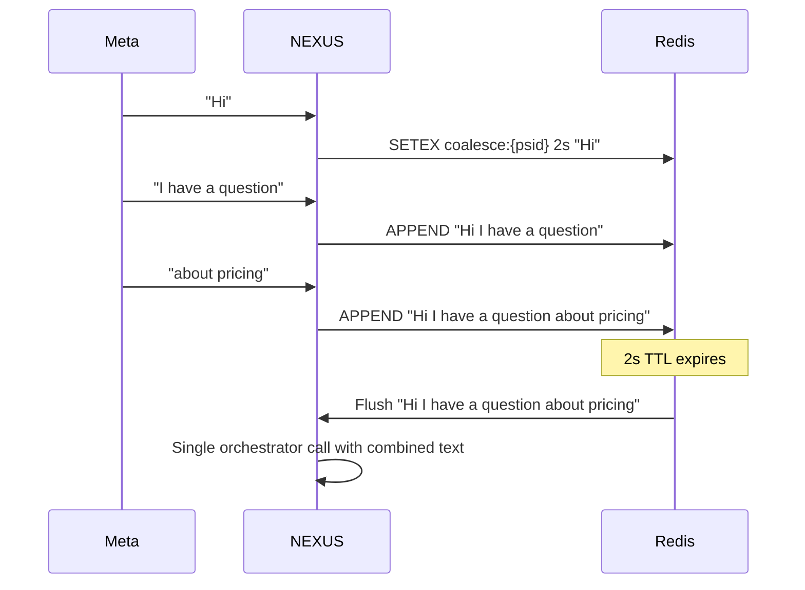

# Rate Limits & Coalescing

Two mechanisms prevent overload: message coalescing buffers rapid multi-part messages into a single orchestrator call, and per-sender rate limiting gates concurrent pipeline runs.

---

## Message Coalescing

When a user sends multiple short messages in quick succession, coalescing combines them into one turn before the orchestrator sees them.

**Why this matters:** Mobile users often send 3–5 short messages in sequence ("Hi" → "I have a question" → "about pricing"). Without coalescing, each message triggers a separate pipeline run, producing disjointed replies.

### Coalesce Window

| Parameter | Value | Config |
|---|---|---|
| Window duration | 2 seconds | Hardcoded in `messenger/coalesce.py` |
| Buffer storage | Redis `coalesce:{sender_id}` | TTL = window duration |
| Separator | ` ` (single space) | Concatenated in order received |
| Max messages | 10 per window | Beyond 10, window flushes immediately |

### Flow



---

## Per-Sender Rate Limiting

### Concurrent Call Gate

Only one orchestrator pipeline runs per sender at a time. This prevents:
- Multiple overlapping retrieval calls hitting Qdrant simultaneously
- Race conditions in `NexusState` thread persistence
- Duplicate replies from parallel generation runs

**Implementation:** Redis key `inflight:{sender_id}` set during orchestrator run, deleted on completion. New messages queue behind it.

```
KEY:    inflight:{sender_id}
VALUE:  "1"
TTL:    120 seconds (safety expiry if pipeline crashes)
```

### Message Queue

Queued messages wait in `queue:{sender_id}` (Redis list):

| Behavior | Detail |
|---|---|
| Queue max depth | 10 messages |
| Message TTL | 60 seconds |
| Processing | FIFO — oldest message processed first |
| Overflow | Messages beyond depth 10 are dropped + logged |

### Absolute Rate Limit

Beyond the concurrent gate, a hard rate limit caps total messages per sender per minute:

| Limit | Window | Behavior when exceeded |
|---|---|---|
| 20 messages | 60 seconds | Messages dropped; `rate_limited` logged |

This protects against bot traffic and automated spam.

---

## Meta Platform Rate Limits

Meta imposes its own limits on the NEXUS side (outbound Graph API calls):

| Limit | Value | Notes |
|---|---|---|
| Messages per second per page | 250 | Shared across all senders on the page |
| Replies per conversation | No hard limit | Subject to spam detection heuristics |
| Typing indicators | 1 per message | Excessive indicators may be throttled |

When Meta returns `(#4) Application request limit reached`, NEXUS backs off 60 seconds before retrying.

---

## Monitoring

Check queue depth and inflight state via Redis:

```bash
# Messages waiting for a sender
redis-cli LLEN queue:{sender_id}

# Check if a sender has an inflight call
redis-cli EXISTS inflight:{sender_id}

# Check coalesce buffer
redis-cli GET coalesce:{sender_id}

# Count active rate-limited senders
redis-cli KEYS "rate_limit:*" | wc -l
```

---

## Troubleshooting

| Symptom | Cause | Fix |
|---|---|---|
| Bot replies with combined message instead of multiple | Coalesce window active | Expected behavior — reduce window if needed |
| Replies very slow for power users | Queue depth backing up | Check `LLEN queue:{psid}`; scale orchestrator if needed |
| Messages dropped silently | Queue overflow (>10) or rate limit hit | Check logs for `queue_overflow` or `rate_limited` events |
| `inflight` key stuck | Orchestrator crashed mid-pipeline | TTL auto-expires in 120s; or delete manually: `redis-cli DEL inflight:{psid}` |

---

## Related Docs

- [Inbound Message Flow](inbound-message-flow.md)
- [Outbound Dispatch](outbound-dispatch.md)
- [API Rate Limits](../03-api-reference/rate-limits.md)
