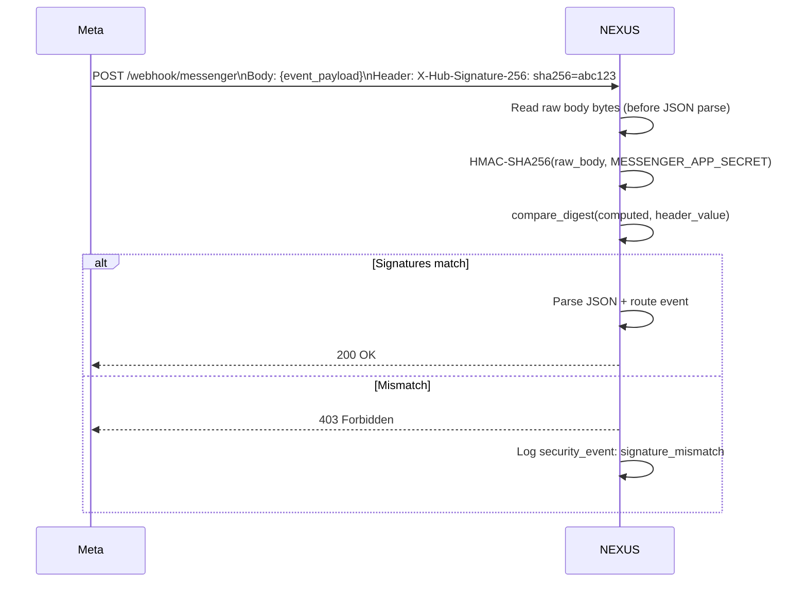

# Security & PII

Two security concerns are handled in the Messenger integration layer: webhook signature verification (prevents spoofed events) and PII detection (prevents sensitive data leaking into logs or LLM context).

---

## HMAC SHA-256 Webhook Verification

Every POST to `/webhook/messenger` includes an `X-Hub-Signature-256` header from Meta:

```
X-Hub-Signature-256: sha256={hex_digest}
```

NEXUS verifies this before processing any event:

```python
import hmac
import hashlib

def verify_signature(payload: bytes, signature_header: str, app_secret: str) -> bool:
    expected = "sha256=" + hmac.new(
        app_secret.encode("utf-8"),
        payload,
        hashlib.sha256
    ).hexdigest()
    return hmac.compare_digest(expected, signature_header)
```

Key properties:
- Uses `hmac.compare_digest` to prevent timing attacks
- Computed over the **raw request body bytes** — do not parse before verifying
- Returns `403 Forbidden` immediately on mismatch; no event processing occurs

> **⚠️ WARNING:** Never log the raw `X-Hub-Signature-256` header or `MESSENGER_APP_SECRET`. If the secret is compromised, any third party can forge valid Messenger events.

---

## Verification Flow



---

## PII Detection

Messenger conversations may contain sensitive personal information. NEXUS applies PII detection before:
1. Storing messages in `app.messages`
2. Passing message text to the LLM
3. Writing to application logs

### Detected PII Types

| Type | Pattern | Action |
|---|---|---|
| Email address | RFC 5322 regex | Redact in logs; preserve in LLM context for lead capture |
| Phone number | E.164 + common formats | Redact in logs; preserve in LLM context for lead capture |
| Credit card number | Luhn-validated 13–19 digit sequences | Redact everywhere — never passed to LLM |
| SSN / national ID | Country-specific patterns | Redact everywhere |
| Full name (heuristic) | NER model classification | Flagged, not redacted (context-dependent) |

### Redaction in Logs

PII is replaced with a placeholder before writing to logs or `app.logs`:

```
Original:  "My email is alice@example.com and phone is +1-555-0100"
Logged as: "My email is [EMAIL] and phone is [PHONE]"
```

### LLM Context Handling

Email and phone are intentionally preserved in the LLM context when the `sales_tools_node` is active — they are needed for `capture_lead`. Credit cards and SSNs are always redacted before the LLM sees them.

---

## Secret Rotation

If `MESSENGER_APP_SECRET` is compromised:

1. Regenerate the App Secret in Meta App Dashboard → App Settings → Basic
2. Update `MESSENGER_APP_SECRET` in NEXUS `.env` on the VPS:
   ```bash
   ssh nexus-rag@72.62.196.231
   nano /home/nexus-rag/.env  # update MESSENGER_APP_SECRET
   sudo systemctl restart nexus-chat
   ```
3. Verify: send a test message from Messenger and confirm it is processed (not rejected as `403`)

> **📝 NOTE:** There is a brief window between Meta updating the secret and NEXUS restarting where legitimate events may be rejected. This window is typically under 30 seconds.

---

## Troubleshooting

| Symptom | Cause | Fix |
|---|---|---|
| All Messenger events return `403` | `MESSENGER_APP_SECRET` wrong or stale | Regenerate secret in Meta Dashboard; update `.env`; restart |
| `security_event: signature_mismatch` in logs | Third-party sending forged events | Expected if under attack; no action needed — events are rejected |
| PII appearing in logs | PII filter not applied to log sink | Verify PII middleware is in request pipeline |
| Credit card numbers reaching LLM | Redaction miss | Check Luhn validation regex in `messenger/security.py` |

---

## Related Docs

- [Meta Webhook Setup](meta-webhook-setup.md) — how to set App Secret in Meta Dashboard
- [Inbound Message Flow](inbound-message-flow.md) — where verification sits in the pipeline
- [Environment Variables](../16-configuration-reference/environment-variables.md)
