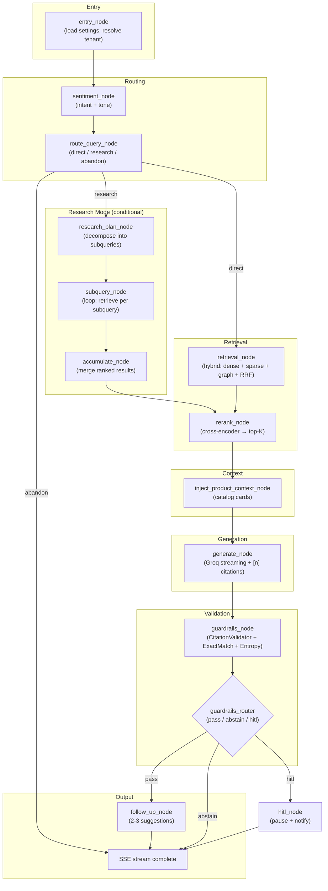

# Orchestrator

The NEXUS orchestrator is a LangGraph `StateGraph` that coordinates the full RAG pipeline. Every chat request — web, Messenger, or API — flows through this graph.

---

## Architecture



---

## NexusState Schema

Every node reads from and writes to `NexusState` — a typed `TypedDict` passed through the graph:

| Field | Type | Set by |
|---|---|---|
| `tenant_id` | `str` | `entry_node` |
| `user_id` | `str` | `entry_node` |
| `thread_id` | `str` | caller |
| `surface` | `"web" \| "messenger" \| "api"` | caller |
| `message` | `str` | caller |
| `sentiment` | `dict \| None` | `sentiment_node` |
| `route` | `"direct" \| "research" \| "abandon"` | `route_query_node` |
| `subqueries` | `list[str]` | `research_plan_node` |
| `retrieved_chunks` | `list[ScoredChunk]` | `retrieval_node` / `accumulate_node` |
| `reranked_chunks` | `list[ScoredChunk]` | `rerank_node` |
| `product_context` | `list[dict] \| None` | `inject_product_context_node` |
| `system_prompt` | `str` | `entry_node` (assembled from persona) |
| `response` | `str` | `generate_node` |
| `citations` | `list[int]` | `generate_node` |
| `guardrail_result` | `GuardrailResult` | `guardrails_node` |
| `follow_ups` | `list[str]` | `follow_up_node` |
| `ai_settings` | `AiSettings` | `entry_node` |

---

## Checkpointer (State Persistence)

Multi-turn conversation state is persisted via a PostgreSQL checkpointer:

```python
from langgraph.checkpoint.postgres import PostgresSaver

checkpointer = PostgresSaver.from_conn_string(settings.DATABASE_URL)
graph = graph_builder.compile(checkpointer=checkpointer)
```

`thread_id` keys the checkpoint. For web sessions: `thread_id = conversation_id`. For Messenger: `thread_id = f"messenger:{sender_psid}"`.

Each turn's full `NexusState` is saved after completion, enabling:
- Multi-turn context continuity
- Conversation replay
- HITL resume from correct state

---

## Section Contents

| Doc | Description |
|---|---|
| [Graph Architecture](graph-architecture.md) | StateGraph wiring, NexusState, checkpointer setup |
| [Nodes Reference](nodes-reference.md) | All 20+ nodes: inputs, outputs, conditions |
| [Retrieval Routing](retrieval-routing.md) | route_query_node: direct / research / abandon |
| [Research Mode](research-mode.md) | Multi-step: plan → subquery loop → accumulate |
| [Product Context](product-context.md) | inject_product_context_node + carousel builder |
| [Sales Tools](sales-tools.md) | check_inventory, generate_checkout_link, capture_lead |
| [Guardrails Integration](guardrails-integration.md) | guardrails_node → router → pass / abstain / HITL |
| [State Persistence](state-persistence.md) | PostgreSQL checkpointer, thread-keyed state |

---

## Related Docs

- [RAG Pipeline](../02-rag-pipeline/README.md) — the 5-stage pipeline the orchestrator coordinates
- [AI Customization — Node Toggles](../06-ai-customization/node-toggles.md)
- [Messenger Integration](../07-messenger-integration/README.md) — Messenger-scoped state
- [Guardrails](../14-guardrails/README.md)
