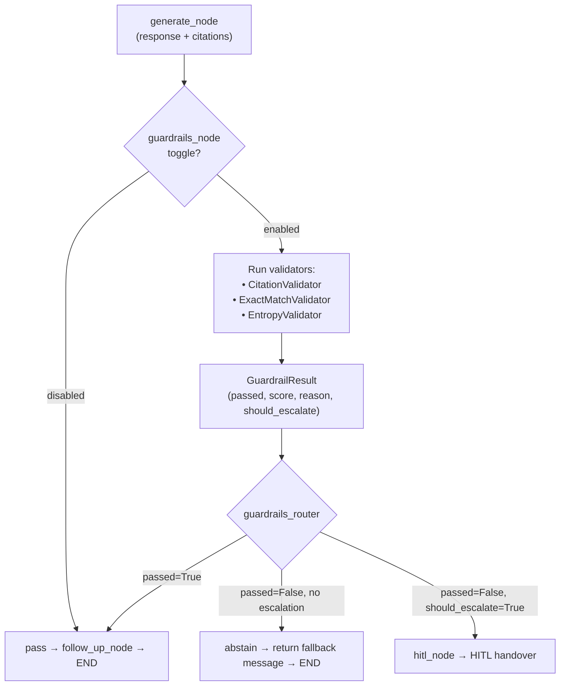

# Guardrails Integration

`guardrails_node` validates every LLM response before it is streamed to the user. The `guardrails_router` decides whether to pass, abstain, or escalate to HITL based on validation results.

---

## Flow



---

## Validators

### CitationValidator

Checks that every `[n]` citation in the response references a chunk that was actually retrieved.

| Check | Pass condition |
|---|---|
| Citation indices valid | All `[n]` in response map to a chunk in `reranked_chunks` |
| Minimum citations | At least 1 citation for factual claims |
| No out-of-range indices | `[n]` values ≤ `len(reranked_chunks)` |

Failure: response contains unsupported factual claims or phantom citations.

---

### ExactMatchValidator

Verifies that specific high-stakes values in the response match the source chunks exactly.

| Value type | Check |
|---|---|
| Prices | Response price matches chunk price within 0.01 |
| Dates | Response dates appear verbatim in at least one chunk |
| Named entities (nouns) | Key nouns appear in retrieved chunks |

Failure: response states a price or date not found in any retrieved chunk.

---

### EntropyValidator

Detects low-confidence or high-uncertainty responses that should be abstained rather than sent.

| Score | Meaning |
|---|---|
| `entropy > 0.8` | High uncertainty — response is highly hedged or vague |
| `entropy < 0.2` | Low uncertainty — confident response |

Failure: response has high entropy AND no strong chunk support (low chunk scores).

---

## GuardrailResult

```python
@dataclass
class GuardrailResult:
    passed: bool
    score: float              # 0.0 (fail) to 1.0 (pass)
    reason: str               # Human-readable failure reason
    should_escalate: bool     # True if HITL should be triggered
    validator: str            # Which validator failed first
```

---

## Routing Logic

```python
def guardrails_router(state: NexusState) -> str:
    result = state.get("guardrail_result")
    if result is None or result.passed:
        return "pass"
    if result.should_escalate:
        return "hitl"
    return "abstain"
```

`should_escalate` is `True` when:
- `ExactMatchValidator` fails on a price value (financial accuracy risk)
- `CitationValidator` finds phantom citations (hallucination risk)
- Multiple validators fail simultaneously

---

## Abstention Response

When `abstain` is returned, the streamed response is replaced with a safe fallback:

```
I don't have enough reliable information to answer that question accurately. 
Please check [source] or contact support for details.
```

The fallback is templated — it can include workspace-specific support links via the `core` scenario prompt.

---

## Toggle Behavior

When `guardrails_node` is disabled:
- All responses bypass validation and stream directly
- No `guardrail_result` is written to state
- `guardrails_router` returns `"pass"` unconditionally

> **⚠️ WARNING:** Disabling guardrails removes price accuracy checking and citation enforcement. Reserve for internal testing only.

---

## Troubleshooting

| Symptom | Cause | Fix |
|---|---|---|
| All responses abstaining | `RERANK_CONFIDENCE_FLOOR` too high; no chunks passing | Lower confidence floor in dynamic settings |
| Correct responses abstaining | `EntropyValidator` threshold miscalibrated | Adjust `ENTROPY_THRESHOLD` in config |
| HITL triggered on price questions | `ExactMatchValidator` failing on price format mismatch | Normalize price format in product catalog (`99.00` vs `$99`) |
| Guardrails not running | Toggle off | Enable `guardrails_node` in AI settings |

---

## Related Docs

- [Guardrails — Full Reference](../14-guardrails/README.md)
- [Node Toggles](../06-ai-customization/node-toggles.md)
- [HITL Handover](../07-messenger-integration/hitl-handover.md)
- [Stage 5 — Generation](../02-rag-pipeline/stage-5-generation.md)
