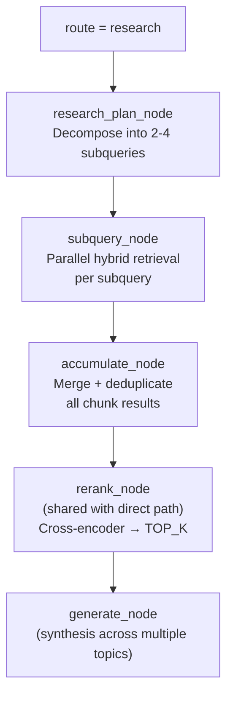

# Research Mode

Research mode handles complex multi-part queries by decomposing them into focused subqueries, retrieving independently for each, then merging results before generation.

---

## When Research Mode Activates

Research mode runs when:
1. `route_query_node` sets `route = "research"` (see [Retrieval Routing](retrieval-routing.md))
2. `ai_settings.node_toggles.research_mode_node = true`

If the toggle is off, the graph falls back to single-pass `direct` retrieval regardless of the route classification.

---

## Pipeline



---

## research_plan_node

Decomposes the user query into 2–4 independent subqueries using a focused LLM prompt:

**Prompt:**
```
Break this complex question into 2-4 focused subqueries that can each be answered
independently from a knowledge base. Each subquery should be a complete, standalone question.

Original question: "{message}"

Return JSON: {"subqueries": ["...", "...", "..."]}
```

**Example:**
- Input: "What are the differences between the Pro and Enterprise plans in terms of pricing, API limits, and support?"
- Output:
  ```json
  {
    "subqueries": [
      "What is the pricing for the Pro plan?",
      "What is the pricing for the Enterprise plan?",
      "What are the API rate limits for Pro vs Enterprise?",
      "What support options are included with Pro and Enterprise?"
    ]
  }
  ```

Subquery count is capped at 4. More than 4 subqueries cause latency to dominate quality gains.

---

## subquery_node

Each subquery in `state.subqueries` is run through the full hybrid retrieval pipeline independently and in parallel:

```python
results = await asyncio.gather(*[
    hybrid_retrieve(subquery, tenant_id, top_k=RETRIEVE_K)
    for subquery in state["subqueries"]
])
state["subquery_results"] = results
```

Each retrieval call returns up to `RETRIEVE_K` chunks (default 50 per arm, RRF-fused).

---

## accumulate_node

Merges all subquery results into a single ranked chunk list:

1. **Union:** Collect all chunks from all subquery results
2. **Deduplicate:** Remove chunks with identical `content_hash`
3. **Re-score:** Average RRF scores across subqueries for chunks appearing in multiple results (promotes breadth coverage)
4. **Sort:** Rank by merged score descending
5. **Cap:** Retain top `RETRIEVE_K` for the reranker

---

## Generation Behavior in Research Mode

`generate_node` is aware of the research path via `state.route`. When `route = "research"`:

- System prompt includes a synthesis instruction: "You have gathered information across multiple topics. Synthesize a complete, structured answer."
- Response may use headers or sections if multiple distinct topics are covered
- Citation count expectation is higher (more chunks consulted)

---

## Latency Profile

| Mode | Typical latency (TTFT) |
|---|---|
| `direct` | 800ms – 1.5s |
| `research` | 2.5s – 5s |

Research mode is 2–4× slower due to parallel retrieval + accumulation. Use the toggle to disable for latency-sensitive deployments (Messenger, real-time chat).

---

## Troubleshooting

| Symptom | Cause | Fix |
|---|---|---|
| Research mode slow | Too many subqueries | Check `research_plan_node` output; cap at 4 |
| Subquery results empty | All subqueries retrieving same zero-result chunks | Check vault coverage for the topic |
| Generation ignores some subquery topics | Accumulate dedup removed relevant chunks | Lower `content_hash` dedup threshold; increase `RETRIEVE_K` |
| Research path never triggers | Toggle off or routing always `direct` | Enable toggle; check routing classification signals |

---

## Related Docs

- [Retrieval Routing](retrieval-routing.md)
- [Stage 3 — Hybrid Retrieval](../02-rag-pipeline/stage-3-hybrid-retrieval.md)
- [Stage 4 — Reranking](../02-rag-pipeline/stage-4-reranking.md)
- [Node Toggles](../06-ai-customization/node-toggles.md)
