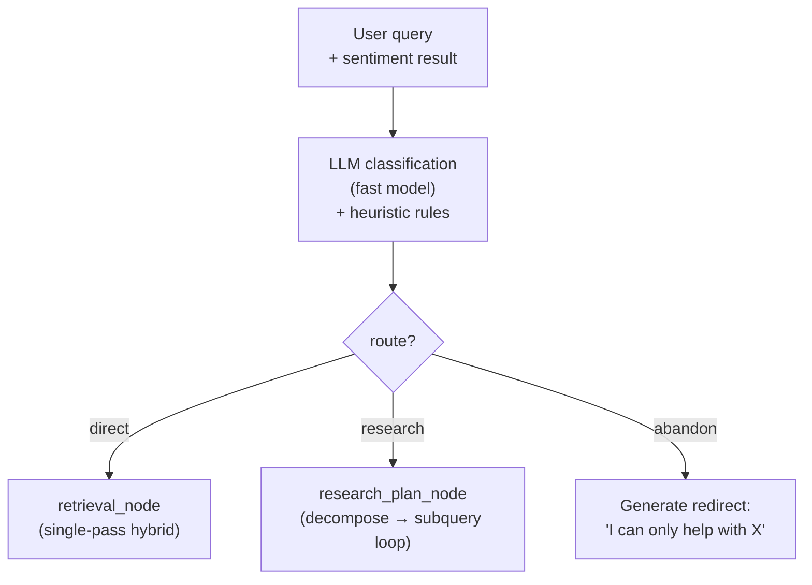

# Retrieval Routing

`route_query_node` classifies each incoming query and sets the routing branch that determines which retrieval path the graph follows.

---

## Route Values

| Route | Retrieval path | When used |
|---|---|---|
| `direct` | Single-pass `retrieval_node` → `rerank_node` | Most queries: clear, single-topic questions |
| `research` | `research_plan_node` → `subquery_node` (loop) → `accumulate_node` → `rerank_node` | Multi-part, comparative, or ambiguous queries |
| `abandon` | Graph exits immediately with a redirect message | Gibberish, off-topic, or clearly unanswerable |

---

## Routing Decision Matrix

| Signal | Route assigned |
|---|---|
| Query contains comparison ("vs", "compare", "difference between") | `research` |
| Query has 3+ distinct topics or sub-questions | `research` |
| Sentiment node reports `confused` or `frustrated` AND query is long | `research` |
| Query is a clear single-topic question | `direct` |
| Query is a greeting or simple acknowledgment | `direct` |
| Query is empty, pure noise, or under 3 characters | `abandon` |
| Query is clearly outside the vault scope (e.g., "what's the weather?") | `abandon` |

---

## Routing Flow



---

## Classification Prompt

`route_query_node` uses a compact LLM call:

```
Classify this query routing:
- "direct": single clear question answerable in one retrieval pass
- "research": multi-part, comparative, or complex — needs decomposition
- "abandon": off-topic, gibberish, or unanswerable from the knowledge base

Query: "{message}"
Sentiment: {sentiment}

Respond with JSON: {"route": "direct|research|abandon", "reason": "..."}
```

Heuristic overrides apply after the LLM call:
- Short queries (< 10 words) default to `direct` unless containing explicit comparison keywords
- Queries matching the `abandon` keyword blocklist skip the LLM call entirely

---

## Abandon Response

When `route = "abandon"`, the graph bypasses retrieval and generation entirely. A canned redirect is returned:

```
I'm designed to help with questions about [workspace topic]. 
I'm not able to help with that particular request — is there 
something else I can assist you with?
```

The redirect text is customizable via the `core` scenario prompt (a well-crafted core prompt can include specific examples of what the bot covers).

---

## Research Mode Gate

`research` routing is only effective when `research_mode_node` toggle is `true`. If the toggle is `false` and routing returns `research`, the router falls back to `direct`:

```python
def route_query_router(state: NexusState) -> str:
    route = state["route"]
    if route == "research" and not state["ai_settings"].node_toggles.research_mode_node:
        return "direct"  # Fallback when toggle off
    return route
```

---

## Troubleshooting

| Symptom | Cause | Fix |
|---|---|---|
| Complex queries always routed `direct` | `research_mode_node` toggled off | Enable toggle in AI settings |
| Bot abandons valid questions | Overly conservative classification | Adjust abort threshold in `route_query_node` prompt |
| Research mode triggers on simple questions | LLM classification over-sensitive | Add few-shot examples to classification prompt; check heuristic overrides |

---

## Related Docs

- [Research Mode](research-mode.md)
- [Nodes Reference](nodes-reference.md)
- [Node Toggles](../06-ai-customization/node-toggles.md)
