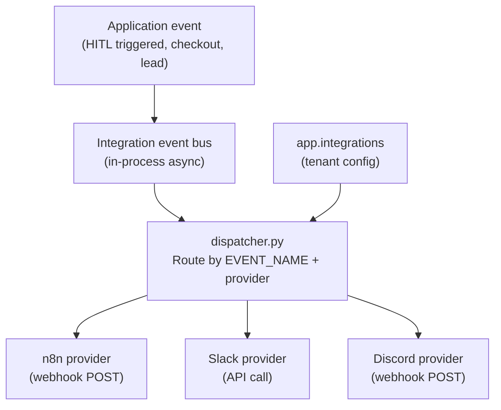

# Integrations

NEXUS connects to external services via a dispatcher + provider plugin model. Integrations are stored per tenant in `app.integrations` and dispatched via an event bus.

---

## Integration Types

| Provider | Purpose | Status |
|---|---|---|
| Meta Messenger | Conversational AI channel | Shipped (Phases 34–38) |
| n8n | Webhook automation (checkout, lead, notify) | Shipped (Phases 34, 37) |
| LiteLLM | LLM proxy / model fallback routing | Shipped |
| Slack | Event subscription notifications | Partial |
| Discord | Event subscription notifications | Partial |

---

## Architecture



---

## Section Contents

| Doc | Description |
|---|---|
| [Integration Event Model](integration-event-model.md) | Event bus, `EVENT_NAMES`, subscription config |
| [n8n Automation](n8n-automation.md) | Messenger bridge, checkout, lead, notify webhooks |
| [LiteLLM Proxy](litellm-proxy.md) | Model routing config, fallbacks, API key mapping |
| [Slack & Discord](slack-discord.md) | Event subscriptions, payload schema |

---

## Adding an Integration

Integrations are created per tenant:

```bash
curl -X POST https://chat.nexus.gayo-sphere.cloud/api/integrations \
  -H "Authorization: Bearer $TOKEN" \
  -H "Content-Type: application/json" \
  -d '{
    "provider": "slack",
    "config": {
      "webhook_url": "https://hooks.slack.com/...",
      "events": ["hitl_triggered", "checkout_completed"]
    }
  }'
```

---

## Related Docs

- [Messenger Integration](../07-messenger-integration/README.md)
- [AI Customization — SDR Persona](../06-ai-customization/sdr-persona.md)
- [API Reference — Integrations](../03-api-reference/integrations/integrations.md)
