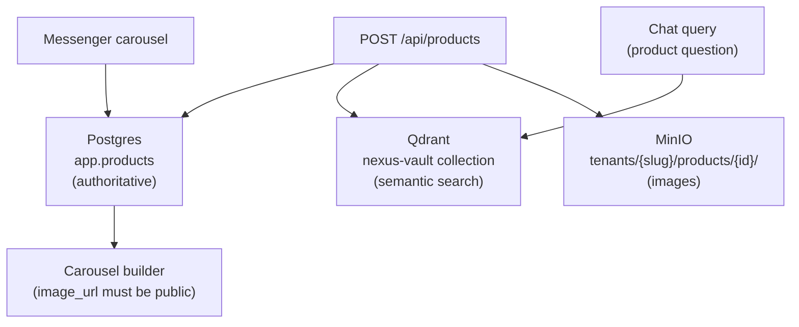

# Product Catalog

NEXUS maintains a product catalog per tenant stored in three places simultaneously: Postgres (authoritative source), Qdrant (semantic search), and MinIO (product images).

---

## Storage Architecture



---

## Data Model

| Field | Type | Notes |
|---|---|---|
| `id` | UUID | Primary key |
| `tenant_id` | UUID | FK → `app.tenants` |
| `slug` | text | URL-safe identifier, unique per tenant |
| `name` | text | Display name |
| `description` | text | Rich text, used for Qdrant embedding |
| `price` | numeric(10,2) | In tenant's currency |
| `currency` | char(3) | ISO 4217, default `USD` |
| `image_urls` | jsonb | Ordered list of MinIO presigned URLs |
| `is_active` | bool | Soft-delete gate |
| `metadata` | jsonb | Arbitrary extension fields |
| `created_at` | timestamptz | — |
| `updated_at` | timestamptz | Auto-updated via trigger |

---

## Section Contents

| Doc | Description |
|---|---|
| [Product Management](product-management.md) | CRUD operations, slug rules, archiving |
| [Image Management](image-management.md) | MinIO WebP uploads, display order, presigned URLs |
| [Qdrant Sync](qdrant-sync.md) | Embedding sync, deterministic UUIDs, deduplication |

---

## Quick Reference

```bash
# List products for current tenant
curl https://chat.nexus.gayo-sphere.cloud/api/products \
  -H "Authorization: Bearer $TOKEN"

# Create product
curl -X POST https://chat.nexus.gayo-sphere.cloud/api/products \
  -H "Authorization: Bearer $TOKEN" \
  -d '{"name": "Pro Package", "price": 99.00, "description": "..."}'

# Upload product image
curl -X POST https://chat.nexus.gayo-sphere.cloud/api/products/{id}/images \
  -H "Authorization: Bearer $TOKEN" \
  -F "file=@product.webp"
```

---

## Related Docs

- [Product Context Node](../08-orchestrator/product-context.md)
- [Sales Tools](../08-orchestrator/sales-tools.md)
- [API Reference — Products](../03-api-reference/products/products.md)
