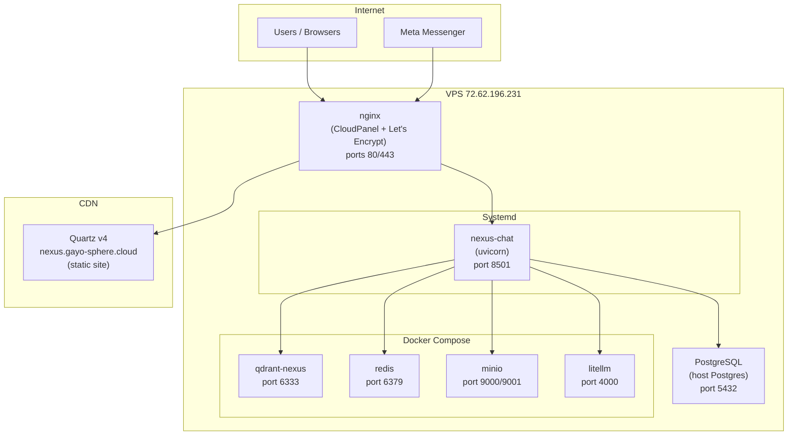

# Deployment

NEXUS runs on a single VPS with Docker Compose for infrastructure services and systemd for the application process. This section covers the full deployment architecture.

---

## Topology



---

## Services Summary

| Service | Runtime | Port | Purpose |
|---|---|---|---|
| `nexus-chat` | systemd + uvicorn | 8501 | FastAPI RAG application |
| `qdrant-nexus` | Docker | 6333 | Vector store |
| `redis` | Docker | 6379 | Queues, coalescing, HITL pause keys |
| `minio` | Docker | 9000/9001 | Object storage (avatars, images) |
| `litellm` | Docker | 4000 | LLM proxy / fallback routing |
| `postgres` | Host | 5432 | Relational data + LangGraph checkpoints |
| `nginx` | Host (CloudPanel) | 80/443 | Reverse proxy + TLS termination |

---

## Deployment Scripts

| Script | Purpose |
|---|---|
| `deploy-rag.sh` | Deploy RAG application: rsync + migrate + restart |
| `deploy-nexus.sh` | Deploy Quartz static site: build + rsync |

---

## Section Contents

| Doc | Description |
|---|---|
| [Prerequisites](prerequisites.md) | VPS specs, DNS, required services |
| [Environment Setup](environment-setup.md) | `.env` structure, secrets, systemd EnvironmentFile |
| [Docker Compose Guide](docker-compose-guide.md) | Container architecture, networking, volumes |
| [RAG Deployment](rag-deployment.md) | `deploy-rag.sh` step-by-step |
| [Quartz Publishing](quartz-publishing.md) | `deploy-nexus.sh`: Quartz build → rsync |
| [Alembic Migrations](alembic-migrations.md) | Migration workflow: create, upgrade, downgrade |
| [nginx Configuration](nginx-configuration.md) | Reverse proxy, TLS, Messenger webhook routing |
| [Post-Deploy Verification](post-deploy-verification.md) | Health checks, systemctl, journalctl, smoke tests |

---

## Quick Deploy

```bash
# Deploy RAG application
./deploy-rag.sh

# Deploy Quartz vault site
./deploy-nexus.sh
```

---

## Related Docs

- [Environment Variables](../16-configuration-reference/environment-variables.md)
- [Observability — Health Endpoint](../13-observability/health-endpoint.md)
- [Alembic Migrations](alembic-migrations.md)
