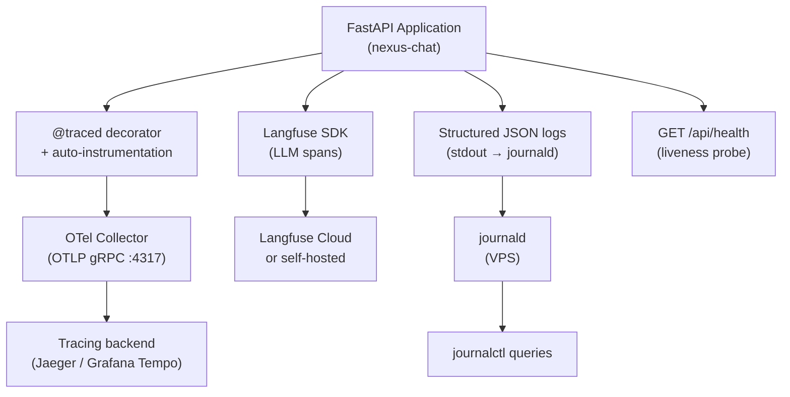

# Observability

NEXUS uses four observability layers: OpenTelemetry traces, Langfuse LLM tracing, a health endpoint, and structured application logs.

---

## Stack

| Layer | Tool | Purpose |
|---|---|---|
| Distributed tracing | OpenTelemetry + OTLP | Spans across FastAPI, Qdrant calls, LLM calls |
| LLM tracing | Langfuse | Token usage, latency, generation quality per conversation |
| Health | `/api/health` | Liveness + dependency readiness |
| Structured logging | Python `logging` + JSON sink | Request logs, audit trail, PII-redacted events |
| Metrics (future) | Prometheus (planned) | Request rates, latency histograms |

---

## Architecture



---

## Section Contents

| Doc | Description |
|---|---|
| [OpenTelemetry](opentelemetry.md) | Collector config, OTLP exporter, `@traced` decorator |
| [Langfuse](langfuse.md) | LLM tracing, span structure, activation |
| [Health Endpoint](health-endpoint.md) | `/api/health`: dependency checks, response format |
| [Structured Logging](structured-logging.md) | Log format, PII redaction, audit log, `journalctl` queries |

---

## Quick Status Check

```bash
# Application alive?
curl -s https://chat.nexus.gayo-sphere.cloud/api/health | jq .status

# Recent errors
journalctl -u nexus-chat -p err -n 20 --no-pager

# LLM traces → Langfuse dashboard (if configured)
# OTel traces → configured backend (if collector running)
```

---

## Related Docs

- [Deployment — Post-Deploy Verification](../12-deployment/post-deploy-verification.md)
- [Deployment — Environment Setup](../12-deployment/environment-setup.md) — OTel + Langfuse env vars
