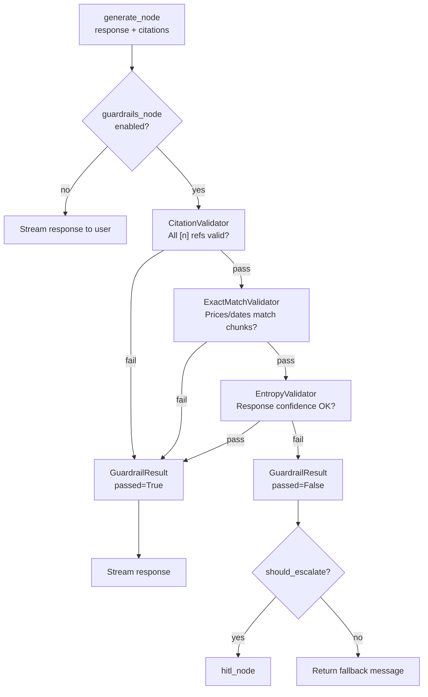

# Guardrails

The guardrails system validates every LLM response before it reaches the user. Three validators run in sequence; any failure routes to abstain or HITL.

---

## Pipeline



---

## Validators Summary

| Validator | Checks | Failure mode |
|---|---|---|
| `CitationValidator` | All `[n]` in response map to real retrieved chunks | `abstain` or `hitl` if phantom citations |
| `ExactMatchValidator` | Prices, dates, named nouns match source chunks | `hitl` if financial value wrong |
| `EntropyValidator` | Response is not excessively hedged or vague | `abstain` if high entropy + low chunk support |

---

## Section Contents

| Doc | Description |
|---|---|
| [Citation Validator](citation-validator.md) | Groundedness check, `[n]` enforcement |
| [ExactMatch Validator](exactmatch-validator.md) | Price/date/noun verification against chunks |
| [Entropy Validator](entropy-validator.md) | Uncertainty score, hedging detection |
| [HITL Fallback](hitl-fallback.md) | Pipeline → HITL handover conditions |

---

## Toggle

Disable via AI settings (testing only):

```json
{ "node_toggles": { "guardrails_node": false } }
```

> **⚠️ WARNING:** Disabling removes all output validation. Never in production.

---

## Related Docs

- [Orchestrator — Guardrails Integration](../08-orchestrator/guardrails-integration.md)
- [Node Toggles](../06-ai-customization/node-toggles.md)
- [HITL Handover](../07-messenger-integration/hitl-handover.md)
