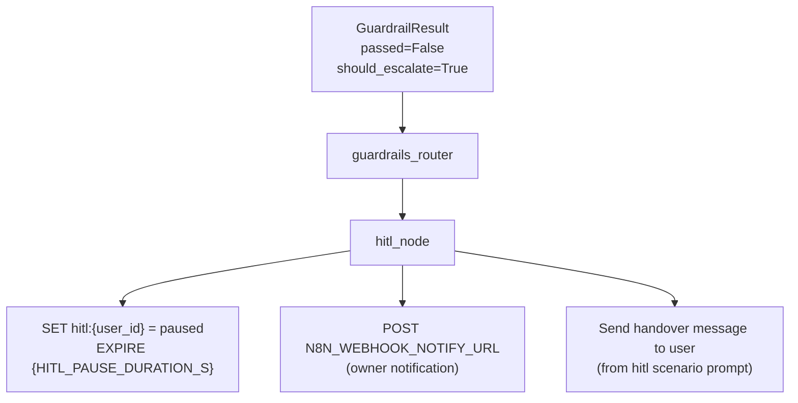

# HITL Fallback

When guardrails detect a response that cannot safely be abstained — typically a price error or phantom citation — the pipeline escalates to HITL handover instead of returning a fallback message.

---

## Escalation Conditions

| Validator | `should_escalate` | Reason |
|---|---|---|
| `CitationValidator` — phantom index | `True` | Model hallucinated a citation — trust compromised |
| `ExactMatchValidator` — price wrong | `True` | Financial accuracy risk — must not auto-abstain |
| `ExactMatchValidator` — date wrong | `False` | Lower risk — safe fallback |
| `EntropyValidator` — high entropy | `False` | Uncertain response — safe fallback |
| Multiple validators fail simultaneously | `True` | Compound failure — escalate |

---

## Escalation Flow



---

## Handover Message

The message sent to the user comes from the `hitl` scenario prompt. If not configured, the built-in default:

```
I want to make sure you get accurate information on this.
I'm connecting you with a human agent who can help you directly.
Please hold on — someone will be with you shortly.
```

The guardrail failure reason is included in the HITL notification to the owner but never shown to the user.

---

## Notification Payload

```json
{
  "event": "hitl_triggered",
  "trigger_source": "guardrails",
  "validator": "ExactMatchValidator",
  "failure_reason": "Price $129 not found in retrieved chunks",
  "tenant_id": "acme-corp",
  "conversation_id": "thread-uuid",
  "sender_id": "psid-or-user-id",
  "triggered_at": "2026-06-14T00:00:00Z"
}
```

The `trigger_source: "guardrails"` field distinguishes guardrail-triggered HITL from user-requested HITL (`"user"`) or triage-triggered HITL (`"triage"`).

---

## Abstain vs. Escalate Decision

When guardrails fail and `should_escalate = False`, the response is replaced with a safe fallback rather than triggering HITL:

```
I don't have enough reliable information to answer that accurately.
For the most up-to-date details, please contact us directly.
```

This keeps human agents available for genuinely high-risk failures rather than routine uncertain answers.

---

## Monitoring

Track escalation frequency via the audit log:

```bash
curl "https://chat.nexus.gayo-sphere.cloud/api/logs?event_type=hitl_triggered&source=guardrails" \
  -H "Authorization: Bearer $TOKEN" | jq '.[] | {reason, triggered_at}'
```

High guardrail escalation rates indicate either poor vault coverage, product catalog formatting issues, or model drift.

---

## Related Docs

- [HITL Handover](../07-messenger-integration/hitl-handover.md) — Redis pause key, resume flow
- [Citation Validator](citation-validator.md)
- [ExactMatch Validator](exactmatch-validator.md)
- [Orchestrator — Guardrails Integration](../08-orchestrator/guardrails-integration.md)
