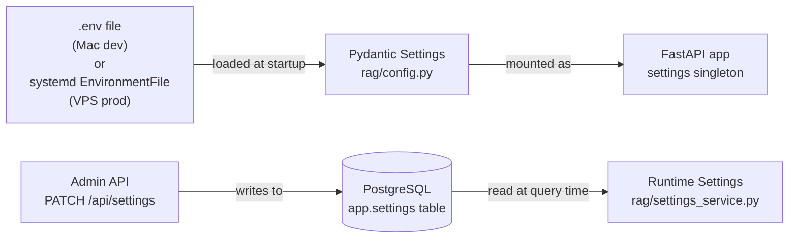

# Configuration Reference

NEXUS has two configuration layers: **static environment variables** (set before startup in `.env` or systemd `EnvironmentFile`) and **dynamic runtime settings** (stored in Postgres, modifiable via the API without restart).

---

## Configuration Layers

---

## Which Layer to Use

| Use case | Layer |
|---|---|
| Database DSN, API keys, secrets | `.env` / environment variables |
| Service URLs (Qdrant, Redis, MinIO) | `.env` / environment variables |
| JWT secret, Groq API key | `.env` / environment variables |
| Retrieval parameters (TOP_K, RETRIEVE_K) | Dynamic settings (live-tunable) |
| Chunk size, overlap, semantic threshold | Dynamic settings (live-tunable) |
| Active LLM models | Dynamic settings (live-tunable) |
| UI theme | Dynamic settings (live-tunable) |

---

## Files

| File | Purpose |
|---|---|
| `rag/config.py` | Pydantic `Settings` class — all static env vars with types and defaults |
| `rag/settings_service.py` | `SettingsService` — async CRUD over `app.settings` Postgres table |
| `rag/.env` | Local dev secrets (gitignored) |
| `/home/nexus-rag/.env` | VPS prod secrets (managed in place, excluded from rsync) |

---

## Security Rules

> **⚠️ WARNING:** Never commit secrets to git. The `.env` file is in `.gitignore`. The VPS `.env` is excluded from `deploy-rag.sh` via `rsync --exclude='.env'`.

- `NEXUS_JWT_SECRET` must be at least 32 bytes of random data
- `QDRANT_API_KEY` must be set in production (Qdrant runs without auth in dev Docker but is exposed via public HTTPS in prod)
- `GROQ_API_KEY` is required for any LLM operation — the server will start without it but all chat endpoints will fail
- API keys for MinIO and Langfuse are optional; features degrade gracefully when absent

---

## Environment Differences (Mac dev vs. VPS prod)

| Variable | Mac dev | VPS prod |
|---|---|---|
| `QDRANT_URL` | `https://qdrant.nexus.gayo-sphere.cloud:443` | `http://127.0.0.1:6333` |
| `VAULT_PATH` | Local disk path | `/home/nexus-vault` |
| `POSTGRES_DSN` | Local Postgres | Container Postgres via Docker network |
| `REDIS_URL` | `redis://localhost:6379` | `redis://redis:6379` (Docker service name) |

---

## Documents in This Section

| Document | Contents |
|---|---|
| [Environment Variables](environment-variables.md) | Complete table of all 60+ static env vars: type, default, required flag |
| [Dynamic Settings](dynamic-settings.md) | `SETTING_KEYS` reference — live-tunable retrieval and generation parameters |
