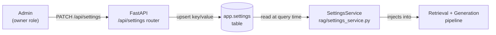

# Dynamic Settings

Dynamic settings are runtime-configurable parameters stored in the `app.settings` PostgreSQL table. Unlike environment variables, they can be changed without restarting the server via `PATCH /api/settings`.

---

## Overview



The `SettingsService` reads settings lazily — each pipeline invocation queries the current value from Postgres. Changes take effect **on the next request** with no restart required.

---

## Allowed Keys (SETTING_KEYS)

Only keys in the allowlist defined in `rag/settings_service.py` can be written. Attempts to write unlisted keys return `400 Bad Request`.

| Key | Type | Default | Description |
|---|---|---|---|
| `TOP_K` | `int` | `6` | Final number of chunks passed to the LLM after reranking. Increasing this gives the LLM more context but raises token usage. Range: 1–20. |
| `RETRIEVE_K` | `int` | `50` | Candidates retrieved per arm (dense / sparse / graph) before RRF fusion. Larger values increase recall at the cost of reranker compute. Range: 10–200. |
| `CHUNK_TOKENS` | `int` | `400` | Target token count per chunk during ingestion. Changing this only affects **new** ingestion runs; existing chunks are not re-chunked automatically. |
| `CHUNK_OVERLAP` | `int` | `50` | Token overlap between adjacent chunks during ingestion. Same note as `CHUNK_TOKENS` — affects new runs only. |
| `SEMANTIC_BREAK_THRESHOLD` | `float` | `0.55` | Cosine similarity floor for semantic chunking. Lower = more splits (smaller, more precise chunks). Higher = fewer splits (larger, more contextual chunks). Affects new ingestion only. |
| `RERANK_CONFIDENCE_FLOOR` | `float` | `0.30` | Minimum cross-encoder score for the top reranked chunk. If the best chunk scores below this, NEXUS rewrites the query or abstains. Range: 0.0–1.0. |
| `GROQ_MODEL` | `str` | `llama-3.3-70b-versatile` | Primary generation model. Must be a valid Groq model ID. Applied to all tenants unless overridden by per-tenant `model_choice` in AI settings. |
| `FOLLOWUP_MODEL` | `str` | `llama-3.1-8b-instant` | Fast follow-up suggestion model. Runs 3 times per turn. |
| `THEME` | `str` | `dark` | UI theme for the nexus-ui frontend (`light` / `dark` / `system`). |
| `system_prompt_id` | `str` | `""` | Slug of the active system prompt from the resources library. Overrides the default prompt for all tenants that haven't set a custom prompt. |

---

## API Usage

### Read All Settings

```http
GET /api/settings
Authorization: Bearer <jwt>
```

Response:

```json
{
  "TOP_K": 6,
  "RETRIEVE_K": 50,
  "CHUNK_TOKENS": 400,
  "CHUNK_OVERLAP": 50,
  "SEMANTIC_BREAK_THRESHOLD": 0.55,
  "RERANK_CONFIDENCE_FLOOR": 0.30,
  "GROQ_MODEL": "llama-3.3-70b-versatile",
  "FOLLOWUP_MODEL": "llama-3.1-8b-instant",
  "THEME": "dark",
  "system_prompt_id": ""
}
```

### Update a Setting

```http
PATCH /api/settings
Authorization: Bearer <jwt>
Content-Type: application/json

{
  "key": "TOP_K",
  "value": 8
}
```

> **📝 NOTE:** Only the `owner` role can update settings. `admin` and `member` roles receive `403 Forbidden`.

---

## Interaction with Per-Tenant AI Settings

Dynamic settings act as **system-wide defaults**. Per-tenant AI settings (Phase 48) can override `model_choice`, `temperature`, and `max_tokens` on a per-workspace basis. The override precedence is:

```
Per-tenant AI settings (model_choice) > GROQ_MODEL dynamic setting > GROQ_MODEL env var
```

→ See [AI Customization — Model Parameters](../06-ai-customization/model-parameters.md) for the full override chain.

---

## Effect on Ingestion vs. Retrieval

| Setting | Affects ingest? | Affects retrieval? | Notes |
|---|---|---|---|
| `TOP_K` | No | ✅ Yes | Immediate on next query |
| `RETRIEVE_K` | No | ✅ Yes | Immediate on next query |
| `CHUNK_TOKENS` | ✅ New runs only | No | Requires re-ingest to apply |
| `CHUNK_OVERLAP` | ✅ New runs only | No | Requires re-ingest to apply |
| `SEMANTIC_BREAK_THRESHOLD` | ✅ New runs only | No | Requires re-ingest to apply |
| `RERANK_CONFIDENCE_FLOOR` | No | ✅ Yes | Immediate |
| `GROQ_MODEL` | No | No | ✅ Generation only |
| `FOLLOWUP_MODEL` | No | No | ✅ Generation only |
| `THEME` | No | No | UI only |
| `system_prompt_id` | No | No | ✅ Generation only |

---

## Storage Schema

```sql
-- app.settings table
CREATE TABLE app.settings (
    key     VARCHAR PRIMARY KEY,
    value   JSONB NOT NULL,
    updated_at TIMESTAMPTZ NOT NULL DEFAULT now()
);
```

Values are stored as JSONB, allowing integers, floats, strings, and booleans without schema changes.

---

## Related Docs

- [Environment Variables](environment-variables.md) — static startup configuration
- [AI Customization — Model Parameters](../06-ai-customization/model-parameters.md) — per-tenant overrides
- [GET/PATCH /api/settings](../03-api-reference/settings/settings.md) — API reference
