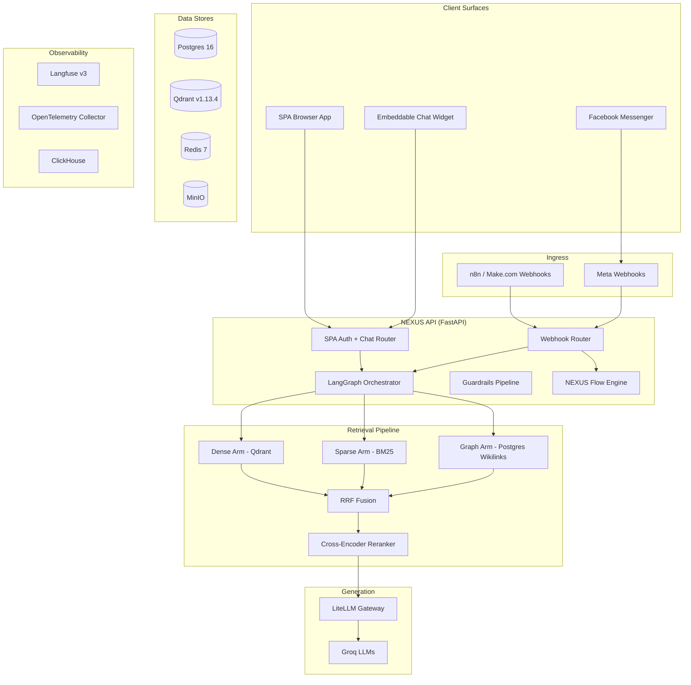

# NEXUS — Exhaustive System Encyclopedia

> **The vault is the source of truth. The RAG layer is the cortex. The agent is the will. Keep all three honest.**

---

## 1. Identity & Mission

**NEXUS** is a sovereign, enterprise-grade **Retrieval-Augmented Generation (RAG)** system fused with an **Obsidian Second Brain**. It is simultaneously:

- A **personal knowledge assistant** — querying, synthesizing, and citing from thousands of Markdown notes organized via the PARA method
- A **B2B SaaS platform** — multi-tenant workspaces with RBAC, product catalogs, and AI customization
- A **Facebook Messenger commerce agent** — an autonomous SDR persona named "Seina" that sells products, triages comments, handles cart recovery, and hands over to humans when needed
- A **visual automation builder** — NEXUS Flow, a drag-and-drop node graph for building Facebook automation workflows

| Attribute | Value |
|---|---|
| **Owner** | Clarence Lloyd Gayo |
| **Vault Root** | `/Users/clarencelloydgayo/Gayo Sphere/Second Brain Nexus` |
| **Published Knowledge Surface** | [nexus.gayo-sphere.cloud](https://nexus.gayo-sphere.cloud) (Quartz v4) |
| **RAG Chat / SaaS App** | [chat.nexus.gayo-sphere.cloud](https://chat.nexus.gayo-sphere.cloud) (FastAPI + React) |
| **VPS** | `72.62.196.231` (Docker Compose v2) |
| **License** | MIT |
| **Python** | ≥3.11 (venv on 3.13), managed by **uv** |
| **Node** | ≥22 (Quartz publishing + React SPA build) |

---

## 2. High-Level Architecture



---

## 3. Docker Compose Infrastructure (11 Services)

The production stack runs on a single VPS via `docker-compose.yml` + `docker-compose.prod.yml`:

| Service | Image | Purpose | Port |
|---|---|---|---|
| **api** | `nexus-v2-api:latest` (custom) | FastAPI unified entrypoint: SPA + API + webhook + LangGraph | 8000 |
| **outbound_worker** | Same image, `python -m rag.messenger.worker` | Redis-backed retry queue consumer for outbound messaging | — |
| **qdrant** | `qdrant/qdrant:v1.13.4` | Vector store, collection `nexus-vault`, 384-dim cosine | 6333 |
| **postgres** | `postgres:16-alpine` | Relational store: app schema, LangGraph checkpoints, Langfuse | 5432 |
| **redis** | `redis:7-alpine` | Cache, rate-limiting, HITL pause flags, outbound queue, idempotency | 6379 |
| **litellm** | `ghcr.io/berriai/litellm:main-stable` | LLM proxy gateway — routes to Groq, Anthropic, OpenAI | 4000 |
| **langfuse-web** | `langfuse/langfuse:3` | Observability UI — trace viewing, cost tracking | 3000 |
| **langfuse-worker** | `langfuse/langfuse-worker:3` | Background event processing for Langfuse | — |
| **clickhouse** | `clickhouse/clickhouse-server:24.8-alpine` | Langfuse v3 analytics store | 8123 |
| **minio** | `minio/minio` | S3-compatible object storage (avatars, product images, Langfuse events) | 9000/9001 |
| **otel-collector** | `otel/opentelemetry-collector-contrib:0.111.0` | OTLP/gRPC → Langfuse OTel ingest + stdout debug | 4317/4318 |

**Named Volumes:** `nexus_qdrant_storage`, `nexus_postgres_data`, `nexus_redis_data`, `nexus_clickhouse_data`, `nexus_clickhouse_logs`, `nexus_minio_data`, `nexus_fastembed_cache`

**Dockerfile** (3-stage multi-stage build):
1. **Stage 0 (`ui`):** Node 22 Alpine — `npm ci` + `npm run build` on `nexus-ui/`
2. **Stage 1 (`builder`):** Python 3.11 slim — installs `uv`, runtime deps (`requirements.txt`), and ingest deps (`requirements-ingest.txt` with PyTorch CPU)
3. **Stage 2 (`runtime`):** Python 3.11 slim — copies site-packages from builder, React dist from ui, creates `nexus` user (UID 1000), runs preflight validator then uvicorn

---

## 4. Obsidian Vault Layout (PARA Method)

| Directory | Purpose | Ingest Behavior |
|---|---|---|
| `00 - Inbox/` | Capture zone; processed daily | Ingested, writable from API upload |
| `01 - Projects/` | Active, dated outcomes | Ingested |
| `02 - Areas/` | Ongoing responsibilities | Ingested |
| `03 - Resources/` | Reference material by topic | Ingested; prompt library source |
| `04 - Archive/` | Completed or inactive | Ingested; excluded from CI reindex |
| `05 - Daily Notes/` | Journal entries | Ingested |
| `06 - Concepts/` | Atomic Zettelkasten notes | Ingested |
| `07 - Entities/` | People, companies, tools, products | Ingested |
| `Dev Logs/` | Engineering work logs (`YYYY-MM-DD — <Title>.md`) | Ingested |
| `_publish/` | Quartz v4 publishing pipeline | **Not ingested** (skip list) |
| `rag/` | The RAG system code | **Not ingested** (skip list) |

---

## 5. Five-Stage RAG Pipeline (Detailed)

### Stage 1 — Ingestion: Layout-Aware + Semantic Chunking

- **Layout-aware splitting:** Parses each note into a tree of Markdown headings (`#` through `####`). The heading path travels with each chunk as `heading_path: ["Parent", "Child", "Leaf"]`
- **Semantic boundaries:** Within each leaf section, a sliding-window cosine-similarity check on adjacent sentence embeddings cuts where similarity drops below `SEMANTIC_BREAK_THRESHOLD` (default `0.55`)
- **Token budget envelope:** Cap per chunk at `CHUNK_TOKENS=400` with `CHUNK_OVERLAP=50` (measured by `tiktoken` cl100k). Overlap taken from the previous semantically-coherent unit
- **Code-fence preservation:** Triple-backtick blocks never split; oversized fences emit as single chunks with `oversize: true`
- **Frontmatter handling:** YAML frontmatter parsed as metadata, not embedded as text
- **Two ingest pipelines exist:**
  - `rag/ingest.py` — v1 production pipeline (header walk + 400/50 chunking, shipped)
  - `rag/ingest_v2/` — v2 pipeline with semantic chunking (`chonkie SemanticChunker`), late-chunking model (`jinaai/jina-embeddings-v2-base-en`, 768-dim, 8192-token), graph DB wikilink extraction, multimodal support, Qdrant writer
- **Watcher:** `rag/watcher.py` — `watchdog` debounced 3s filesystem observer triggers incremental ingest on `.md` create/modify. Skip list: `_publish`, `.obsidian`, `.git`, `rag`, `node_modules`

### Stage 2 — Automated Metadata Extraction

Every chunk carries a rich, queryable payload:

| Field | Source | Purpose |
|---|---|---|
| `file` | absolute path | citation, dedup, vector GC |
| `folder` | PARA bucket | filter by Projects/Areas/Resources/Archive |
| `title` | frontmatter or first `#` | display name |
| `heading_path` | layout walk | structural context |
| `tags` | frontmatter `tags:` + inline `#tag` | facet filters |
| `aliases` | frontmatter `aliases:` | query expansion |
| `wikilinks_out` | `[[…]]` parser | GraphRAG edges |
| `wikilinks_in` | reverse index | backlink boosting |
| `date_created` / `date_modified` | filesystem stat or frontmatter | recency reranking |
| `content_hash` | SHA-256 of body | idempotent re-ingest |
| `chunk_index` / `chunk_total` | layout walk | reassembly |
| `source_kind` | `note` / `daily` / `product` | source mixing |
| `tenant_id` | tenant slug | multi-tenant isolation |
| `language` | fasttext detect | route to multilingual model |

### Stage 3 — Hybrid Retrieval (3 Arms + RRF)

- **Dense arm (`rag/retrieval/dense.py`):** Qdrant cosine search, `BAAI/bge-small-en-v1.5` (384-dim), `RETRIEVE_K=50`
- **Sparse arm (`rag/retrieval/sparse.py`):** BM25 via `rank_bm25`, in-memory corpus cache (`BM25_CACHE_TTL_SECONDS=3600`), tenant-scoped. **Zero-trust guard:** raises `RuntimeError` when no `tenant_id` predicate is present
- **Graph arm (`rag/retrieval/graph.py`):** Postgres-backed one-hop wikilink walk on `app.document_links`, tenant-scoped
- **Fusion (`rag/retrieval/rrf.py`):** Reciprocal Rank Fusion with `k=60`, intent-adaptive weights (`factual` → dense-heavy, `conceptual` → sparse-heavy)
- **Filters:** folder / tag / date / `source_kind` filters always honored at retrieval time

### Stage 4 — Cross-Encoder Reranking

- **Model:** `Xenova/ms-marco-MiniLM-L-6-v2` (23MB ONNX, fastembed-native, loads in <2s)
- **Input:** Top-50 from RRF → score each `(query, chunk_text)` pair → sort → return `TOP_K=6`
- **Recency bias:** Optional `λ · recency_score` when temporal intent detected (default λ=0.0)
- **Score logging:** `bm25_rank`, `dense_rank`, `rrf_score`, `rerank_score` per surviving chunk

### Stage 5 — Generation with Citation Enforcement

- **Primary model:** Groq `llama-3.3-70b-versatile` via LiteLLM proxy, temperature `0.3`, max tokens `1024`
- **Follow-up model:** Groq `llama-3.1-8b-instant`, temperature `0.5`, 3 follow-ups per turn
- **Vision model:** Groq `llama-4-scout` for image attachments
- **System prompts:** Three distinct prompts:
  - `system_brix.md` — Seina persona for Messenger (warm sales rep, product-recall pronoun rules, CRM personalization)
  - `system_internal.md` — Vault knowledge assistant for SPA (concise, citation-strict, multi-hop reasoning)
  - `system_recovery.md` — Cart recovery (warm, ≤200 chars, plain prose, no tools)
- **Strict citation:** Sources injected as `Source [n]: <display_name>\nContent: ...`. Every claim must carry `[n]` citations. Refuses when context can't support the answer
- **Streaming SSE events:** `status → sources → token×N → followups → done`

---

## 6. LangGraph Orchestrator (20-Node State Graph)

### Graph Topology

```
START
  → enrich_customer_profile
    → rewrite_query
      → preprocess_vision
        → sentiment_analysis
          → route_query
            ├──[direct]── direct_fanout ─┐
            └──[research]── plan_research │
                → next_subquery ──────────┤
                                          ├→ retrieve_dense  ─┐
                                          ├→ retrieve_sparse ─┤
                                          └→ retrieve_graph  ─┘
                                                  │
                                                fuse
                                                  │
                                                rerank
                                                  │
                                          inject_product_context
                                                  │
                                          accumulate_context
                                            ├──[loop]── next_subquery (cycle)
                                            └──[generate]── generate
                                                              │
                                                          guardrails
                                                            ├──[pass]── respond → build_carousel → END
                                                            └──[fail]── abstain → END
```

### NexusState TypedDict (27 Fields)

| Field | Type | Phase | Purpose |
|---|---|---|---|
| `query` | `str` | Entry | Raw user query |
| `thread_key` | `str` | Entry | Conversation threading key |
| `correlation_id` | `str` | Entry | Request trace ID |
| `surface` | `"messenger" \| "spa" \| "test" \| "outbound_recovery"` | Entry | Which surface adapter |
| `tenant_id` | `str` | P29 | Tenant slug for retrieval scoping |
| `attachments` | `list[dict]` | P15 | Multimodal image attachments |
| `search_query` | `str` | P22 | Rewritten/caption-augmented retrieval query |
| `dense_hits` | `list[ScoredChunk]` | — | Dense retrieval results |
| `sparse_hits` | `list[ScoredChunk]` | — | BM25 retrieval results |
| `graph_hits` | `list[ScoredChunk]` | P7 | Wikilink graph expansion results |
| `fused` | `list[ScoredChunk]` | — | RRF-fused results |
| `reranked` | `list[ScoredChunk]` | — | Cross-encoder reranked results |
| `answer` | `str` | — | Generated answer text |
| `citations` | `tuple[str, ...]` | — | Extracted citation set |
| `guardrail_passed` | `bool` | P5 | Did guardrails pass? |
| `guardrail_reason` | `str \| None` | P5 | Failure explanation |
| `abstained` | `bool` | — | Did the system abstain? |
| `requires_human_handover` | `bool` | P5 | HITL escalation flag |
| `handover_reason` | `str \| None` | P5 | Handover explanation |
| `uncertainty_score` | `float` | P5 | Confidence metric |
| `validator_failures` | `tuple[str, ...]` | P5 | Which validators failed |
| `llm_model` / `llm_*_tokens` / `llm_latency_ms` | various | P5 | LLM usage capture |
| `history` | `Annotated[list, append_history]` | P18 | Conversational memory (40 entries max, 64KB cap, 7-day rolling TTL) |
| `is_research_mode` / `sub_queries` / `accumulated_context` / `research_iterations` | various | P24 | Agentic iterative plan-and-solve loop |
| `query_intent` | `"factual" \| "conceptual" \| "mixed" \| None` | P25 | Dynamic RRF weight adjustment |
| `product_carousel` | `dict` | P32 | Messenger product carousel payload |
| `sentiment` | `str \| None` | P35 | `frustrated/urgent/excited/neutral` |
| `sender_id` | `str` | P36 | Messenger PSID for CRM lookup |
| `customer_profile` | `dict \| None` | P36 | GoHighLevel CRM contact record |
| `cart_context` | `dict \| None` | P40 | Cart recovery items + checkout URL |
| `ai_settings` | `dict` | P45 | Tenant AI customization blob |

### Checkpointer

- **Dev/test:** `MemorySaver()` (in-memory)
- **Production:** `AsyncPostgresSaver` (durable LangGraph state in Postgres, setup during FastAPI lifespan)
- **Recursion limit:** 50 (accounts for 3 research iterations × 6 super-steps each)

---

## 7. Guardrails Pipeline

Located at `rag/guardrails/`:

| Validator | File | Purpose | Severity |
|---|---|---|---|
| **CitationValidator** | `validators.py` | Every factual claim has `[n]` citation; indices are in-bounds | Critical |
| **ExactMatchValidator** | `validators.py` | Detects long suspicious token runs not grounded in retrieved text. Proper-noun allowlist. Surface-aware: Messenger bumps `max_suspicious` 2→5 for SDR filler | High |
| **EntropyValidator** | `entropy.py` | Catches degenerate/repetitive/nonsensical LLM output | Medium |
| **GroundednessValidator** | `groundedness.py` | Validates answer is grounded in retrieved chunks | High |
| **HandoverValidator** | `handover.py` | Detects when human handover is required | Critical |

**Pipeline behavior** (`pipeline.py`):
- Runs validators in order; critical failures → abstain
- **Surface-aware:** Messenger vision path bypasses citation (multimodal models emit bad indices)
- **Recovery surface:** `outbound_recovery` bypasses citation and exact-match (recovery copy isn't RAG-cited)
- Product catalog text threaded into validator query so franchise proper nouns count as grounded

---

## 8. Database Schema (20+ Tables in `app` Schema)

### Core Identity & Multi-Tenancy

| Table | Phase | Purpose |
|---|---|---|
| `app.users` | P27 | fastapi-users base + `display_name`, `profile_image_url`, `language` (P54), `created_at` |
| `app.access_token` | P27 | Reserved for fastapi-users `DatabaseStrategy` |
| `app.tenants` | P29 | Top-level workspace boundary: `name`, `slug` (unique), `avatar_url`, `archived_at` (P52), `domain` (P56 SSO), `ai_settings` (P45 JSONB), `preferred_language` (P59) |
| `app.tenant_users` | P29 | Many-to-many membership: composite PK `(tenant_id, user_id)`, `role` CHECK `('owner','admin','member')` (P50) |
| `app.tenant_invites` | P51 | Token-based invites: SHA-256 `token_hash`, `status` CHECK `('pending','accepted','revoked')`, 7-day expiry |

### Authentication & OAuth

| Table | Phase | Purpose |
|---|---|---|
| `app.oauth_accounts` | P56 | Third-party identity link (Google SSO): `oauth_name`, `account_id`, `access_token_enc` (Fernet) |
| `app.oauth_states` | P56 | Single-use CSRF state + nonce + PKCE verifier (short TTL) |
| `app.refresh_tokens` | P56 | Rotating refresh tokens: SHA-256 hash, `revoked_at` for replay detection |
| `app.domain_join_requests` | P56 | Pending domain auto-join awaiting admin approval |

### Facebook/Messenger Integration

| Table | Phase | Purpose |
|---|---|---|
| `app.messenger_page_tenants` | P29.2 | Maps Facebook page IDs to owning tenants. P55 adds: `page_name`, `page_about`, `profile_picture_url`, `page_access_token_enc` (Fernet), `token_status`, `subscribed_fields` (JSONB), `sync_status` |
| `app.facebook_user_tokens` | P55 | Per-tenant long-lived Facebook user token (~60 days), Fernet encrypted |
| `app.facebook_automations` | P57 | Keyword-triggered private reply rules: `trigger_keyword`, `match_type` (`exact`/`contains`), `reply_payload` (JSONB) |
| `app.processed_fb_comments` | P57 | Idempotency lock table for comment-to-message jobs |

### NEXUS Flow

| Table | Phase | Purpose |
|---|---|---|
| `app.nexus_flows` | P58 | Visual automation flow definition: `flow_state` (React Flow JSON), `is_active`, partial index for fast webhook lookup |
| `app.flow_runs` | P58 | Per-user execution state: `current_node_id` (for Wait-for-Input resume), `status` CHECK `('active','waiting','completed','failed')`, `context` (JSONB), `path` (JSONB trail), `failed_node_id` |
| `app.flow_contacts` | P58.3 | Durable per-sender CRM contact: `tags` (JSONB), `attributes` (JSONB), `hot_lead`, `last_interaction_at` (P66 broadcast window anchor) |

### Content & Products

| Table | Phase | Purpose |
|---|---|---|
| `app.chat_sessions` | P27 | Server-issued session IDs, tenant-scoped |
| `app.conversations` / `app.messages` | P30.1 | Chat memory: UUID-keyed, `sources` as JSONB for citation introspection |
| `app.documents` | P31 | Per-tenant document registry: `file`, `title`, `folder`, `tags` (JSONB), `content_hash`, `chunk_total`, `source_kind`, `archived_at` |
| `app.document_links` | P31 | Per-tenant wikilink edges: `src_document_id` → `dst_target` / `dst_document_id` |
| `app.products` | P32 | Tenant-scoped product catalog: `name`, `slug`, `price_cents`, `currency`, `quantity`, `is_active`, `extra_metadata` (JSONB). CHECK constraints: `price_cents >= 0`, `quantity >= 0` |
| `app.product_images` | P32 | Ordered image attachments: `storage_key` (MinIO), `display_order`, `width`/`height`, `content_type` |
| `app.api_tokens` | P30.1 | Programmatic bearer tokens (`nxs_…`): SHA-256 hash, scopes, tenant-scoped (P31) |
| `app.integrations` | P30.1 | Outbound provider config: `type`, `config` (JSONB), `events_csv`, tenant-scoped |
| `app.settings` | P30.1 | Global typed KV store with JSONB values |

### Alembic Migrations (19 versions)

`0001_phase27` → `0002_phase29` → `0003_phase29_messenger` → `0004_phase30_sqlite_to_pg` → `0005_phase31_security` → `0006_phase32_products` → `0007_phase45_ai_settings` → `0008_phase50_rbac` → `0009_phase51_invites` → `0010_phase52_lifecycle` → `0011_phase54_user_language` → `0012_phase55_fb_page_sync` → `0013_phase56_google_sso` → `0014_phase57_comment_to_message` → `0015_phase58_nexus_flows` → `0016_phase58_flow_contacts` → `0017_phase58_flow_analytics` → `0018_phase59_tenant_language` → `0019_phase66_broadcast_window`

---

## 9. API Surface (25+ Routers)

### Authentication & Users

| Route Prefix | Router | Purpose |
|---|---|---|
| `/api/auth/jwt` | fastapi-users JWT auth | Login, token refresh |
| `/api/auth` | fastapi-users register + legacy | Registration, legacy login |
| `/api/auth/google` | `auth/oauth.py` | Google SSO (OIDC + PKCE) |
| `/api/auth/session` | `auth/session.py` | Rotating refresh token session management |
| `/api/users` | fastapi-users + `profile.py` | User CRUD, password change, avatar upload |
| `/api/admin` | `admin_users.py` | Superuser admin provisioning |

### Tenancy & Workspaces

| Route Prefix | Router | Purpose |
|---|---|---|
| `/api/tenants` | `v2_tenants.py` | Tenant CRUD, membership, usage telemetry, lifecycle (rename/slug/archive/transfer/delete) |
| `/api/tenants/{id}/invites` | `tenant_invites.py` | Invite create/list/revoke |
| `/api/invites/accept` | `tenant_invites.py` (public) | Public invite acceptance |
| `/api/domain-join` | `domain_join.py` | Domain auto-join request management |
| `/api/workspace/ai-settings` | `workspace_ai_settings.py` | GET/PUT tenant AI customization (Prompt Studio backend) |

### Facebook & Flows

| Route Prefix | Router | Purpose |
|---|---|---|
| `/api/facebook` | `auth_fb.py` | One-click Meta OAuth page connect (P61) |
| `/api/tenants/{id}/facebook/automations` | `automations.py` | Keyword automation CRUD (P57) |
| `/api/tenants/{id}/facebook/flows` | `flows.py` | NEXUS Flow CRUD + run analytics (P58) |
| `/api/tenants/{id}/facebook/broadcasts` | `broadcasts.py` | Audience broadcasting (P66) |
| `/webhook/messenger` | `webhook.py` | Meta Messenger inbound webhook (40.6KB, largest router) |
| `/webhook/outbound/cart-recovery` | `outbound.py` | Proactive cart recovery endpoint |

### Content & Chat

| Route Prefix | Router | Purpose |
|---|---|---|
| `/api/chat` | `chat.py` + `chat_uploads.py` | SSE streaming chat + file uploads |
| `/api/documents` | `documents.py` | Document registry, upload, archive |
| `/api/uploads` | `uploads.py` | File upload to vault |
| `/api/conversations` | `conversations.py` | Conversation history |
| `/api/products` | `products.py` | Product CRUD, image upload, drag-reorder |
| `/api/objects/{token}` | `objects.py` | Object proxy for presigned MinIO URLs (supports HEAD for Meta) |

### Admin & Platform

| Route Prefix | Router | Purpose |
|---|---|---|
| `/api/dashboard` | `dashboard.py` | KPIs, health pills, 7-day charts |
| `/api/settings` | `settings.py` | Runtime settings + password rotation |
| `/api/changelog` | `changelog.py` | CHANGELOG.md renderer |
| `/api/integrations` | `integrations.py` | Webhook integrations + premium catalog stub |
| `/api/tokens` | `api_tokens.py` | Scoped API tokens |
| `/api/resources` | `resources.py` | Prompt library |
| `/api/logs` | `logs.py` | Application logs |
| `/api/health` | `health.py` | Aggregated health: Qdrant, LiteLLM, Postgres, Redis readiness |
| `/privacy` | inline HTML | Meta App Review privacy policy |

---

## 10. Messenger Subsystem (17 Modules)

Located at `rag/messenger/`:

| Module | Size | Purpose |
|---|---|---|
| `flow_engine.py` | 41.7KB | **NEXUS Flow** stateful JSON-graph traversal engine with Wait-for-Input resume. 9 node types: Start, Send Message, Wait for Input, AI Intent Router, Pause, Trigger Webhook, Update CRM, End, plus Inspector |
| `sender.py` | 25.3KB | Graph API v21.0 outbound dispatcher: text bubbles, Meta Generic Template carousels, comment replies, private replies. Per-body dispatch isolation, retry/DLQ, transport error handling |
| `webhook.py` (router) | 40.6KB | Inbound webhook: event coalescing (2s window), idempotency, rate limiting, HITL gatekeeper, tenant resolution, background task scheduling with drain-on-SIGTERM |
| `hitl.py` | 5.5KB | Human-in-the-loop: `is_bot_paused`/`set_bot_paused`/`clear_bot_paused` (Redis TTL), `notify_owner_if_needed` (n8n webhook, SET-NX 24h dedupe), `is_human_echo`/`is_read_event` |
| `idempotency.py` | 7.8KB | Redis SET-NX idempotency for message events (`86400s TTL`) and cart recovery claims |
| `page_sync.py` | 10.7KB | Facebook Page metadata sync worker (name, about, picture via Graph API) |
| `payloads.py` | 5.7KB | Payload parsing and normalization for Meta webhook events |
| `pii.py` | 4.6KB | PII detection/redaction utilities |
| `private_reply.py` | 10.9KB | Private reply dispatcher for comment-to-message automation |
| `queue.py` | 6.4KB | Redis sorted-set outbound queue with exponential backoff |
| `ratelimit.py` | 2.0KB | Per-sender rolling-window rate limiter (Redis) |
| `redis_client.py` | 1.2KB | Redis client factory |
| `schemas.py` | 3.5KB | Pydantic models for Messenger payloads |
| `security.py` | 3.1KB | Meta webhook signature verification (`X-Hub-Signature-256`) |
| `tenant_resolver.py` | 1.5KB | Resolve Facebook page_id → tenant mapping |
| `triage.py` | 4.5KB | Stateless LLM triage of public comments: `public_only`/`public_and_private`/`ignore` |
| `worker.py` | 10.5KB | Outbound delivery worker: polls Redis queue, retries with backoff, DLQ |

---

## 11. Frontend SaaS UI (nexus-ui)

### Technology
- **Framework:** React 19 + Vite
- **Styling:** Tailwind CSS with custom `nexus-*` palette, glassmorphic design system
- **Component library:** Radix UI (`react-dialog`, `react-dropdown-menu`, `react-tooltip`, `react-tabs`, `react-switch`, `react-slider`, `react-select`)
- **Animations:** GSAP (page-mount choreography, tactile micro-interactions, `prefers-reduced-motion` safe)
- **Graph visualization:** `react-force-graph-2d` (d3-force)
- **Flow builder:** `@xyflow/react` (React Flow)
- **Theme:** Light/Dark/System with `localStorage` persistence + OS media query tracking

### Pages (25 files)

| Page | Route | Purpose |
|---|---|---|
| `DashboardPage` | `/` | KPI cards, health pills, 7-day charts |
| `DocumentsPage` | `/documents` | Document registry with indexed status |
| `ChatPage` | `/chat` | SSE streaming chat with citation rendering |
| `ConversationsPage` | `/conversations` | Chat history browser |
| `ProductsDashboardPage` | `/products` | Product catalog grid (owner-only) |
| `ProductEditPage` | `/products/:id` | Product editor with image staging |
| `ResourcesPage` | `/resources` | Prompt/template library |
| `IntegrationsPage` | `/integrations` | Webhook integrations + premium stubs |
| `GraphPage` | `/graph` | Force-directed relation graph (3 views) |
| `FlowsPage` | `/flows` | NEXUS Flow list dashboard |
| `FlowBuilderPage` | `/flows/:id` | Visual node-based flow builder canvas |
| `BroadcastsPage` | `/broadcasts` | Audience broadcasting dashboard (P66) |
| `SettingsPage` | `/settings` | Settings hub |
| `SettingsWorkspacesPage` | `/settings/workspaces` | Workspace management |
| `WorkspaceDetailPage` | `/settings/workspaces/:slug` | Workspace detail (General/Members/Usage/Advanced tabs) |
| `SettingsAiStudioPage` | `/settings/ai-studio` | Prompt Studio (owner-only) |
| `ProfilePage` | `/profile` | User profile with avatar upload |
| `AdminUsersPage` | `/admin/users` | Superuser admin panel |
| `WhatsNewPage` | `/whats-new` | Curated capability showcase (4 active + 4 locked roadmap) |
| `ChangelogPage` | `/changelog` | Dynamic CHANGELOG.md renderer |
| `LogsPage` | `/logs` | Application log viewer |
| `DocsPage` | `/docs` | API documentation viewer |
| `JoinWorkspacePage` | `/join` | Invite acceptance flow |
| `OAuthCallback` | `/oauth/callback` | Google SSO callback handler |
| `Placeholder` | various | Empty state component |

### Component Groups (21 directories)

`aistudio`, `auth`, `changelog`, `chat`, `command` (Cmd+K palette), `conversations`, `dashboard`, `documents`, `flows`, `graph`, `integrations`, `layout` (AppShell, Sidebar, PageHeader), `logs`, `products`, `profile`, `resources`, `settings`, `tenant` (WorkspaceSwitcher), `ui` (shared primitives), `whatsnew`, `workspace`

### Design System
- **Glass classes:** `glass-pane`, `glass-card`, `glass-header`, `glass-rail`, `glass-dialog`, `glass-overlay` — with `dark:` variants
- **Animation hooks:** `useGsapContext`, `usePageMountTimeline` (fade/scale-in + child cascade), `useTactilePress` (elastic press feedback)
- **Sidebar:** Collapsible glass rail (desktop) + mobile hamburger drawer. `SidebarProvider` with `localStorage` persistence
- **Cmd+K palette:** Radix Dialog, keyboard navigation, role-gated commands derived from `nav.js`
- **Dark mode:** Full sweep across ~65 components. `ThemeProvider` with `Sun/Moon/Monitor` toggle

---

## 12. Configuration System (80+ Settings)

All settings centralized in `rag/config.py` as a Pydantic `BaseSettings` class. Groups:

| Group | Key Settings |
|---|---|
| **Vault** | `vault_path` |
| **Qdrant** | `qdrant_url`, `qdrant_api_key`, `qdrant_collection` (`nexus-vault-v2`) |
| **Postgres** | `postgres_dsn` (`postgresql+asyncpg://...`) |
| **Redis** | `redis_url` |
| **LiteLLM** | `litellm_base_url`, `litellm_master_key` |
| **Auth (P27)** | `nexus_jwt_secret` (must be ≥32 bytes, enforced at boot) |
| **Embedding** | `embed_model` (`BAAI/bge-small-en-v1.5`), `fastembed_cache_dir` |
| **Retrieval** | `retrieval_k_per_arm` (50), `retrieval_top_k` (8), `rerank_model` |
| **Generation** | `generation_model`, `generation_temperature` (0.3), `generation_max_tokens` (1024), `followup_model` |
| **Vision (P15/16)** | `vision_model` (`groq-llama-4-scout`), `vision_max_attachments` (4), `vision_pdf_*` settings |
| **Research (P24)** | `research_max_iterations` (3), `research_subquery_top_k` (4) |
| **Ingest (P4)** | `ingest_embed_model` (jina-v2), `semantic_break_threshold` (0.55), `ingest_chunk_size` (400) |
| **MinIO** | `minio_endpoint`, `minio_bucket_avatars`, `minio_bucket_products`, upload limits |
| **Webhook** | `webhook_api_key`, rate limiting, idempotency TTL, coalesce window (2s), shutdown drain (30s) |
| **Messenger** | `messenger_public_enabled`, `messenger_app_secret`, `messenger_verify_token`, `messenger_page_access_token`, `messenger_app_id` |
| **HITL (P37)** | `hitl_pause_duration_s` (3600), `n8n_webhook_notify_url` |
| **SDR Webhooks (P34)** | `n8n_webhook_checkout_url`, `n8n_webhook_lead_url` |
| **CRM (P36)** | `n8n_webhook_profile_url` |
| **Invites (P51)** | `n8n_webhook_invite_url` |
| **Comment Triage (P38)** | `comment_triage_enabled` (default False) |
| **Automations (P57)** | `fb_automations_enabled` (default True) |
| **NEXUS Flow (P58)** | `nexus_flows_enabled` (default False) |
| **Encryption (P55)** | `nexus_token_encryption_key` (Fernet) |
| **Facebook Sync (P55)** | `facebook_sync_enabled`, `facebook_graph_version` (v21.0) |
| **Meta OAuth (P61)** | `facebook_app_id`, `facebook_app_secret`, `facebook_redirect_uri` |
| **Google SSO (P56)** | `google_client_id`, `google_client_secret`, `google_redirect_uri`, `oauth_state_ttl_seconds`, `refresh_token_ttl_days`, `domain_autojoin_enabled` |
| **Security (ZAP)** | `cors_allow_origins_csv`, `security_headers_enabled`, `hsts_max_age` (63072000), `security_csp`, `security_csp_widget` |
| **Observability** | `langfuse_host`, `langfuse_public_key`, `langfuse_secret_key`, `otel_exporter_otlp_endpoint` |
| **Outbound** | `make_webhook_url`, `outbound_dispatch_enabled`, retry/backoff/DLQ settings |
| **LangGraph** | `langgraph_checkpoint` (`memory`/`postgres`) |

---

## 13. Security Hardening

### Authentication
- **fastapi-users** with JWT (1h access tokens)
- **Google SSO** (OIDC authorization-code + PKCE, rotating refresh cookies)
- **Rotating refresh tokens** (SHA-256 hash stored, replay detection via `revoked_at`)
- **JWT secret enforcement** — boot guard rejects secrets < 32 bytes
- **Password storage:** scrypt hash + per-installation salt

### Token Security
- **Fernet encryption at rest** (AES-128-CBC + HMAC-SHA256) for all Facebook tokens and Google OAuth tokens
- **API tokens:** SHA-256 hashed, plaintext shown once at creation, immediate revocation

### HTTP Security Headers (ZAP 2026-06-20 Remediation)
- **CORS:** Explicit allowlist (no wildcard), env-overridable via `CORS_ALLOW_ORIGINS`
- **CSP:** `default-src 'self'`, `script-src 'self'`, `object-src 'none'`, `frame-ancestors 'self'`. Widget gets permissive `frame-ancestors *`
- **HSTS:** `max-age=63072000; includeSubDomains` (2 years, preload-eligible)
- **X-Content-Type-Options:** `nosniff`
- **Referrer-Policy:** `strict-origin-when-cross-origin`
- **Permissions-Policy:** `geolocation=(), microphone=(), camera=()`
- **X-Frame-Options:** `SAMEORIGIN` (except widget)
- **Cache-Control:** `no-store, no-cache, must-revalidate` on API/auth/webhook and HTML responses

### Data Isolation
- **Zero-trust BM25 guard:** `RuntimeError` when no `tenant_id` predicate in Qdrant filter
- **Defense-in-depth SQL:** Product enrichment JOINs tenant table
- **Path traversal guard:** SPA catch-all validates `candidate` against `WEBAPP_DIR` root
- **Meta webhook signature verification:** `X-Hub-Signature-256` HMAC-SHA256

---

## 14. Observability Stack

| Layer | Technology | Purpose |
|---|---|---|
| **Tracing** | OpenTelemetry → OTel Collector → Langfuse | Per-request spans across pipeline stages |
| **LLM Observability** | Langfuse v3 (Web + Worker + ClickHouse + MinIO) | Cost tracking, latency, logical tracing, prompt management |
| **Structured Logging** | Python `logging` module | Structured key-value logs (`stage.event key=value`) |
| **Health Endpoints** | `/health`, `/api/health`, `/health/ready` | Qdrant, LiteLLM, Postgres, Redis readiness checks |
| **Trace Store** | `rag/data/traces/YYYY-MM-DD.jsonl` (planned) | Append-only retrieval trace logs |
| **Decorators** | `rag/observability/decorators.py` | Automatic OTel span wrapping for pipeline functions |
| **Diagnostics** | `rag/observability/diagnose.py` | Runtime diagnostic utilities |

---

## 15. Testing Infrastructure

**121 test files** across 7 `tests/` directories:

| Directory | Files | Coverage Area |
|---|---|---|
| `rag/tests/` | 69 | Core: auth, chat, config, dashboard, documents, events, guardrails phases, ingest, products, retrieval, settings, tenants, invites, lifecycle, flows, HITL, broadcasts |
| `rag/messenger/tests/` | 23 | Webhook, sender, triage, comment dispatch, HITL, cart recovery, flow engine, idempotency, security, page sync |
| `rag/orchestrator/tests/` | 12 | Sales tools, generate node, sentiment, persona, AI settings, node toggles, model params, recovery prompt |
| `rag/ingest_v2/tests/` | 8 | Semantic chunker, graph DB, graph index, late chunker, metadata, pipeline, multimodal |
| `rag/guardrails/tests/` | 5 | Pipeline, citation bypass, surface-aware thresholds, catalog text threading, outbound recovery bypass |
| `rag/retrieval/tests/` | 2 | Dense, sparse, RRF, graph retrieval |
| `rag/observability/tests/` | 2 | Tracing, decorators |

**Test tooling:** pytest + asyncio (auto mode), fakeredis, moto (S3), ruff, mypy --strict (opt-in per module)
**Coverage target:** 80%+ on changed files

---

## 16. Operational Scripts

| Script | Purpose |
|---|---|
| `deploy-rag.sh` | Docker Compose deployment: rsync vault + code → VPS, rebuild `api` container, Alembic migrate, smoke test 6 endpoints + Vite bundle verification |
| `deploy-nexus.sh` | Quartz publish: `nvm use 22`, rsync built `_publish/public/` → VPS |
| `rag/scripts/audit_tenant_payloads.py` | Scan entire Qdrant collection for orphan points missing `tenant_id` |
| `rag/scripts/cleanup_phase31_leak.py` | Remove cross-tenant leaked data from Phase 31 transition |
| `rag/scripts/phase27_backfill.py` | Backfill Phase 27 IAM data |
| `rag/scripts/phase28_bootstrap_minio.py` | Bootstrap MinIO buckets |
| `rag/scripts/reupsert_products.py` | Backfill enriched product payloads into Qdrant |
| `rag/scripts/seed_messenger_page.py` | Bind Facebook page_id to tenant (idempotent) |
| `rag/scripts/setup_phase32_products.py` | Bootstrap product catalog infrastructure |
| `rag/watcher.py` | Watchdog filesystem observer for incremental ingest |
| `rag/preflight_validator.py` | Pre-boot verification of fastembed ONNX models before binding port 8000 |

---

## 17. Deploy Procedure

### RAG Deploy (`deploy-rag.sh`)

1. **rsync vault** → `/home/nexus-vault` on VPS (excludes `_publish`, `.obsidian`, `rag`, `nexus-ui`, `.git`)
2. **Fix ownership** on `00 - Inbox/` and `04 - Archive/` for Docker nexus user (UID 1000)
3. **rsync `rag/` code** → `/home/nexus-rag-v2/rag/` (excludes `.env`, `.venv`, `__pycache__`, db files)
4. **rsync `nexus-ui/` source** (excludes `node_modules`, `dist`)
5. **rsync `litellm/` config** (mounted into litellm container)
6. **rsync infra files** (Dockerfile, compose files, requirements)
7. **Restart litellm** container for new `config.yaml`
8. **Ensure fastembed cache volume** writable by UID 1000
9. **Rebuild api container** via `docker compose up -d --build api`
10. **Wait for health** (poll 30× at 2s intervals)
11. **Alembic migrate** via `docker exec -w /app/rag nexus-api alembic upgrade head`
12. **Smoke test** 6 endpoints + Vite bundle URL verification

### Quartz Deploy (`deploy-nexus.sh`)
1. `nvm use 22`
2. rsync built `_publish/public/` → VPS → https://nexus.gayo-sphere.cloud

---

## 18. Complete Development Phase History

| Phase | Title | Description |
|:---:|---|---|
| — | **Initial RAG Pipeline** (v0.2.0) | Layout-aware Markdown chunking, fastembed bge-small-en-v1.5, Qdrant vector store, Groq streaming chat. Single-password JWT auth + SPA shell (Dashboard, Documents, Chat, Conversations, Logs). |
| — | **Documents & Dashboard** (v0.3.0) | Document upload/archive with content-hash dedup and vector GC. Dashboard observability (KPIs, health pills, 7-day charts). Conversation persistence (SQLite). Migrated systemd from Chainlit to FastAPI/Uvicorn. |
| 5 | **Guardrails & Observability** | Input/output validators (citation, exact-match, entropy). LLM usage capture. Human handover flags. Uncertainty scoring. |
| 6–7 | **Outbound Delivery Worker** | Redis-backed retry queue. Outbound sender with exponential backoff and DLQ. Webhook hardening: rate limiting, idempotency, coalescing. |
| 8 | **Facebook Messenger Surface** | Public Messenger webhook integration. Meta webhook signature verification. Messenger system prompt (`system_brix.md`). |
| 9 | **Unified FastAPI Entrypoint** | Merged v1 SPA/admin + v2 webhook/LangGraph into single ASGI app (`rag/main.py`). Legacy `nexus-chat` systemd unit decommissioned. |
| 11 | **React SPA Migration** | Replaced legacy `rag/static/` vanilla app with React build from `nexus-ui/dist`. Vite build, Dockerfile UI stage. |
| 15 | **Multimodal Vision** | Image attachment support. Vision model routing (`llama-4-scout`). Base64 + CDN URL handling. |
| 16 | **PDF Image Captioning** | `vision_pdf.py`: extract + caption images from PDF uploads using vision model. Concurrency-limited. |
| 18 | **Conversational Memory** | LangGraph state history with `append_history` reducer. Entry validation. |
| 19 | **Durable LangGraph Checkpointer** | `AsyncPostgresSaver` for production. Memory saver for dev/test. Persistence error classification. |
| 20 | **Preflight Validator** | Pre-boot ONNX model verification. Container refuses to bind port 8000 until embedder + reranker verified on disk. |
| 21 | **Webhook Coalescing & Drain** | 2-second event coalescing window for split Meta events. Background task registry with SIGTERM drain (30s default). |
| 22 | **History TTL & Coreference Rewrite** | 7-day rolling history TTL. 40-entry/64KB caps. `rewrite_query_node`: 8B coreference resolver disambiguates multi-turn queries. `search_query` field separates retrieval query from display query. |
| 24 | **Agentic Research Mode** | Plan-and-solve loop: `route_query` classifies direct vs research. Research path: `plan_research → next_subquery → retrieval → fuse → rerank → accumulate_context → loop_decision`. Max 3 iterations × 4 chunks = 12 accumulated chunks. |
| 25 | **Intent-Adaptive RRF Weights** | `query_intent` classification (`factual`/`conceptual`/`mixed`). Dynamic RRF weights based on intent. |
| 26 | **OpenTelemetry Collector** | OTel Collector (OTLP/gRPC) → Langfuse native ingest + stdout debug. |
| 27 | **IAM & User Management** (v0.4.0) | `fastapi-users[sqlalchemy]`. Settings page (retrieval params, model picker, theme, password, JWT rotate). What's New page. Integrations page. API tokens (`nxs_…`). Resources page. Event bus. |
| 28 | **MinIO Avatar Uploads** (v0.4.1) | Tenant-scoped avatar storage. UI avatar picker with crop preview. `mypy --strict` clean. |
| 29 | **Multi-Tenancy** (v0.4.2) | `app.tenants` + `app.tenant_users`. Messenger page → tenant binding. `X-Tenant-ID` header. Cross-tenant leak closure. |
| 30.1 | **SQLite → Postgres Migration** | Promoted conversations, messages, api_tokens, integrations, settings from SQLite to Postgres. UUID keys. |
| 31 | **Security Hardening & Document Registry** | Per-tenant `app.documents` + `app.document_links`. Closed horizontal data leak. Tenant-scoped API tokens + integrations. Postgres graph retrieval arm. |
| 32 | **Product Catalog + Meta Carousels** (v0.4.3) | `app.products` + `app.product_images`. CRUD, multipart image upload (Pillow → WebP), drag-reorder. MinIO + Qdrant sync. Messenger carousel via Meta Generic Template. SPA Products page. |
| 32.2–32.5 | **Product Polish** | Products in Documents view. Object-proxy presigned URLs. Chat session lazy-create. Carousel HEAD fix for Meta's probe. Per-body dispatch isolation. |
| 33 | **Autonomous Sales SDR** (v0.6.0) | Three OpenAI-compatible tools: `check_inventory`, `generate_checkout_link`, `capture_lead`. SDR persona overlay on Messenger. 3-iteration tool-call loop cap. |
| 33.1 | **SDR / Guardrail Clash Fix** | Surface-aware exact-match thresholds. Tool calls stripped on vision path. Expanded proper-noun allowlist. |
| 33.2 | **Vision Citation Bypass** | Messenger vision path bypasses citation validator. In-bounds `cited_ids` preserved. |
| 33.3 | **Conversational Continuity Fix** | Product dedup (last-3 assistant messages). `_CONTINUITY_NOTE` hint. Catalog text threaded into validator query. |
| 34 | **Live n8n Webhook Execution** (v0.7.0) | `generate_checkout_link` → Stripe via n8n. `capture_lead` → GoHighLevel CRM via n8n. Async httpx with timeout. Unconfigured falls back to mock. |
| 35 | **Cognitive Empathy** (v0.8.0) | `sentiment_analysis_node` classifies `frustrated/urgent/excited/neutral`. Per-sentiment prompt overlays. Frustrated → suppresses SDR + sales tools. |
| 36 | **Deep Commerce Context** (v0.9.0) | `enrich_customer_profile_node` at graph entry. n8n → GoHighLevel CRM → contact record. CRM block in Messenger system prompt. Ungated by sentiment. |
| 37 | **HITL Handover & Notification** (v0.10.0) | Bot pause on human owner echo/read (Redis TTL 1h). Owner notification via n8n (SET-NX 24h dedupe). Echo discrimination via `app_id`. All Redis ops fail-open. |
| 38 | **Comment Triage Engine** (v0.11.0) | Stateless LLM triage of public Facebook comments. Three routes: `public_only`/`public_and_private`/`ignore`. Graph API comment + private replies. Echo guard. Default-off flag. |
| 38.x | **Seina Persona Rewrite** (v0.11.1) | Named persona "Seina." Product-recall pronoun rules. Greeting warmth. CRM personalization guidance. Transactional grace. Last-3 dedup. |
| 39 | **SaaS Showcase Polish** (v0.12.0) | Premium integration stubs (Hunter, Akiro). What's New capability showcase (4 active + 4 locked roadmap). `GET /api/integrations/catalog`. |
| 40 | **Proactive Cart Recovery** (v0.13.0) | n8n abandoned-cart webhook → LangGraph with thread memory. Four locks: idempotency, HITL, 24h window, thread lock. Dedicated `system_recovery.md`. Guardrails bypass for recovery copy. |
| 41 | **GSAP Animation Foundation** | `useGsapContext`, `usePageMountTimeline`, `useTactilePress` hooks. Glass CSS token classes. StrictMode-safe, motion-preference respecting. |
| 42 | **Glassmorphic App Shell + Cmd+K** (v0.14.0) | Frosted-glass SaaS interface. Collapsible sidebar (`glass-rail`). Cmd+K command palette (Radix Dialog). Ambient gradient. DRY nav module. |
| 43 | **Relation Graph Engine** (v0.15.0) | Interactive force-directed graph at `/graph`. Three views: LangGraph Runtime (20 nodes), Conversion Lifecycle (12 nodes), Ecosystem (8 nodes). Canvas theme with halo labels. Node detail panel. |
| 44 | **Motion Choreography + Radix Polish** (v0.16.0) | Page-mount choreography wired to all pages. Tactile micro-interactions. Radix dropdown profile + workspace switcher. Glass tooltips. |
| 45 | **Lifecycle Persona Engine** | Per-lifecycle-phase AI instructions (Introduction, Core Behavior, Checkout Transition, Human Handoff) as tenant JSONB. Migration 0007. |
| 46 | **Knowledge Boundary Harden & Audit** | Zero-trust BM25 guard. Defense-in-depth product SQL. Orphan point audit script. |
| 47 | **Workflow Node Toggles** | Six toggles: sentiment, research, product context, carousel, SDR persona, HITL handover. Early-return no-op pattern. Default all True. |
| 48 | **Per-Tenant Model Params** | Tunable temperature (0–2), max_tokens (64–8192), model_choice (from allowlist). Wired into generate + tool-call loop. Out-of-bounds silently falls back. |
| 49 | **Prompt Studio** | Owner-facing UI at `/settings/ai-studio`. Scenario Prompts (4 textareas), Node Toggles (6 switches), Model Params (sliders + select). `GET/PUT /api/workspace/ai-settings`. |
| 50 | **3-Tier RBAC** | `owner > admin > member` hierarchy. `require_manager` dependency. CHECK constraint. Migration 0008. |
| 51 | **Token-Based Invites** | SHA-256 token hash. n8n email webhook. Public `/api/invites/accept`. `/join` route. Create/accept/revoke lifecycle. |
| 52 | **Workspace Lifecycle** | Rename/slug (blocked while docs exist). MinIO tenant avatars. Archive guard. Ownership transfer. Hard-delete: Qdrant cascade → Postgres FK cascade. Migration 0010. |
| 53 | **Usage Telemetry Dashboard** | `GET /api/tenants/{id}/usage`: doc/product/member counts, Qdrant chunks (graceful null), 7-day message buckets. Master-detail workspace UI with Radix tabs. |
| 54 | **User Language Preference** | Per-user `language` column (BCP-47). Frontend i18n scaffolding. Migration 0011. |
| 55 | **Facebook Page Metadata Sync** | Page name/about/picture sync worker. Fernet-encrypted page/user tokens. `token_status`/`sync_status` tracking. Graph API metadata fetch. Migration 0012. |
| 56 | **Google SSO (OIDC + PKCE)** | `OAuthAccount`, `OAuthState`, `RefreshToken`, `DomainJoinRequest` tables. Authorization-code flow with PKCE. Rotating HttpOnly refresh cookies. Domain auto-join. Migration 0013. |
| 57 | **Comment-to-Message Automation** | `FacebookAutomation` table: keyword-triggered private replies. `ProcessedFbComment` idempotency. Coexistence with LLM triage. Migration 0014. |
| 58.1 | **NEXUS Flow — Core Engine** | Visual flow builder: `nexus_flows` + `flow_runs` tables. Stateful JSON-graph engine with Wait-for-Input resume. CRUD API. React Flow canvas. Foundation nodes: Start, Send Message, Wait for Input, End. Migration 0015. |
| 58.2 | **NEXUS Flow — AI + Control** | AI Intent Router node (LLM classify → dynamic handles, strict `other` fallback). Pause node (24h bot pause, terminal). Reusable Node Inspector sidebar. |
| 58.3 | **NEXUS Flow — Integrations** | Trigger Webhook node (templated httpx POST). Update CRM node (`flow_contacts` table, tag/field/hot_lead upsert). **V1 = 9 node types.** Migration 0016. |
| 58.4a | **Flow Analytics** | `path` (JSONB trail) + `failed_node_id` on `flow_runs`. Per-node visit + failure counts. Migration 0017. |
| 59 | **Multi-Language Chatbot** | Workspace `preferred_language`. Flow engine injects "reply exclusively in \<language\>" directive. `rag/i18n.py` shared module. Migration 0018. Default `en` = no-op. |
| 61 | **One-Click Meta OAuth** | Facebook Login app credentials. `/api/facebook/login` + `/callback`. Page connect flow. `auth_fb.py` router. `FlowRun.updated_at` auto-track for "Run Time" dashboard. |
| 66 | **Audience Broadcasting** | `last_interaction_at` on `flow_contacts` (24h window anchor). Broadcasting router. Migration 0019. |
| — | **Per-Page Dark Mode** | Complete dark sweep across ~65 components. Every light utility gained `dark:` counterpart. |
| — | **Mobile Responsive UI** | Mobile drawer sidebar. Light/Dark/System theme toggle. Active-path fix. Responsive KPI grids. |
| — | **ZAP Security Remediation** | CORS allowlist, CSP headers, HSTS, X-Content-Type-Options, Cache-Control hardening, frame-ancestors. |
| — | **Privacy Policy Page** | `/privacy` — public, auth-free HTML. Meta App Review compliant. Covers Facebook data usage, deletion, retention. |

---

## 19. Remaining Gaps & Future Work

| Area | Gap | Notes |
|---|---|---|
| **Ingestion** | Semantic-boundary detector | Stage 1 gap — cosine-similarity sentence splitter not yet wired in production ingest |
| **Ingestion** | Code-fence preservation | Triple-backtick blocks still split in v1 ingest |
| **Metadata** | Wikilinks index, aliases, `source_kind`, `language` | Only partially populated |
| **BM25** | In-memory only | Sparse arm rebuilds per-process; planned persistent `rank_bm25` snapshot |
| **Graph DB** | Legacy SQLite resolver | `rag/data/nexus_graph.db` ingest-side resolver still exists alongside Postgres graph |
| **Evals** | No RAGAS harness | `rag/scripts/eval/` planned — golden set, CI regression gate |
| **Observability** | Partial trace store | JSONL trace store + OTel spans partially in place |
| **NEXUS Flow V2** | Webhook SSRF hardening | Top priority — tenant-controlled URLs → internal services |
| **NEXUS Flow V2** | Instagram Story Mentions + analytics | Phase 58.4 |
| **NEXUS Flow V2** | CRM-read/condition-on-tags | Flow branching based on contact CRM data |

---

## 20. Development Methodology

- **RIPER-5** spec-driven development: Research → Innovate → Plan → Execute → Review
- **Phase-stamped work** tracked in `CHANGELOG.md` + `Dev Logs/`
- **TDD default:** failing test → minimal impl → green → refactor → commit
- **Quality gates:** `mypy --strict` (opt-in per module), `ruff check` + `ruff format`, 80%+ coverage on changed lines
- **Definition of Done:** Tests pass, coverage ≥80%, ruff+mypy clean, RAGAS non-regression, trace schema unchanged, health green, E2E for user-facing, dev log written
- **AI-to-AI collaboration:** Principal Architect Protocol (Gemini Director → Agent hands-and-eyes). Mandatory plan-before-code stops
- **Agent harness:** RIPER-5 with orchestrator + actor agents + contract skills + helper skills

> *"The vault is the source of truth. The RAG layer is the cortex. The agent is the will. Keep all three honest."*
